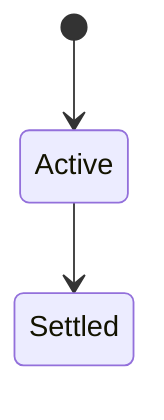
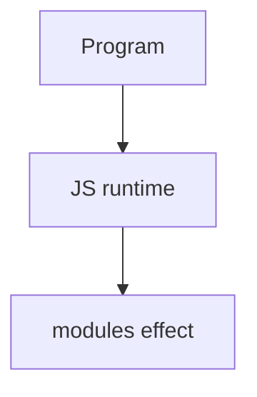

# Modules

<TopicMeta />

<Prerequisites />

::: tip Published
This page meets the handbook **published** bar: deep explanation, ≥10 common mistakes, and official references. Further engine-level errata welcome via PR.
:::

## Introduction

**Modules** split code into files with explicit exports/imports, isolating scope and enabling dependency graphs. On the web and in Node, **ES modules** are the standard; **CommonJS** remains in older Node code.

## Why does it exist?

Globals do not scale. Modules provide encapsulation, static analysis, tree-shaking, and clearer ownership.

## Historical Background

From script tags and CJS (`require`) to ESM (`import`/`export`) as the cross-runtime standard.

## Mental Model

One module → one environment. Cyclic dependencies have defined evaluation rules. Bundlers rewrite graphs for browsers/old Node.

## Internal Workflow

1. Prefer ESM for new code.
2. Know file extensions/package `type`.
3. Avoid circular god-modules.
4. Export minimal public API.

## Lifecycle

Lifecycle for modules:



## Browser Perspective

Browsers host the JS runtime; DevTools Sources/Console observe this topic at runtime.

## JavaScript Engine Perspective

Engines implement ECMAScript semantics (V8/JavaScriptCore/SpiderMonkey); optimize hot paths after correctness.

## React Perspective

React app code is JS—misunderstanding this topic often shows up as stale UI state or broken effects.

## Next.js Perspective

Next.js runs JS in Node/Edge and the browser; verify APIs exist in each runtime.

## Server Perspective

Node/Edge may implement the same language feature with different host APIs.

## Network Perspective

Not primarily a network feature unless combined with fetch/HTTP.

## Memory Perspective

Watch retained objects via DevTools Memory; closures and globals keep references alive.

## Performance

Measure with Performance panel / benchmarks before micro-optimizing.

## Production Example

Migrating a package to `exports` map + ESM fixed dual-package hazards for consumers.

## Code Examples

```js
// math.js
export function add(a, b) { return a + b }
// app.js
import { add } from './math.js'
```

## Diagrams



## Common Mistakes

1. Treating the feature as magic without the language rule behind it
2. Copying Stack Overflow snippets without edge cases
3. Confusing browser host APIs with ECMAScript language semantics
4. Optimizing before measuring
5. Ignoring strict mode / module differences
6. Dual CJS/ESM package footguns
7. Side-effect imports relied on without documentation
8. Missing a production edge case for 06-javascript.modules (#1)
9. Missing a production edge case for 06-javascript.modules (#2)
10. Missing a production edge case for 06-javascript.modules (#3)


## Best Practices

- Prefer language defaults and clear naming
- Write a failing test for the sharp edge you hit
- Use MDN + ECMA-262 for disagreements
- Keep examples small and runnable

## Anti-patterns

- Clever code that obscures control flow
- Polyfilling incorrectly and masking bugs
- Global mutable state as the default architecture

## Comparison

| System | Syntax |
| --- | --- |
| ESM | `import`/`export` |
| CJS | `require`/`module.exports` |

## Interview Questions

### Easy

**Q:** What is JS modules?

**A:** Per-file scopes with explicit imports/exports forming a dependency graph.

### Medium

**Q:** Why modules over globals?

**A:** Encapsulation, dependency clarity, better tooling/tree-shaking, fewer collisions.

### Hard

**Q:** What is a circular dependency risk?

**A:** Partial initialization can yield undefined bindings if you access imports before evaluation finishes.

## Summary

- modules has precise ECMAScript/host semantics
- Know failure modes and scope interactions
- Measure production impact
- Cross-link related handbook topics

## References

- [MDN: Modules](https://developer.mozilla.org/en-US/docs/Web/JavaScript/Guide/Modules)
- [Node.js Modules](https://nodejs.org/api/esm.html)

<RelatedTopics />

Prev: [Arrays](/06-javascript/arrays/) · Next: [ES Modules](/06-javascript/es-modules/)
