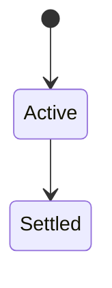
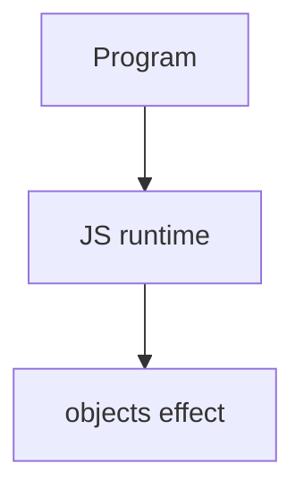

# Objects

<TopicMeta />

<Prerequisites />

::: tip Published
This page meets the handbook **published** bar: deep explanation, ≥10 common mistakes, and official references. Further engine-level errata welcome via PR.
:::

## Introduction

Ordinary **objects** map string/symbol keys to values with attributes (writable/enumerable/configurable). Literals, constructors, and descriptors underpin most JS data modeling.

## Why does it exist?

Almost everything structured in JS is an object or coerced via objects. Correct cloning and mutation rules prevent shared-state bugs.

## Historical Background

From mutable bags to `Map`, records proposals, and immutable patterns in apps.

## Mental Model

Own vs inherited keys; enumerable vs not; shallow vs deep copy. Prefer `Object.create(null)`/`Map` for arbitrary key dictionaries.

## Internal Workflow

1. Prefer literals.
2. Freeze selectively when exposing APIs.
3. Clone explicitly (`structuredClone`).
4. Avoid `__proto__` keys from JSON untrusted input.

## Lifecycle

Lifecycle for objects:



## Browser Perspective

Browsers host the JS runtime; DevTools Sources/Console observe this topic at runtime.

## JavaScript Engine Perspective

Engines implement ECMAScript semantics (V8/JavaScriptCore/SpiderMonkey); optimize hot paths after correctness.

## React Perspective

React app code is JS—misunderstanding this topic often shows up as stale UI state or broken effects.

## Next.js Perspective

Next.js runs JS in Node/Edge and the browser; verify APIs exist in each runtime.

## Server Perspective

Node/Edge may implement the same language feature with different host APIs.

## Network Perspective

Not primarily a network feature unless combined with fetch/HTTP.

## Memory Perspective

Watch retained objects via DevTools Memory; closures and globals keep references alive.

## Performance

Measure with Performance panel / benchmarks before micro-optimizing.

## Production Example

Using `structuredClone` for worker messages removed silent shared mutations between UI and worker state.

## Code Examples

```js
const o = Object.create(null)
Object.defineProperty(o, 'id', { value: 1, enumerable: true })
const copy = structuredClone({ a: { b: 2 } })
```

## Diagrams



## Common Mistakes

1. Treating the feature as magic without the language rule behind it
2. Copying Stack Overflow snippets without edge cases
3. Confusing browser host APIs with ECMAScript language semantics
4. Optimizing before measuring
5. Ignoring strict mode / module differences
6. Shallow copy then mutating nested objects unexpectedly
7. Object.assign as deep clone
8. Missing a production edge case for 06-javascript.objects (#1)
9. Missing a production edge case for 06-javascript.objects (#2)
10. Missing a production edge case for 06-javascript.objects (#3)


## Best Practices

- Prefer language defaults and clear naming
- Write a failing test for the sharp edge you hit
- Use MDN + ECMA-262 for disagreements
- Keep examples small and runnable

## Anti-patterns

- Clever code that obscures control flow
- Polyfilling incorrectly and masking bugs
- Global mutable state as the default architecture

## Comparison

| Copy | Depth |
| --- | --- |
| `{...o}` / assign | Shallow |
| `structuredClone` | Deep (structured) |
| JSON parse/stringify | Lossy deep |

## Interview Questions

### Easy

**Q:** What is JS objects?

**A:** Collections of properties with keys and attributes, delegating via prototypes.

### Medium

**Q:** Enumerable properties?

**A:** Those visited by `for...in` / `Object.keys` (own enumerable strings)—symbols and non-enumerable differ.

### Hard

**Q:** Why Map over object for dictionaries?

**A:** Arbitrary keys, size, insertion order iteration without prototype key collisions.

## Summary

- objects has precise ECMAScript/host semantics
- Know failure modes and scope interactions
- Measure production impact
- Cross-link related handbook topics

## References

- [MDN: Objects](https://developer.mozilla.org/en-US/docs/Web/JavaScript/Reference/Global_Objects/Object)
- [ECMA-262](https://tc39.es/ecma262/)

<RelatedTopics />

Prev: [Functions](/06-javascript/functions/) · Next: [Arrays](/06-javascript/arrays/)
