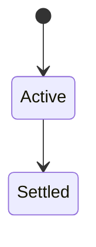
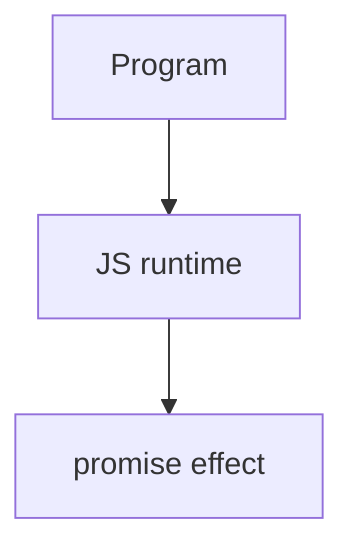

# Promise

<TopicMeta />

<Prerequisites />

::: tip Published
This page meets the handbook **published** bar: deep explanation, ≥10 common mistakes, and official references. Further engine-level errata welcome via PR.
:::

## Introduction

A **Promise** represents a future settlement: pending → fulfilled or rejected. `then`/`catch`/`finally` chain reactions; combinators (`all`, `allSettled`, `race`, `any`) coordinate groups.

## Why does it exist?

Promises standardize async success/failure, fix callback hell composability, and underpin async/await.

## Historical Background

Promulgated by libraries then ES2015; finally/combinators followed.

## Mental Model

Promises are eager. Chain returns new promises. Throw/reject jumps to nearest catch. Unhandled rejections are host-reported errors.

## Internal Workflow

1. Always handle failures.
2. Return promises from then callbacks.
3. Choose all vs allSettled intentionally.
4. Don’t wrap already-thenable APIs carelessly.

## Lifecycle

Lifecycle for promise:



## Browser Perspective

Browsers host the JS runtime; DevTools Sources/Console observe this topic at runtime.

## JavaScript Engine Perspective

Engines implement ECMAScript semantics (V8/JavaScriptCore/SpiderMonkey); optimize hot paths after correctness.

## React Perspective

React app code is JS—misunderstanding this topic often shows up as stale UI state or broken effects.

## Next.js Perspective

Next.js runs JS in Node/Edge and the browser; verify APIs exist in each runtime.

## Server Perspective

Node/Edge may implement the same language feature with different host APIs.

## Network Perspective

Not primarily a network feature unless combined with fetch/HTTP.

## Memory Perspective

Watch retained objects via DevTools Memory; closures and globals keep references alive.

## Performance

Measure with Performance panel / benchmarks before micro-optimizing.

## Production Example

Payment APIs standardized on Promise returns; unhandledrejection logging caught silent failures in production.

## Code Examples

```js
const p = Promise.resolve(1)
  .then(x => x + 1)
  .then(x => { throw new Error('nope') })
  .catch(err => 0)
await Promise.allSettled([fetch('/a'), fetch('/b')])
```

## Diagrams



## Common Mistakes

1. Treating the feature as magic without the language rule behind it
2. Copying Stack Overflow snippets without edge cases
3. Confusing browser host APIs with ECMAScript language semantics
4. Optimizing before measuring
5. Ignoring strict mode / module differences
6. Not returning in then (lost chaining)
7. Promise.all aborting siblings without cleanup
8. Forgetting to return Promise chains inside `then` (flat vs nested)
9. Using `Promise.all` when failure of one should not cancel others (`allSettled`)
10. Creating unresolved promises with no reject path (hangs)


## Best Practices

- Prefer language defaults and clear naming
- Write a failing test for the sharp edge you hit
- Use MDN + ECMA-262 for disagreements
- Keep examples small and runnable

## Anti-patterns

- Clever code that obscures control flow
- Polyfilling incorrectly and masking bugs
- Global mutable state as the default architecture

## Comparison

| Combinator | Fails when |
| --- | --- |
| `all` | First rejection |
| `allSettled` | Never (reports all) |
| `race` | First settle |
| `any` | All reject |

## Interview Questions

### Easy

**Q:** What is Promises?

**A:** Objects representing eventual fulfillment or rejection of an async operation, with composable chaining.

### Medium

**Q:** all vs allSettled?

**A:** `all` rejects fast on first failure; `allSettled` waits for every result as fulfilled/rejected entries.

### Hard

**Q:** What does then return?

**A:** A new promise that settles based on the handler’s return/throw.

## Summary

- promise has precise ECMAScript/host semantics
- Know failure modes and scope interactions
- Measure production impact
- Cross-link related handbook topics

## References

- [MDN: Promise](https://developer.mozilla.org/en-US/docs/Web/JavaScript/Reference/Global_Objects/Promise)
- [ECMA-262: Promise](https://tc39.es/ecma262/#sec-promise-objects)

<RelatedTopics />

Prev: [Event Loop (JavaScript View)](/06-javascript/event-loop-js/) · Next: [Async/Await](/06-javascript/async-await/)
