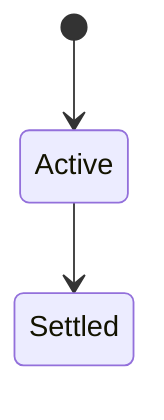
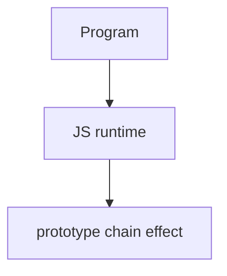

# Prototype Chain

<TopicMeta />

<Prerequisites />

::: tip Published
This page meets the handbook **published** bar: deep explanation, ≥10 common mistakes, and official references. Further engine-level errata welcome via PR.
:::

## Introduction

The **prototype chain** is the linked list of objects followed during property lookup until found or the chain ends (`null`). Shadowing occurs when an own property hides an inherited one.

## Why does it exist?

Explains method sharing, `instanceof` (prototype presence in chain), and performance intuition for deep chains.

## Historical Background

Same history as prototypes; engines optimize chains with hidden classes/ICs.

## Mental Model

Read: walk chain. Write: usually sets own property (shadows). `instanceof` checks if `Ctor.prototype` appears in the receiver’s chain.

## Internal Workflow

1. Keep chains shallow.
2. Prefer composition over deep inheritance.
3. Use `Object.create(null)` for dictionary objects when needed.
4. Debug with `Object.getPrototypeOf` loops.

## Lifecycle

Lifecycle for prototype chain:



## Browser Perspective

Browsers host the JS runtime; DevTools Sources/Console observe this topic at runtime.

## JavaScript Engine Perspective

Engines implement ECMAScript semantics (V8/JavaScriptCore/SpiderMonkey); optimize hot paths after correctness.

## React Perspective

React app code is JS—misunderstanding this topic often shows up as stale UI state or broken effects.

## Next.js Perspective

Next.js runs JS in Node/Edge and the browser; verify APIs exist in each runtime.

## Server Perspective

Node/Edge may implement the same language feature with different host APIs.

## Network Perspective

Not primarily a network feature unless combined with fetch/HTTP.

## Memory Perspective

Watch retained objects via DevTools Memory; closures and globals keep references alive.

## Performance

Measure with Performance panel / benchmarks before micro-optimizing.

## Production Example

Replacing a 5-level class hierarchy with composition removed brittle `super` chains and simplified testing.

## Code Examples

```js
function Animal() {}
Animal.prototype.eat = function () {}
function Dog() {}
Dog.prototype = Object.create(Animal.prototype)
new Dog().eat()
new Dog() instanceof Animal // true
```

## Diagrams



## Common Mistakes

1. Treating the feature as magic without the language rule behind it
2. Copying Stack Overflow snippets without edge cases
3. Confusing browser host APIs with ECMAScript language semantics
4. Optimizing before measuring
5. Ignoring strict mode / module differences
6. Broken constructors when replacing `.prototype` without resetting constructor
7. Deep inheritance hierarchies
8. Missing a production edge case for 06-javascript.prototype-chain (#1)
9. Missing a production edge case for 06-javascript.prototype-chain (#2)
10. Missing a production edge case for 06-javascript.prototype-chain (#3)


## Best Practices

- Prefer language defaults and clear naming
- Write a failing test for the sharp edge you hit
- Use MDN + ECMA-262 for disagreements
- Keep examples small and runnable

## Anti-patterns

- Clever code that obscures control flow
- Polyfilling incorrectly and masking bugs
- Global mutable state as the default architecture

## Comparison

| Operation | Walks chain? |
| --- | --- |
| Get | Yes |
| Set (ordinary) | No (own) |
| `in` operator | Yes |
| `hasOwn` | No |

## Interview Questions

### Easy

**Q:** What is the prototype chain?

**A:** The sequence of prototypes consulted to resolve a property read.

### Medium

**Q:** How does instanceof work?

**A:** It checks whether the constructor’s `.prototype` exists in the value’s prototype chain (with caveats across realms).

### Hard

**Q:** What does Object.create(null) give you?

**A:** An object with no prototype—no inherited toString/etc.—good for maps of arbitrary keys.

## Summary

- prototype chain has precise ECMAScript/host semantics
- Know failure modes and scope interactions
- Measure production impact
- Cross-link related handbook topics

## References

- [MDN: Prototype chain](https://developer.mozilla.org/en-US/docs/Web/JavaScript/Inheritance_and_the_prototype_chain)
- [ECMA-262](https://tc39.es/ecma262/)

<RelatedTopics />

Prev: [Prototype](/06-javascript/prototype/) · Next: [this](/06-javascript/this/)
