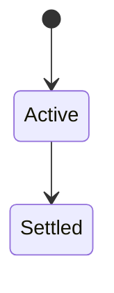
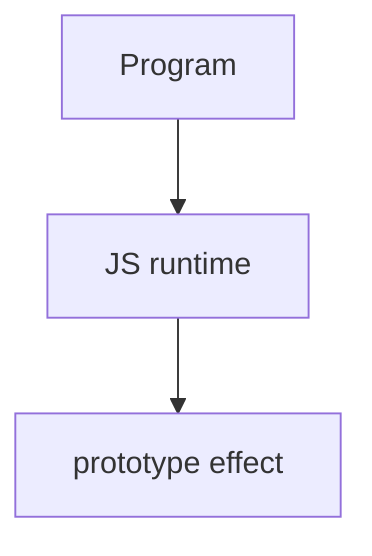

# Prototype

<TopicMeta />

<Prerequisites />

::: tip Published
This page meets the handbook **published** bar: deep explanation, ≥10 common mistakes, and official references. Further engine-level errata welcome via PR.
:::

## Introduction

Every ordinary object has an internal **`[[Prototype]]`** (accessible via `Object.getPrototypeOf` / `__proto__`). Property reads walk that chain; writes typically affect the own object.

## Why does it exist?

Prototypes enable shared methods without classes-as-copies. Understanding them demystifies inheritance and `instanceof`.

## Historical Background

Prototypal inheritance is JS’s original OO model; `class` syntax is sugar over prototypes.

## Mental Model

Own properties vs inherited. `obj.method()` looks up `method` on the chain. `Object.create(proto)` builds objects with a chosen prototype.

## Internal Workflow

1. Prefer `Object.create` / `class` over mutating `__proto__`.
2. Put shared methods on `Constructor.prototype`.
3. Use `Object.hasOwn` / `hasOwnProperty` carefully.
4. Don’t flatten prototype knowledge into “classes only.”

## Lifecycle

Lifecycle for prototype:



## Browser Perspective

Browsers host the JS runtime; DevTools Sources/Console observe this topic at runtime.

## JavaScript Engine Perspective

Engines implement ECMAScript semantics (V8/JavaScriptCore/SpiderMonkey); optimize hot paths after correctness.

## React Perspective

React app code is JS—misunderstanding this topic often shows up as stale UI state or broken effects.

## Next.js Perspective

Next.js runs JS in Node/Edge and the browser; verify APIs exist in each runtime.

## Server Perspective

Node/Edge may implement the same language feature with different host APIs.

## Network Perspective

Not primarily a network feature unless combined with fetch/HTTP.

## Memory Perspective

Watch retained objects via DevTools Memory; closures and globals keep references alive.

## Performance

Measure with Performance panel / benchmarks before micro-optimizing.

## Production Example

A bug where `data.toJSON` vanished was traced to `Object.create(null)` for maps—no Object.prototype.

## Code Examples

```js
const proto = { greet() { return 'hi' } }
const o = Object.create(proto)
o.greet() // 'hi'
Object.getPrototypeOf(o) === proto
```

## Diagrams



## Common Mistakes

1. Treating the feature as magic without the language rule behind it
2. Copying Stack Overflow snippets without edge cases
3. Confusing browser host APIs with ECMAScript language semantics
4. Optimizing before measuring
5. Ignoring strict mode / module differences
6. For-in without hasOwn filtering
7. Mutating Object.prototype
8. Missing a production edge case for 06-javascript.prototype (#1)
9. Missing a production edge case for 06-javascript.prototype (#2)
10. Missing a production edge case for 06-javascript.prototype (#3)


## Best Practices

- Prefer language defaults and clear naming
- Write a failing test for the sharp edge you hit
- Use MDN + ECMA-262 for disagreements
- Keep examples small and runnable

## Anti-patterns

- Clever code that obscures control flow
- Polyfilling incorrectly and masking bugs
- Global mutable state as the default architecture

## Comparison

| API | Purpose |
| --- | --- |
| `Object.create` | Set proto |
| `Object.getPrototypeOf` | Read proto |
| `Object.setPrototypeOf` | Change (slow/rare) |

## Interview Questions

### Easy

**Q:** What is prototypes?

**A:** Objects delegate missing properties to their prototype chain via `[[Prototype]]`.

### Medium

**Q:** Own vs inherited properties?

**A:** Own exist on the object; inherited are found by walking `[[Prototype]]`.

### Hard

**Q:** Why is mutating Object.prototype dangerous?

**A:** It affects nearly all objects and can break libraries/for-in assumptions.

## Summary

- prototype has precise ECMAScript/host semantics
- Know failure modes and scope interactions
- Measure production impact
- Cross-link related handbook topics

## References

- [MDN: Prototypes](https://developer.mozilla.org/en-US/docs/Web/JavaScript/Inheritance_and_the_prototype_chain)
- [ECMA-262: Ordinary object internal methods](https://tc39.es/ecma262/)

<RelatedTopics />

Prev: [Lexical Environment](/06-javascript/lexical-environment/) · Next: [Prototype Chain](/06-javascript/prototype-chain/)
