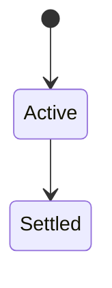
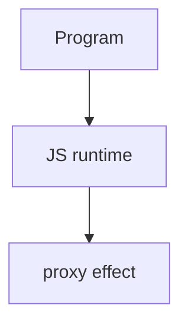

# Proxy

<TopicMeta />

<Prerequisites />

::: tip Published
This page meets the handbook **published** bar: deep explanation, ≥10 common mistakes, and official references. Further engine-level errata welcome via PR.
:::

## Introduction

**`Proxy`** wraps a target with a **handler** of traps (`get`, `set`, `apply`, …) to intercept operations. Used for reactivity, validation, and virtual APIs—careful with invariants and performance.

## Why does it exist?

Enables transparent metaprogramming (Vue 3 reactivity uses Proxies) without rewriting every property access.

## Historical Background

ES2015 Proxies replaced incomplete `__defineGetter__` era hacks.

## Mental Model

Traps must uphold invariants with the target’s invariants or throw. Identity: proxy ≠ target. `typeof` may still be object/function.

## Internal Workflow

1. Keep traps small.
2. Cache when wrapping deeply.
3. Beware Map/Set and private fields limitations.
4. Prefer explicit APIs when Proxy obscures debugging.

## Lifecycle

Lifecycle for proxy:



## Browser Perspective

Browsers host the JS runtime; DevTools Sources/Console observe this topic at runtime.

## JavaScript Engine Perspective

Engines implement ECMAScript semantics (V8/JavaScriptCore/SpiderMonkey); optimize hot paths after correctness.

## React Perspective

React app code is JS—misunderstanding this topic often shows up as stale UI state or broken effects.

## Next.js Perspective

Next.js runs JS in Node/Edge and the browser; verify APIs exist in each runtime.

## Server Perspective

Node/Edge may implement the same language feature with different host APIs.

## Network Perspective

Not primarily a network feature unless combined with fetch/HTTP.

## Memory Perspective

Watch retained objects via DevTools Memory; closures and globals keep references alive.

## Performance

Measure with Performance panel / benchmarks before micro-optimizing.

## Production Example

A form library validated fields via Proxy set traps; later moved hot paths to explicit setters after profiling overhead.

## Code Examples

```js
const user = new Proxy({ name: 'Ada' }, {
  set(obj, key, value) {
    if (key === 'name' && !value) throw new Error('name required')
    obj[key] = value
    return true
  }
})
```

## Diagrams



## Common Mistakes

1. Treating the feature as magic without the language rule behind it
2. Copying Stack Overflow snippets without edge cases
3. Confusing browser host APIs with ECMAScript language semantics
4. Optimizing before measuring
5. Ignoring strict mode / module differences
6. Breaking Proxy invariants
7. Proxying everything in a hot loop without measuring
8. Missing a production edge case for 06-javascript.proxy (#1)
9. Missing a production edge case for 06-javascript.proxy (#2)
10. Missing a production edge case for 06-javascript.proxy (#3)


## Best Practices

- Prefer language defaults and clear naming
- Write a failing test for the sharp edge you hit
- Use MDN + ECMA-262 for disagreements
- Keep examples small and runnable

## Anti-patterns

- Clever code that obscures control flow
- Polyfilling incorrectly and masking bugs
- Global mutable state as the default architecture

## Comparison

| Tool | Level |
| --- | --- |
| Proxy | Runtime ops |
| getters | Per property |
| compile-time (TS) | Types only |

## Interview Questions

### Easy

**Q:** What is Proxy?

**A:** An object that intercepts fundamental operations on a target via handler traps.

### Medium

**Q:** Why Vue 3 uses Proxy?

**A:** To observe property access/assignment broadly for reactivity without per-property defines.

### Hard

**Q:** What are invariants?

**A:** Rules traps must respect (e.g., non-writable non-configurable target properties) or TypeError results.

## Summary

- proxy has precise ECMAScript/host semantics
- Know failure modes and scope interactions
- Measure production impact
- Cross-link related handbook topics

## References

- [MDN: Proxy](https://developer.mozilla.org/en-US/docs/Web/JavaScript/Reference/Global_Objects/Proxy)
- [ECMA-262: Proxy Objects](https://tc39.es/ecma262/)

<RelatedTopics />

Prev: [AbortController](/06-javascript/abortcontroller/) · Next: [Reflect](/06-javascript/reflect/)
