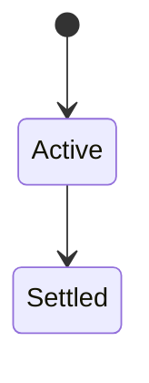
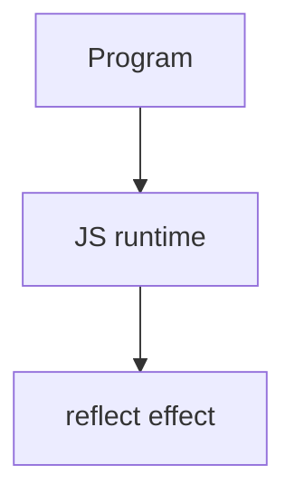

# Reflect

<TopicMeta />

<Prerequisites />

::: tip Published
This page meets the handbook **published** bar: deep explanation, ≥10 common mistakes, and official references. Further engine-level errata welcome via PR.
:::

## Introduction

**`Reflect`** provides static methods (`Reflect.get`, `set`, `construct`, …) that perform the default object operations corresponding to Proxy traps—returning booleans for some ops instead of throwing.

## Why does it exist?

When writing Proxy traps, calling `Reflect.*` preserves correct default behavior and argument forwarding (including receiver).

## Historical Background

ES2015 companion to Proxy.

## Mental Model

Prefer `Reflect.get(target, prop, receiver)` inside `get` traps to honor inheritance/getters correctly.

## Internal Workflow

1. Inside Proxy traps, forward via Reflect.
2. Use Reflect.construct for subclassing patterns.
3. Prefer clear Object APIs for ordinary app code.

## Lifecycle

Lifecycle for reflect:



## Browser Perspective

Browsers host the JS runtime; DevTools Sources/Console observe this topic at runtime.

## JavaScript Engine Perspective

Engines implement ECMAScript semantics (V8/JavaScriptCore/SpiderMonkey); optimize hot paths after correctness.

## React Perspective

React app code is JS—misunderstanding this topic often shows up as stale UI state or broken effects.

## Next.js Perspective

Next.js runs JS in Node/Edge and the browser; verify APIs exist in each runtime.

## Server Perspective

Node/Edge may implement the same language feature with different host APIs.

## Network Perspective

Not primarily a network feature unless combined with fetch/HTTP.

## Memory Perspective

Watch retained objects via DevTools Memory; closures and globals keep references alive.

## Performance

Measure with Performance panel / benchmarks before micro-optimizing.

## Production Example

A Proxy helper switched to Reflect.set and fixed broken setter `this`/receiver bugs.

## Code Examples

```js
const handler = {
  get(target, prop, receiver) {
    return Reflect.get(target, prop, receiver)
  }
}
```

## Diagrams



## Common Mistakes

1. Treating the feature as magic without the language rule behind it
2. Copying Stack Overflow snippets without edge cases
3. Confusing browser host APIs with ECMAScript language semantics
4. Optimizing before measuring
5. Ignoring strict mode / module differences
6. Reimplementing defaults incorrectly in traps without Reflect
7. Using Reflect everywhere as style without need
8. Missing a production edge case for 06-javascript.reflect (#1)
9. Missing a production edge case for 06-javascript.reflect (#2)
10. Missing a production edge case for 06-javascript.reflect (#3)


## Best Practices

- Prefer language defaults and clear naming
- Write a failing test for the sharp edge you hit
- Use MDN + ECMA-262 for disagreements
- Keep examples small and runnable

## Anti-patterns

- Clever code that obscures control flow
- Polyfilling incorrectly and masking bugs
- Global mutable state as the default architecture

## Comparison

| Goal | Prefer |
| --- | --- |
| Proxy defaulting | Reflect |
| App-level property ops | Object.* / dot |

## Interview Questions

### Easy

**Q:** What is Reflect?

**A:** A built-in object of methods for default meta-operations aligned with Proxy traps.

### Medium

**Q:** Why Reflect.get’s receiver matters?

**A:** It sets `this` for getters when forwarding through prototypes/proxies.

### Hard

**Q:** Reflect.defineProperty vs Object.defineProperty?

**A:** Reflect returns boolean success; Object throws on failure—handy in traps.

## Summary

- reflect has precise ECMAScript/host semantics
- Know failure modes and scope interactions
- Measure production impact
- Cross-link related handbook topics

## References

- [MDN: Reflect](https://developer.mozilla.org/en-US/docs/Web/JavaScript/Reference/Global_Objects/Reflect)
- [ECMA-262: Reflect](https://tc39.es/ecma262/)

<RelatedTopics />

Prev: [Proxy](/06-javascript/proxy/) · Next: [Symbols](/06-javascript/symbols/)
