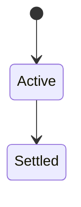
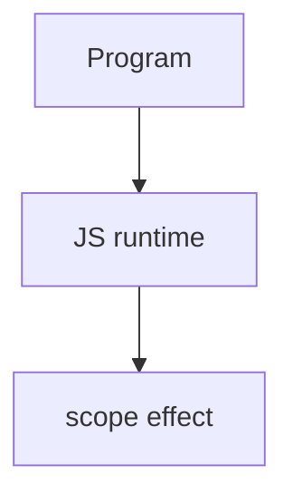

# Scope

<TopicMeta />

<Prerequisites />

::: tip Published
This page meets the handbook **published** bar: deep explanation, ≥10 common mistakes, and official references. Further engine-level errata welcome via PR.
:::

## Introduction

**Scope** determines where a binding is visible. JS uses **lexical scoping**: nested functions see outer bindings based on where they were written, not where they were called.

## Why does it exist?

Without scope rules, every name would be global and collisions would dominate. Scope enables encapsulation and closures.

## Historical Background

Function scope (`var`) then block scope (`let`/`const`); modules added per-module scope.

## Mental Model

Identifier lookup walks the lexical environment chain outward until found or ReferenceError. Shadowing hides outer names.

## Internal Workflow

1. Keep scopes small.
2. Avoid globals.
3. Prefer block bindings.
4. Watch catch/parameter scopes.

## Lifecycle

Lifecycle for scope:



## Browser Perspective

Browsers host the JS runtime; DevTools Sources/Console observe this topic at runtime.

## JavaScript Engine Perspective

Engines implement ECMAScript semantics (V8/JavaScriptCore/SpiderMonkey); optimize hot paths after correctness.

## React Perspective

React app code is JS—misunderstanding this topic often shows up as stale UI state or broken effects.

## Next.js Perspective

Next.js runs JS in Node/Edge and the browser; verify APIs exist in each runtime.

## Server Perspective

Node/Edge may implement the same language feature with different host APIs.

## Network Perspective

Not primarily a network feature unless combined with fetch/HTTP.

## Memory Perspective

Watch retained objects via DevTools Memory; closures and globals keep references alive.

## Performance

Measure with Performance panel / benchmarks before micro-optimizing.

## Production Example

Moving helpers into module scope (not `window`) fixed naming clashes between analytics and checkout scripts.

## Code Examples

```js
const x = 1
function outer() {
  const x = 2
  function inner() { return x } // 2 — lexical
  return inner
}
```

## Diagrams



## Common Mistakes

1. Treating the feature as magic without the language rule behind it
2. Copying Stack Overflow snippets without edge cases
3. Confusing browser host APIs with ECMAScript language semantics
4. Optimizing before measuring
5. Ignoring strict mode / module differences
6. Confusing lexical scope with dynamic `this`
7. Accidental globals via assignment without declaration
8. Missing a production edge case for 06-javascript.scope (#1)
9. Missing a production edge case for 06-javascript.scope (#2)
10. Missing a production edge case for 06-javascript.scope (#3)


## Best Practices

- Prefer language defaults and clear naming
- Write a failing test for the sharp edge you hit
- Use MDN + ECMA-262 for disagreements
- Keep examples small and runnable

## Anti-patterns

- Clever code that obscures control flow
- Polyfilling incorrectly and masking bugs
- Global mutable state as the default architecture

## Comparison

| Kind | Created by |
| --- | --- |
| Global | Script/globalThis |
| Module | ES module |
| Function | Function body |
| Block | `{}` with let/const |

## Interview Questions

### Easy

**Q:** What is lexical scope?

**A:** Rules determining which binding an identifier refers to based on source nesting.

### Medium

**Q:** Scope vs this?

**A:** Scope resolves variables lexically; `this` is usually call-site determined (except arrows).

### Hard

**Q:** What is shadowing?

**A:** An inner binding with the same name hides an outer one in that inner scope.

## Summary

- scope has precise ECMAScript/host semantics
- Know failure modes and scope interactions
- Measure production impact
- Cross-link related handbook topics

## References

- [MDN: Scope](https://developer.mozilla.org/en-US/docs/Glossary/Scope)
- [ECMA-262: Lexical Environments](https://tc39.es/ecma262/)

<RelatedTopics />

Prev: [Types and Values](/06-javascript/types-and-values/) · Next: [Closures](/06-javascript/closures/)
