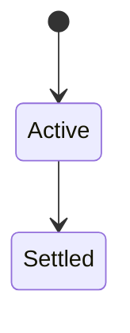
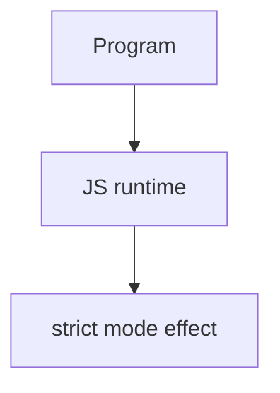

# Strict Mode

<TopicMeta />

<Prerequisites />

::: tip Published
This page meets the handbook **published** bar: deep explanation, ≥10 common mistakes, and official references. Further engine-level errata welcome via PR.
:::

## Introduction

**Strict mode** (`'use strict'` or ES modules) changes semantics: assigns to undeclared bindings throw, `this` is `undefined` in plain calls, octal pitfalls banned, `arguments` less magical, duplicates illegal, etc.

## Why does it exist?

Sloppy mode silently created globals and masked bugs. Strict mode + modules make failures loud early.

## Historical Background

ES5 introduced strict; ES modules always strict.

## Mental Model

If you write modules, you already have strict mode. Be careful pasting sloppy-era patterns that relied on `this === window`.

## Internal Workflow

1. Prefer modules.
2. Don’t fight strict—fix the code.
3. Know differences when maintaining ancient scripts.
4. Enable bundler/lint rules that assume strict.

## Lifecycle

Lifecycle for strict mode:



## Browser Perspective

Browsers host the JS runtime; DevTools Sources/Console observe this topic at runtime.

## JavaScript Engine Perspective

Engines implement ECMAScript semantics (V8/JavaScriptCore/SpiderMonkey); optimize hot paths after correctness.

## React Perspective

React app code is JS—misunderstanding this topic often shows up as stale UI state or broken effects.

## Next.js Perspective

Next.js runs JS in Node/Edge and the browser; verify APIs exist in each runtime.

## Server Perspective

Node/Edge may implement the same language feature with different host APIs.

## Network Perspective

Not primarily a network feature unless combined with fetch/HTTP.

## Memory Perspective

Watch retained objects via DevTools Memory; closures and globals keep references alive.

## Performance

Measure with Performance panel / benchmarks before micro-optimizing.

## Production Example

Legacy analytics assumed `this` was window inside a callback; wrapping in module broke it until rewritten with `globalThis`.

## Code Examples

```js
'use strict'
// x = 1 // ReferenceError
function f() { return this }
f() // undefined
```

## Diagrams



## Common Mistakes

1. Treating the feature as magic without the language rule behind it
2. Copying Stack Overflow snippets without edge cases
3. Confusing browser host APIs with ECMAScript language semantics
4. Optimizing before measuring
5. Ignoring strict mode / module differences
6. Relying on sloppy this===window
7. Assuming non-module scripts are strict without pragma
8. Missing a production edge case for 06-javascript.strict-mode (#1)
9. Missing a production edge case for 06-javascript.strict-mode (#2)
10. Missing a production edge case for 06-javascript.strict-mode (#3)


## Best Practices

- Prefer language defaults and clear naming
- Write a failing test for the sharp edge you hit
- Use MDN + ECMA-262 for disagreements
- Keep examples small and runnable

## Anti-patterns

- Clever code that obscures control flow
- Polyfilling incorrectly and masking bugs
- Global mutable state as the default architecture

## Comparison

| Context | Strict? |
| --- | --- |
| ES module | Yes |
| class bodies | Yes |
| classic script | Only with pragma |

## Interview Questions

### Easy

**Q:** What is strict mode?

**A:** A restricted JS language mode that turns silent mistakes into errors and changes some `this`/`arguments` semantics.

### Medium

**Q:** Are modules strict?

**A:** Yes—always.

### Hard

**Q:** Name two strict differences.

**A:** No implicit globals; `this` is undefined in undecorated function calls instead of globalThis.

## Summary

- strict mode has precise ECMAScript/host semantics
- Know failure modes and scope interactions
- Measure production impact
- Cross-link related handbook topics

## References

- [MDN: Strict mode](https://developer.mozilla.org/en-US/docs/Web/JavaScript/Reference/Strict_mode)
- [ECMA-262 Strict Mode Code](https://tc39.es/ecma262/)

<RelatedTopics />

Prev: [Error Handling](/06-javascript/error-handling/) · Next: [Memory and References](/06-javascript/memory-and-references/)
