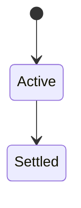
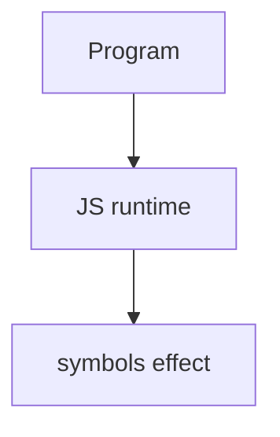

# Symbols

<TopicMeta />

<Prerequisites />

::: tip Published
This page meets the handbook **published** bar: deep explanation, ≥10 common mistakes, and official references. Further engine-level errata welcome via PR.
:::

## Introduction

**Symbols** are unique primitive keys. They avoid name collisions on objects and power well-known protocols (`Symbol.iterator`, `Symbol.toStringTag`, `Symbol.toPrimitive`).

## Why does it exist?

String keys collide across libraries. Symbols create isolated extension points and language hooks.

## Historical Background

ES2015; registered symbols via `Symbol.for` for cross-realm shared keys.

## Mental Model

Every `Symbol('desc')` is unique. Hidden from most key enumerations (`Object.keys`), but visible via `Object.getOwnPropertySymbols` / `Reflect.ownKeys`.

## Internal Workflow

1. Use symbols for meta keys.
2. Prefer well-known symbols for protocols.
3. Don’t overuse—string keys are fine for data.
4. Know JSON drops symbol keys.

## Lifecycle

Lifecycle for symbols:



## Browser Perspective

Browsers host the JS runtime; DevTools Sources/Console observe this topic at runtime.

## JavaScript Engine Perspective

Engines implement ECMAScript semantics (V8/JavaScriptCore/SpiderMonkey); optimize hot paths after correctness.

## React Perspective

React app code is JS—misunderstanding this topic often shows up as stale UI state or broken effects.

## Next.js Perspective

Next.js runs JS in Node/Edge and the browser; verify APIs exist in each runtime.

## Server Perspective

Node/Edge may implement the same language feature with different host APIs.

## Network Perspective

Not primarily a network feature unless combined with fetch/HTTP.

## Memory Perspective

Watch retained objects via DevTools Memory; closures and globals keep references alive.

## Performance

Measure with Performance panel / benchmarks before micro-optimizing.

## Production Example

A library attached private-ish metadata via symbols to host objects without colliding with user fields.

## Code Examples

```js
const secret = Symbol('secret')
const o = { [secret]: 42, visible: 1 }
Object.keys(o) // ['visible']
```

## Diagrams



## Common Mistakes

1. Treating the feature as magic without the language rule behind it
2. Copying Stack Overflow snippets without edge cases
3. Confusing browser host APIs with ECMAScript language semantics
4. Optimizing before measuring
5. Ignoring strict mode / module differences
6. Expecting JSON.stringify to keep symbol keys
7. Assuming Symbol('x') === Symbol('x')
8. Missing a production edge case for 06-javascript.symbols (#1)
9. Missing a production edge case for 06-javascript.symbols (#2)
10. Missing a production edge case for 06-javascript.symbols (#3)


## Best Practices

- Prefer language defaults and clear naming
- Write a failing test for the sharp edge you hit
- Use MDN + ECMA-262 for disagreements
- Keep examples small and runnable

## Anti-patterns

- Clever code that obscures control flow
- Polyfilling incorrectly and masking bugs
- Global mutable state as the default architecture

## Comparison

| Kind | Sharing |
| --- | --- |
| `Symbol()` | Unique |
| `Symbol.for` | Global registry |
| Well-known | Language protocols |

## Interview Questions

### Easy

**Q:** What is Symbols?

**A:** Unique primitive values used as non-colliding property keys and protocol hooks.

### Medium

**Q:** Symbol.iterator purpose?

**A:** Defines how an object becomes iterable for `for...of` and spread.

### Hard

**Q:** Symbol.for vs Symbol?

**A:** `Symbol.for` reuses a registry key across realms/calls; `Symbol()` always fresh.

## Summary

- symbols has precise ECMAScript/host semantics
- Know failure modes and scope interactions
- Measure production impact
- Cross-link related handbook topics

## References

- [MDN: Symbol](https://developer.mozilla.org/en-US/docs/Web/JavaScript/Reference/Global_Objects/Symbol)
- [ECMA-262](https://tc39.es/ecma262/)

<RelatedTopics />

Prev: [Reflect](/06-javascript/reflect/) · Next: [WeakMap](/06-javascript/weakmap/)
