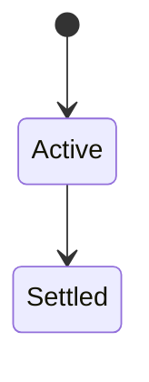
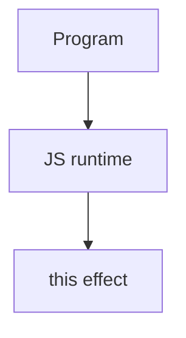

# this

<TopicMeta />

<Prerequisites />

::: tip Published
This page meets the handbook **published** bar: deep explanation, ≥10 common mistakes, and official references. Further engine-level errata welcome via PR.
:::

## Introduction

**`this`** is a call-dependent binding (for ordinary functions): default/`undefined` in strict mode, object for method calls, new instance for constructors, or explicit via `call`/`apply`/`bind`. **Arrow functions** inherit `this` lexically.

## Why does it exist?

Methods need a receiver. Misbinding is one of the most common JS bugs—especially with callbacks extracted from objects.

## Historical Background

Early JS dynamic `this` + later arrows (lexical) + classes.

## Mental Model

Ask: how was the function invoked? Method call? Plain call? `new`? Bound? Arrow? That answers `this`.

## Internal Workflow

1. Use arrows for callbacks needing outer `this`.
2. Or `.bind` / wrap.
3. Class fields/arrow methods when appropriate.
4. Prefer passing data explicitly over relying on `this` in shared utils.

## Lifecycle

Lifecycle for this:



## Browser Perspective

Browsers host the JS runtime; DevTools Sources/Console observe this topic at runtime.

## JavaScript Engine Perspective

Engines implement ECMAScript semantics (V8/JavaScriptCore/SpiderMonkey); optimize hot paths after correctness.

## React Perspective

Class component handlers needed bind/arrows; function components avoid `this` entirely.

## Next.js Perspective

Next.js runs JS in Node/Edge and the browser; verify APIs exist in each runtime.

## Server Perspective

Node/Edge may implement the same language feature with different host APIs.

## Network Perspective

Not primarily a network feature unless combined with fetch/HTTP.

## Memory Perspective

Watch retained objects via DevTools Memory; closures and globals keep references alive.

## Performance

Measure with Performance panel / benchmarks before micro-optimizing.

## Production Example

Extracting `obj.method` into a variable broke `this` until rewritten as `(...a) => obj.method(...a)` or bound.

## Code Examples

```js
const obj = {
  n: 1,
  m() { return this.n },
  a: () => this, // lexical (probably window/undefined)
}
obj.m() // 1
const f = obj.m
f() // undefined (strict) / global (sloppy)
```

## Diagrams



## Common Mistakes

1. Treating the feature as magic without the language rule behind it
2. Copying Stack Overflow snippets without edge cases
3. Confusing browser host APIs with ECMAScript language semantics
4. Optimizing before measuring
5. Ignoring strict mode / module differences
6. Losing this when passing method references
7. Using arrow functions for object methods that need dynamic this
8. Missing a production edge case for 06-javascript.this (#1)
9. Missing a production edge case for 06-javascript.this (#2)
10. Missing a production edge case for 06-javascript.this (#3)


## Best Practices

- Prefer language defaults and clear naming
- Write a failing test for the sharp edge you hit
- Use MDN + ECMA-262 for disagreements
- Keep examples small and runnable

## Anti-patterns

- Clever code that obscures control flow
- Polyfilling incorrectly and masking bugs
- Global mutable state as the default architecture

## Comparison

| Call style | `this` |
| --- | --- |
| `obj.fn()` | `obj` |
| `fn()` strict | `undefined` |
| `new Fn()` | new object |
| arrow | lexical |

## Interview Questions

### Easy

**Q:** What is `this`?

**A:** A binding usually determined by how a function is called; arrows use lexical `this`.

### Medium

**Q:** Why did my callback lose this?

**A:** You passed a bare function reference; it was not called as a method. Bind or wrap it.

### Hard

**Q:** How do class methods behave?

**A:** Prototype methods are ordinary functions—extracting them still loses `this` unless bound or arrow public fields.

## Summary

- this has precise ECMAScript/host semantics
- Know failure modes and scope interactions
- Measure production impact
- Cross-link related handbook topics

## References

- [MDN: this](https://developer.mozilla.org/en-US/docs/Web/JavaScript/Reference/Operators/this)
- [ECMA-262](https://tc39.es/ecma262/)

<RelatedTopics />

Prev: [Prototype Chain](/06-javascript/prototype-chain/) · Next: [Classes](/06-javascript/classes/)
