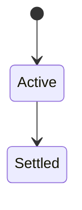
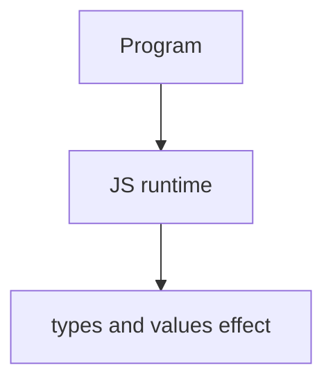

# Types and Values

<TopicMeta />

<Prerequisites />

::: tip Published
This page meets the handbook **published** bar: deep explanation, ≥10 common mistakes, and official references. Further engine-level errata welcome via PR.
:::

## Introduction

JS values are **primitives** (string, number, bigint, boolean, undefined, symbol, null) or **objects**. Dynamic typing + coercion (`==`, `+`) create sharp edges; prefer `===` and explicit conversions.

## Why does it exist?

Every expression produces a value of some type. Understanding coercion prevents `[] + {}` class bugs.

## Historical Background

From loosely typed early JS to tighter modern practice (TypeScript, ESLint eqeqeq).

## Mental Model

Know `typeof null === 'object'` historical bug. Distinguish primitive strings from `String` objects. Numbers are IEEE-754 doubles (plus bigint).

## Internal Workflow

1. Use `===`.
2. Coerce explicitly (`Number`, `String`, `Boolean`).
3. Handle `NaN` with `Number.isNaN`.
4. Prefer primitives over object wrappers.

## Lifecycle

Lifecycle for types and values:



## Browser Perspective

Browsers host the JS runtime; DevTools Sources/Console observe this topic at runtime.

## JavaScript Engine Perspective

Engines implement ECMAScript semantics (V8/JavaScriptCore/SpiderMonkey); optimize hot paths after correctness.

## React Perspective

React app code is JS—misunderstanding this topic often shows up as stale UI state or broken effects.

## Next.js Perspective

Next.js runs JS in Node/Edge and the browser; verify APIs exist in each runtime.

## Server Perspective

Node/Edge may implement the same language feature with different host APIs.

## Network Perspective

Not primarily a network feature unless combined with fetch/HTTP.

## Memory Perspective

Primitives are copied by value; objects by reference—aliases mutate shared data.

## Performance

Measure with Performance panel / benchmarks before micro-optimizing.

## Production Example

A payment form validated amounts with `Number.isFinite` and rejected `''`/`null` coercions that once became 0.

## Code Examples

```js
typeof null // 'object'
[] == false // true (avoid)
Number.isNaN(Number('x')) // true
```

## Diagrams



## Common Mistakes

1. Treating the feature as magic without the language rule behind it
2. Copying Stack Overflow snippets without edge cases
3. Confusing browser host APIs with ECMAScript language semantics
4. Optimizing before measuring
5. Ignoring strict mode / module differences
6. Using `==` for user input checks
7. Trusting `typeof` for arrays/null
8. Missing a production edge case for 06-javascript.types-and-values (#1)
9. Missing a production edge case for 06-javascript.types-and-values (#2)
10. Missing a production edge case for 06-javascript.types-and-values (#3)


## Best Practices

- Prefer language defaults and clear naming
- Write a failing test for the sharp edge you hit
- Use MDN + ECMA-262 for disagreements
- Keep examples small and runnable

## Anti-patterns

- Clever code that obscures control flow
- Polyfilling incorrectly and masking bugs
- Global mutable state as the default architecture

## Comparison

| Check | Prefer |
| --- | --- |
| Equality | `===` |
| Array | `Array.isArray` |
| NaN | `Number.isNaN` |

## Interview Questions

### Easy

**Q:** What is JS types and values?

**A:** Values are primitives or objects; operators may coerce types, which is why `===` and explicit conversion are preferred.

### Medium

**Q:** Why is typeof null 'object'?

**A:** Historical bug kept for compatibility; null is a primitive.

### Hard

**Q:** How do you safely parse user numbers?

**A:** Trim, reject '', use Number/parse with Number.isFinite, never rely on == 0 tricks.

## Summary

- types and values has precise ECMAScript/host semantics
- Know failure modes and scope interactions
- Measure production impact
- Cross-link related handbook topics

## References

- [MDN: Data types](https://developer.mozilla.org/en-US/docs/Web/JavaScript/Data_structures)
- [ECMA-262: Types](https://tc39.es/ecma262/)

<RelatedTopics />

Prev: [Variables](/06-javascript/variables/) · Next: [Scope](/06-javascript/scope/)
