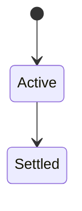
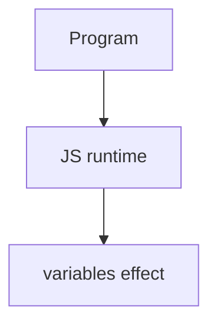

# Variables

<TopicMeta />

<Prerequisites />

::: tip Published
This page meets the handbook **published** bar: deep explanation, ≥10 common mistakes, and official references. Further engine-level errata welcome via PR.
:::

## Introduction

**Variables** are bindings created with `let`, `const`, or `var`. `let`/`const` are block-scoped; `const` prevents rebinding (not deep immutability). `var` is function-scoped and hoisted differently.

## Why does it exist?

Programs need named storage. Choosing the right declaration prevents accidental globals and TDZ bugs.

## Historical Background

`var` dominated pre-ES6; `let`/`const` fixed function-scope pitfalls. Modules made implicit globals rarer.

## Mental Model

`const` by default; `let` when rebinding; avoid `var` in modern code. `const obj` can still mutate properties.

## Internal Workflow

1. Prefer `const`.
2. Use `let` for loop counters/reassignment.
3. Never rely on implicit globals.
4. Understand TDZ for `let`/`const`.

## Lifecycle

Lifecycle for variables:



## Browser Perspective

Browsers host the JS runtime; DevTools Sources/Console observe this topic at runtime.

## JavaScript Engine Perspective

Engines implement ECMAScript semantics (V8/JavaScriptCore/SpiderMonkey); optimize hot paths after correctness.

## React Perspective

React app code is JS—misunderstanding this topic often shows up as stale UI state or broken effects.

## Next.js Perspective

Next.js runs JS in Node/Edge and the browser; verify APIs exist in each runtime.

## Server Perspective

Node/Edge may implement the same language feature with different host APIs.

## Network Perspective

Not primarily a network feature unless combined with fetch/HTTP.

## Memory Perspective

Watch retained objects via DevTools Memory; closures and globals keep references alive.

## Performance

Measure with Performance panel / benchmarks before micro-optimizing.

## Production Example

Lint rule `prefer-const` + ban `var` eliminated a class of loop/closure bugs in a legacy migration.

## Code Examples

```js
const user = { name: 'Ada' }
user.name = 'Grace' // ok
// user = {} // TypeError
for (let i = 0; i < 3; i++) setTimeout(() => console.log(i), 0) // 0,1,2
```

## Diagrams



## Common Mistakes

1. Treating the feature as magic without the language rule behind it
2. Copying Stack Overflow snippets without edge cases
3. Confusing browser host APIs with ECMAScript language semantics
4. Optimizing before measuring
5. Ignoring strict mode / module differences
6. Assuming `const` freezes objects
7. Using `var` in loops with async callbacks
8. Missing a production edge case for 06-javascript.variables (#1)
9. Missing a production edge case for 06-javascript.variables (#2)
10. Missing a production edge case for 06-javascript.variables (#3)


## Best Practices

- Prefer language defaults and clear naming
- Write a failing test for the sharp edge you hit
- Use MDN + ECMA-262 for disagreements
- Keep examples small and runnable

## Anti-patterns

- Clever code that obscures control flow
- Polyfilling incorrectly and masking bugs
- Global mutable state as the default architecture

## Comparison

| Keyword | Scope | Rebind |
| --- | --- | --- |
| `const` | Block | No |
| `let` | Block | Yes |
| `var` | Function | Yes |

## Interview Questions

### Easy

**Q:** What is let/const/var?

**A:** `let`/`const` are block-scoped bindings; `var` is function-scoped and hoisted with undefined initialization.

### Medium

**Q:** What is the TDZ?

**A:** The temporal dead zone: accessing `let`/`const` before initialization throws ReferenceError.

### Hard

**Q:** Why const for objects?

**A:** It prevents rebinding the variable; property mutation still allowed unless frozen.

## Summary

- variables has precise ECMAScript/host semantics
- Know failure modes and scope interactions
- Measure production impact
- Cross-link related handbook topics

## References

- [MDN: let](https://developer.mozilla.org/en-US/docs/Web/JavaScript/Reference/Statements/let)
- [ECMA-262: Declarations](https://tc39.es/ecma262/)

<RelatedTopics />
Next: [Types and Values](/06-javascript/types-and-values/)
