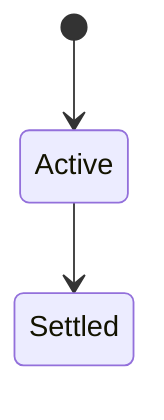
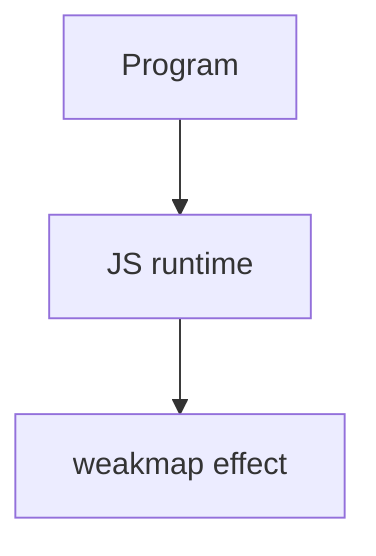

# WeakMap

<TopicMeta />

<Prerequisites />

::: tip Published
This page meets the handbook **published** bar: deep explanation, ≥10 common mistakes, and official references. Further engine-level errata welcome via PR.
:::

## Introduction

**WeakMap** keys must be objects/functions; holding a key does **not** prevent garbage collection of that key. Used for private metadata associated with objects without leaks.

## Why does it exist?

Attaching data to DOM nodes/objects with Map can leak if you forget to delete. WeakMap allows GC when the object is unreachable elsewhere.

## Historical Background

ES2015 weak collections.

## Mental Model

Not iterable (by design). No size. Values can be anything; only keys are weak. Pair with objects you don’t own.

## Internal Workflow

1. Store per-object metadata in WeakMap.
2. Don’t expect iteration/listing keys.
3. Use Map when you need enumeration.
4. Consider WeakRef/FinalizationRegistry only with care.

## Lifecycle

Lifecycle for weakmap:



## Browser Perspective

Browsers host the JS runtime; DevTools Sources/Console observe this topic at runtime.

## JavaScript Engine Perspective

Engines implement ECMAScript semantics (V8/JavaScriptCore/SpiderMonkey); optimize hot paths after correctness.

## React Perspective

React app code is JS—misunderstanding this topic often shows up as stale UI state or broken effects.

## Next.js Perspective

Next.js runs JS in Node/Edge and the browser; verify APIs exist in each runtime.

## Server Perspective

Node/Edge may implement the same language feature with different host APIs.

## Network Perspective

Not primarily a network feature unless combined with fetch/HTTP.

## Memory Perspective

Primary purpose is leak avoidance for associated metadata.

## Performance

Measure with Performance panel / benchmarks before micro-optimizing.

## Production Example

A tooltip manager keyed listeners by element in a WeakMap; removing nodes no longer leaked handler maps.

## Code Examples

```js
const meta = new WeakMap()
function tag(el) {
  meta.set(el, { seen: Date.now() })
}
```

## Diagrams



## Common Mistakes

1. Treating the feature as magic without the language rule behind it
2. Copying Stack Overflow snippets without edge cases
3. Confusing browser host APIs with ECMAScript language semantics
4. Optimizing before measuring
5. Ignoring strict mode / module differences
6. Expecting to iterate WeakMap keys
7. Using primitive keys (throws)
8. Missing a production edge case for 06-javascript.weakmap (#1)
9. Missing a production edge case for 06-javascript.weakmap (#2)
10. Missing a production edge case for 06-javascript.weakmap (#3)


## Best Practices

- Prefer language defaults and clear naming
- Write a failing test for the sharp edge you hit
- Use MDN + ECMA-262 for disagreements
- Keep examples small and runnable

## Anti-patterns

- Clever code that obscures control flow
- Polyfilling incorrectly and masking bugs
- Global mutable state as the default architecture

## Comparison

| | Map | WeakMap |
| --- | --- | --- |
| Key types | Any |
| GC of keys | Strong |
| Iterable | Yes | No |

## Interview Questions

### Easy

**Q:** What is WeakMap?

**A:** A collection of object-keyed entries that does not prevent key GC and is not iterable.

### Medium

**Q:** When prefer WeakMap over Map?

**A:** When keys are objects you don’t control and you must avoid retaining them after others drop references.

### Hard

**Q:** Why non-iterable?

**A:** Enumeration would reveal keys and interfere with nondeterministic GC semantics.

## Summary

- weakmap has precise ECMAScript/host semantics
- Know failure modes and scope interactions
- Measure production impact
- Cross-link related handbook topics

## References

- [MDN: WeakMap](https://developer.mozilla.org/en-US/docs/Web/JavaScript/Reference/Global_Objects/WeakMap)
- [ECMA-262](https://tc39.es/ecma262/)

<RelatedTopics />

Prev: [Symbols](/06-javascript/symbols/) · Next: [WeakSet](/06-javascript/weakset/)
