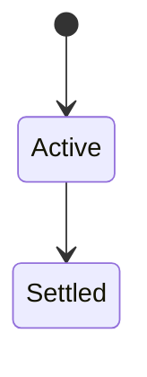
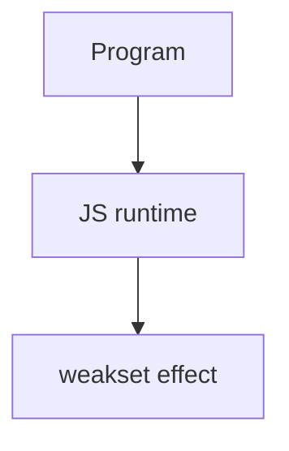

# WeakSet

<TopicMeta />

<Prerequisites />

::: tip Published
This page meets the handbook **published** bar: deep explanation, ≥10 common mistakes, and official references. Further engine-level errata welcome via PR.
:::

## Introduction

**WeakSet** stores a set of objects/functions without preventing their GC. Useful for tagging “seen” objects or marking brands without leaks.

## Why does it exist?

Like WeakMap but only membership—no values. Good for once-processing graphs without retaining nodes.

## Historical Background

ES2015 alongside WeakMap.

## Mental Model

`.add`, `.has`, `.delete` only. No iteration/size. Objects only.

## Internal Workflow

1. Use for visited flags in graphs.
2. Use for branding instances.
3. Prefer Set when you need to list members.

## Lifecycle

Lifecycle for weakset:



## Browser Perspective

Browsers host the JS runtime; DevTools Sources/Console observe this topic at runtime.

## JavaScript Engine Perspective

Engines implement ECMAScript semantics (V8/JavaScriptCore/SpiderMonkey); optimize hot paths after correctness.

## React Perspective

React app code is JS—misunderstanding this topic often shows up as stale UI state or broken effects.

## Next.js Perspective

Next.js runs JS in Node/Edge and the browser; verify APIs exist in each runtime.

## Server Perspective

Node/Edge may implement the same language feature with different host APIs.

## Network Perspective

Not primarily a network feature unless combined with fetch/HTTP.

## Memory Perspective

Weak membership avoids retaining tagged objects solely via the set.

## Performance

Measure with Performance panel / benchmarks before micro-optimizing.

## Production Example

Cycle detection in a serializer used WeakSet visited tags; large graphs no longer retained after serialization.

## Code Examples

```js
const seen = new WeakSet()
function walk(node) {
  if (seen.has(node)) return
  seen.add(node)
  node.children?.forEach(walk)
}
```

## Diagrams



## Common Mistakes

1. Treating the feature as magic without the language rule behind it
2. Copying Stack Overflow snippets without edge cases
3. Confusing browser host APIs with ECMAScript language semantics
4. Optimizing before measuring
5. Ignoring strict mode / module differences
6. Expecting WeakSet to hold strings/numbers
7. Needing to list contents (use Set)
8. Missing a production edge case for 06-javascript.weakset (#1)
9. Missing a production edge case for 06-javascript.weakset (#2)
10. Missing a production edge case for 06-javascript.weakset (#3)


## Best Practices

- Prefer language defaults and clear naming
- Write a failing test for the sharp edge you hit
- Use MDN + ECMA-262 for disagreements
- Keep examples small and runnable

## Anti-patterns

- Clever code that obscures control flow
- Polyfilling incorrectly and masking bugs
- Global mutable state as the default architecture

## Comparison

| Need | Structure |
| --- | --- |
| Weak membership | WeakSet |
| Weak key→value | WeakMap |
| Iterable set | Set |

## Interview Questions

### Easy

**Q:** What is WeakSet?

**A:** A non-iterable set of objects that does not keep those objects alive for GC purposes.

### Medium

**Q:** Typical use case?

**A:** Marking visited objects during graph walks without leaking them afterward.

### Hard

**Q:** Why only objects?

**A:** Primitives are not GC’d by reference identity the same way; weak collections key on object identity.

## Summary

- weakset has precise ECMAScript/host semantics
- Know failure modes and scope interactions
- Measure production impact
- Cross-link related handbook topics

## References

- [MDN: WeakSet](https://developer.mozilla.org/en-US/docs/Web/JavaScript/Reference/Global_Objects/WeakSet)
- [ECMA-262](https://tc39.es/ecma262/)

<RelatedTopics />

Prev: [WeakMap](/06-javascript/weakmap/) · Next: [Error Handling](/06-javascript/error-handling/)
