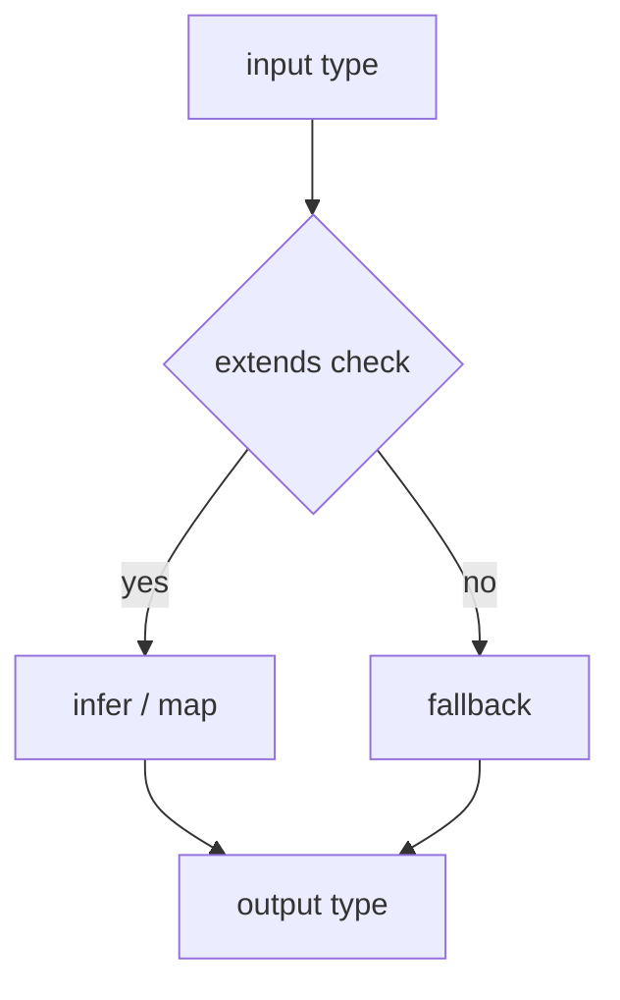

# Advanced Types

<TopicMeta />

<Prerequisites />

::: tip Published
This page meets the handbook **published** bar: deep explanation, ≥10 common mistakes, and official references. Further engine-level errata welcome via PR.
:::

## Introduction

**Advanced types** are TypeScript’s type-level programming tools: conditional types (`T extends U ? X : Y`), mapped types, `infer` in conditional arms, and template literal types. They power libraries (React, Zod, tRPC) and precise app utilities.

Use them to encode invariants—not to prove cleverness.

## Why does it exist?

Some APIs cannot be typed with interfaces alone: “return type depends on input literal,” “strip `null` deeply,” “route params from a path string.” Advanced types make those APIs autocomplete-safe.

## Historical Background

Conditional types (2.8), improved `infer`, recursive conditionals, and template literal types (4.1) unlocked string-level typing. The community learned the hard way that unbounded type recursion harms editor UX.

## Mental Model

Think of the type system as a **pure functional language** evaluated by the checker. `extends` is pattern matching; `infer` binds variables; mapped types are `map` over keys. Keep transformations total and readable.

## Internal Workflow

1. Write examples of inputs/outputs as tests in types (`expectType`).
2. Implement with the simplest conditional/mapped type.
3. Name intermediate aliases.
4. Cap recursion; prefer iterative mapped patterns.
5. Document non-obvious utilities for humans.

## Lifecycle



## Browser Perspective

Not applicable.

## JavaScript Engine Perspective

Erased completely.

## React Perspective

Library typings for hooks and polymorphic components (`as` props) rely on conditionals. App code rarely needs deep recursion.

## Next.js Perspective

Not applicable.

## Server Perspective

Not applicable.

## Network Perspective

Not applicable.

## Memory Perspective

Not applicable.

## Performance

Deep recursive types are a leading cause of IDE freezes. Prefer flatter models and built-in utilities.

## Production Example

A router helper types `params` from `/users/:id` via template literals so `navigate` requires `{ id: string }`—typos fail at compile time.

## Code Examples

```ts
type IsString<T> = T extends string ? true : false

type ElementOf<T> = T extends readonly (infer E)[] ? E : never

type NullableToOptional<T> = {
  [K in keyof T as null extends T[K] ? K : never]?: Exclude<T[K], null>
} & {
  [K in keyof T as null extends T[K] ? never : K]: T[K]
}

type EventName<T extends string> = `on${Capitalize<T>}`
```

## Diagrams


## Common Mistakes

1. Writing recursive types that hang the language service
2. Using advanced types where a simpler union works
3. Not testing type utilities with `expectType` harnesses
4. Leaking huge conditional types in public docs
5. Incorrect variance assumptions with `infer`
6. Template-literal routing types that reject valid paths
7. Overlooking an edge case #1 specific to 07-typescript.advanced-types in production traffic
8. Overlooking an edge case #2 specific to 07-typescript.advanced-types in production traffic
9. Overlooking an edge case #3 specific to 07-typescript.advanced-types in production traffic
10. Overlooking an edge case #4 specific to 07-typescript.advanced-types in production traffic


## Best Practices

- Prefer built-in utilities first
- Alias steps for readability
- Add type-level unit tests
- Keep app domain models simple; push complexity into shared libs carefully

## Anti-patterns

- Type golf in product PRs
- Copying 200-line utility types from Gists without understanding

## Comparison

| Tool | Use when |
| --- | --- |
| Conditional type | Output depends on input shape |
| Mapped type | Transform all/some keys |
| `infer` | Extract inner types |
| Template literal | String patterns / events / routes |
| Overloads | Finite discrete cases |

## Interview Questions

### Easy

**Q:** What is a conditional type?

**A:** A type of the form `T extends U ? X : Y` that picks a branch based on assignability.

### Medium

**Q:** What does `infer` do inside a conditional type?

**A:** It introduces a new type variable by pattern-matching a shape, e.g. unpacking `Promise<infer R>`.

### Hard

**Q:** How would you type `deepReadonly<T>` safely?

**A:** Map over keys recursively with `Readonly`, special-case primitives/functions/arrays to avoid exploding or breaking callables, and test with nested objects.

## Summary

- Advanced types are type-level programs
- Prefer clarity and checker performance over cleverness
- Conditionals, mapped types, and `infer` power library APIs

## References

- [Conditional Types](https://www.typescriptlang.org/docs/handbook/2/conditional-types.html)
- [Template Literal Types](https://www.typescriptlang.org/docs/handbook/2/template-literal-types.html)

<RelatedTopics />


Prev: [`07-typescript.type-inference`](/07-typescript/type-inference/) · Next: [`07-typescript.declaration-files`](/07-typescript/declaration-files/)
