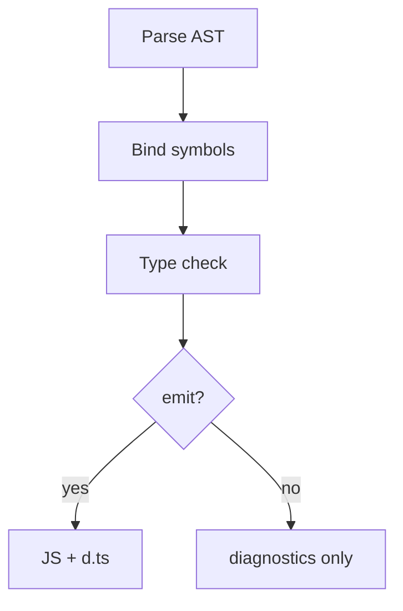
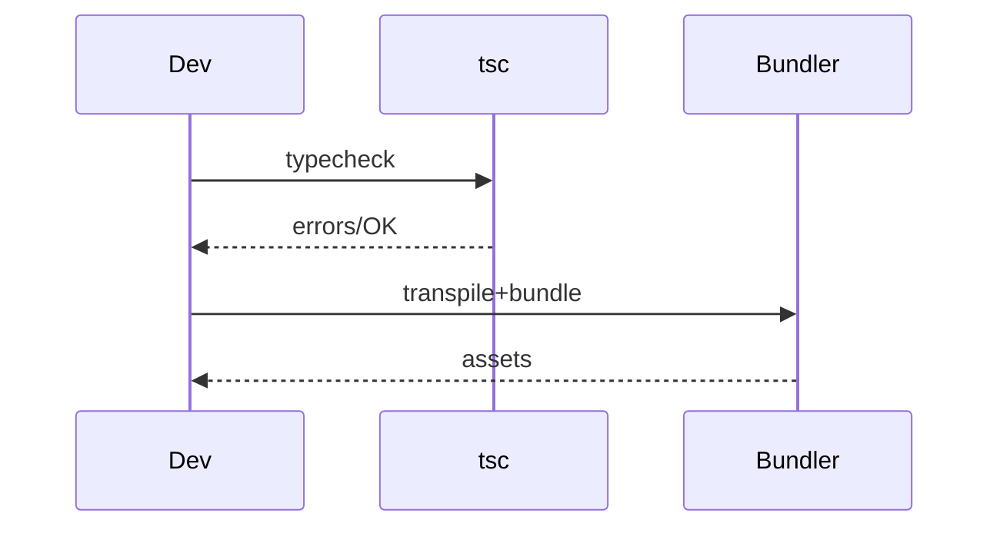

# TypeScript Compiler

<TopicMeta />

<Prerequisites />

::: tip Published
This page meets the handbook **published** bar: deep explanation, ≥10 common mistakes, and official references. Further engine-level errata welcome via PR.
:::

## Introduction

The **TypeScript compiler** (`tsc`) parses source into an AST, binds symbols, runs the type checker, and optionally emits JavaScript and declaration files. In modern frontend apps, bundlers often own emit while `tsc --noEmit` owns checking.

Understanding the pipeline explains error messages, `const enum` inlining, and why types vanish in output.

## Why does it exist?

When builds fail only in CI, or IDE errors disagree with `tsc`, you need a model of program construction (files, options, module graph)—not just “TypeScript is broken.”

## Historical Background

`tsc` began as a full emit compiler. The ecosystem shifted: Babel/SWC/esbuild strip types quickly; `tsc` remains the source of truth for type correctness. `transpileModule` and project references evolved for scale.

## Mental Model

Pipeline: **Parse → Bind → Check → Emit**. Checking is the expensive, valuable stage. Emit is optional. The **Program** object owns source files + options; incremental mode reuses graphs.

## Internal Workflow

1. `tsc --noEmit` in CI for truth.
2. Bundler/SWC for fast transpile in dev.
3. Use project references for large repos.
4. Investigate errors via `pretty` output and `traceResolution` when modules fail to resolve.
5. Do not mix incompatible emit settings across tools blindly.

## Lifecycle



## Browser Perspective

Browsers do not run `.ts` natively in production apps (experimental import maps aside).

## JavaScript Engine Perspective

Engines run emitted/bundled JS only.

## React Perspective

Not applicable.

## Next.js Perspective

Next may use SWC for transpile and still rely on TS types; run `tsc` or `next` typechecking as configured.

## Server Perspective

Not applicable.

## Network Perspective

Not applicable.

## Memory Perspective

Not applicable.

## Performance

Checker time dominates. Incremental builds, fewer ambient libs, and avoiding massive union types help.

## Production Example

CI gate: `pnpm typecheck` runs `tsc -b` across packages. Deploy proceeds only if the program checks clean—bundler success alone is insufficient.

## Code Examples

```bash
# Typecheck without emit
pnpm exec tsc --noEmit -p tsconfig.json

# Emit declarations for a library package
pnpm exec tsc -p tsconfig.build.json
```

```ts
// Illustrative: types erase
const n: number = 1
// emit ~ const n = 1
```

## Diagrams



## Common Mistakes

1. Trusting bundler transpile as a typecheck
2. Different `tsc` versions in CI vs local
3. Emitting with `tsc` and also bundling without aligning targets
4. Ignoring project reference build order
5. Turning off `isolatedModules` while using Babel/SWC (they need per-file transpile safety)
6. Using `const enum` across packages incorrectly with isolated modules
7. Overlooking an edge case #1 specific to 07-typescript.compiler in production traffic
8. Overlooking an edge case #2 specific to 07-typescript.compiler in production traffic
9. Overlooking an edge case #3 specific to 07-typescript.compiler in production traffic
10. Overlooking an edge case #4 specific to 07-typescript.compiler in production traffic


## Best Practices

- Always CI typecheck
- Keep `typescript` version pinned
- Enable `isolatedModules` when using single-file transpilers
- Use incremental / references at scale

## Anti-patterns

- `transpileOnly: true` everywhere with no separate typecheck job
- Committing emitted `dist` from mismatched configs

## Comparison

| Tool | Typechecks? | Emits JS? |
| --- | --- | --- |
| `tsc` | Yes | Optional |
| SWC/Babel/esbuild | No (strip) | Yes |
| Vite | Via plugin / separate | Yes |

## Interview Questions

### Easy

**Q:** Does `tsc` always emit JavaScript?

**A:** No. With `noEmit: true` it only typechecks.

### Medium

**Q:** Why enable `isolatedModules`?

**A:** Single-file transpilers cannot do cross-file const-enum/namespace tricks; `isolatedModules` forces TS features compatible with per-file emit.

### Hard

**Q:** How do bundler and `tsc` responsibilities split in a modern React app?

**A:** Bundler handles transform, tree-shake, and assets; `tsc --noEmit` (or project build) is the type authority. Align JSX/module settings so both see the same program.

## Summary

- `tsc` parses, binds, checks, optionally emits
- Frontends often typecheck with tsc and emit with bundlers
- Pin versions and CI-check the same program the IDE uses

## References

- [TypeScript Compiler Options](https://www.typescriptlang.org/tsconfig)
- [Project References](https://www.typescriptlang.org/docs/handbook/project-references.html)

<RelatedTopics />


Prev: [`07-typescript.tsconfig`](/07-typescript/tsconfig/) · Next: [`07-typescript.type-narrowing`](/07-typescript/type-narrowing/)
