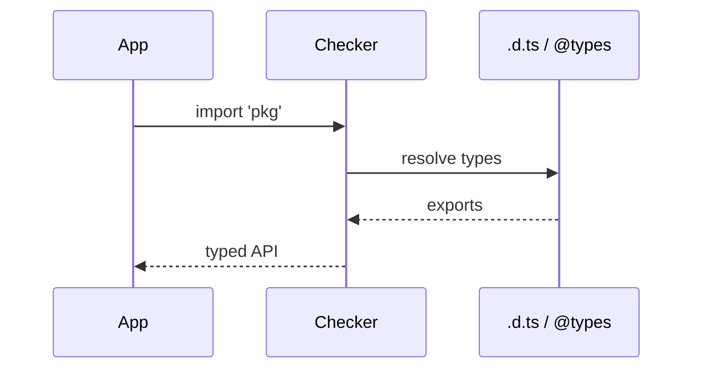
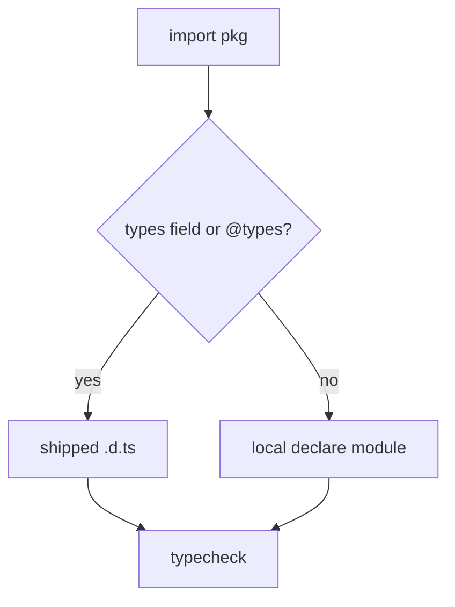

# Declaration Files

<TopicMeta />

<Prerequisites />

::: tip Published
This page meets the handbook **published** bar: deep explanation, ≥10 common mistakes, and official references. Further engine-level errata welcome via PR.
:::

## Introduction

**Declaration files** (`.d.ts`) describe the types of JavaScript (or already-emitted) modules without providing implementation. They are how TypeScript understands `lodash`, the DOM, and your own `allowJs` code.

Writing good declarations is how you bridge untyped dependencies safely.

## Why does it exist?

Most npm packages historically shipped JS only. Declarations—bundled or via `@types/...`—restore editor tooling and compile-time checks. Without them, imports collapse to `any` (depending on settings).

## Historical Background

DefinitelyTyped standardized community typings. Today many packages ship types via `"types"` in `package.json`. TS also supports project-local `declare module 'x'` shims when typings are incomplete.

## Mental Model

A `.d.ts` is a **type-only module graph**. Ambient declarations (`declare global`, `declare module`) extend the world; module declarations match import specifiers. Nothing in a declaration file runs.

## Internal Workflow

1. Prefer official shipped types.
2. Install `@types/pkg` when needed.
3. For missing modules, add `src/types/pkg.d.ts` with minimal surface.
4. Narrow `any` gradually; export types your app actually uses.
5. Avoid editing `node_modules` typings—patch via augmentation.

## Lifecycle



## Browser Perspective

`lib.dom.d.ts` is the declaration surface for Web APIs.

## JavaScript Engine Perspective

Declarations never execute.

## React Perspective

Not applicable.

## Next.js Perspective

Ensure server-only packages are not typed as client-safe just because declarations exist.

## Server Perspective

Not applicable.

## Network Perspective

Not applicable.

## Memory Perspective

Not applicable.

## Performance

`skipLibCheck: true` skips typechecking declaration files for speed; you still get types for your code against their signatures.

## Production Example

A legacy analytics SDK has no types. The team adds a thin `analytics.d.ts` with only `track(event: string, props?: Record<string, string>): void`, preventing `any` leakage across the app.

## Code Examples

```ts
// types/legacy-analytics.d.ts
declare module 'legacy-analytics' {
  export function track(
    event: string,
    props?: Record<string, string | number | boolean>,
  ): void
}

// augmentation
declare module 'legacy-analytics' {
  export function identify(userId: string): void
}
```

## Diagrams



## Common Mistakes

1. Leaving untyped imports as implicit `any`
2. Over-typing a shim with APIs that do not exist at runtime
3. Editing files inside `node_modules/@types`
4. Using `export =` vs `export` incorrectly for CJS packages
5. Forgetting triple-slash / `types` config so libs are missing
6. Publishing a package without the `types` field
7. Overlooking an edge case #1 specific to 07-typescript.declaration-files in production traffic
8. Overlooking an edge case #2 specific to 07-typescript.declaration-files in production traffic
9. Overlooking an edge case #3 specific to 07-typescript.declaration-files in production traffic
10. Overlooking an edge case #4 specific to 07-typescript.declaration-files in production traffic


## Best Practices

- Minimal accurate surface over perfect incomplete models
- Co-locate app shims under `types/`
- Augment instead of fork
- When publishing, ship `.d.ts` (or `declaration: true`)

## Anti-patterns

- `declare module "*"` catch-alls
- Casting every import to `any` instead of a 10-line shim

## Comparison

| Source of types | Pros | Cons |
| --- | --- | --- |
| Bundled by package | Accurate, versioned | Depends on maintainer |
| `@types/...` | Community coverage | Can lag package version |
| Local shim | Unblocks quickly | You maintain it |

## Interview Questions

### Easy

**Q:** What is a `.d.ts` file?

**A:** A TypeScript declaration file that describes types for JavaScript (or emit) without containing runtime code.

### Medium

**Q:** How does TypeScript find types for `import "pkg"`?

**A:** It resolves `package.json` `types`/`typings`, then `@types/pkg`, according to module resolution rules and `typeRoots`.

### Hard

**Q:** How do you type a CJS `module.exports = function` package?

**A:** Use `export =` in the declaration (and `esModuleInterop`/`allowSyntheticDefaultImports` as appropriate) so default/import interop matches runtime.

## Summary

- Declarations describe JS modules to the checker
- Prefer shipped types, then DefinitelyTyped, then local shims
- Never confuse declaration completeness with runtime safety

## References

- [Declaration Files](https://www.typescriptlang.org/docs/handbook/declaration-files/introduction.html)
- [Module Resolution](https://www.typescriptlang.org/docs/handbook/module-resolution.html)

<RelatedTopics />


Prev: [`07-typescript.advanced-types`](/07-typescript/advanced-types/) · Next: [`07-typescript.tsconfig`](/07-typescript/tsconfig/)
