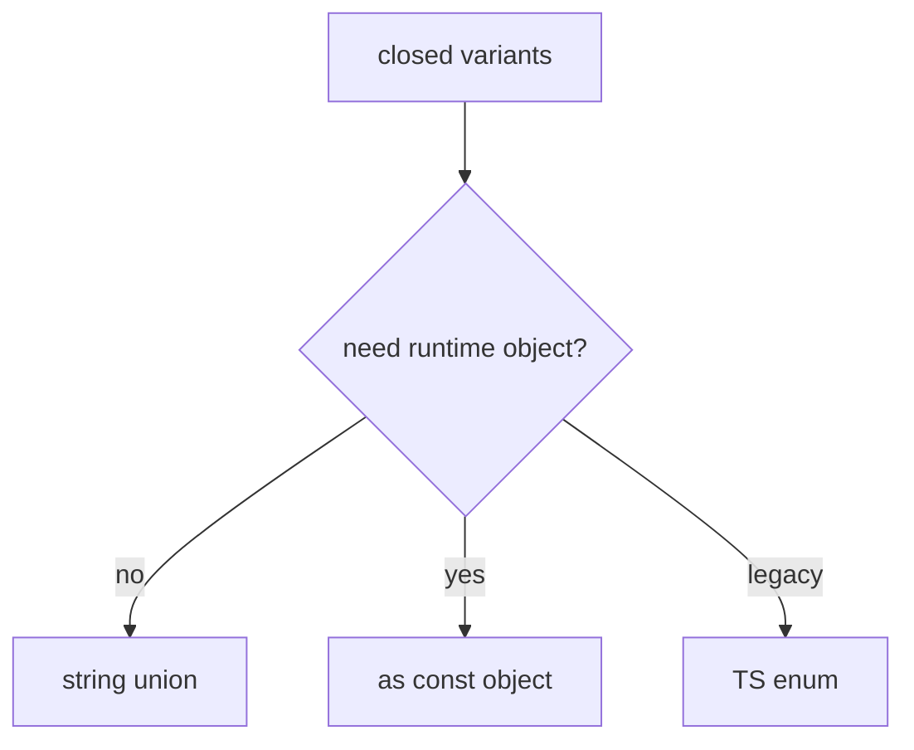
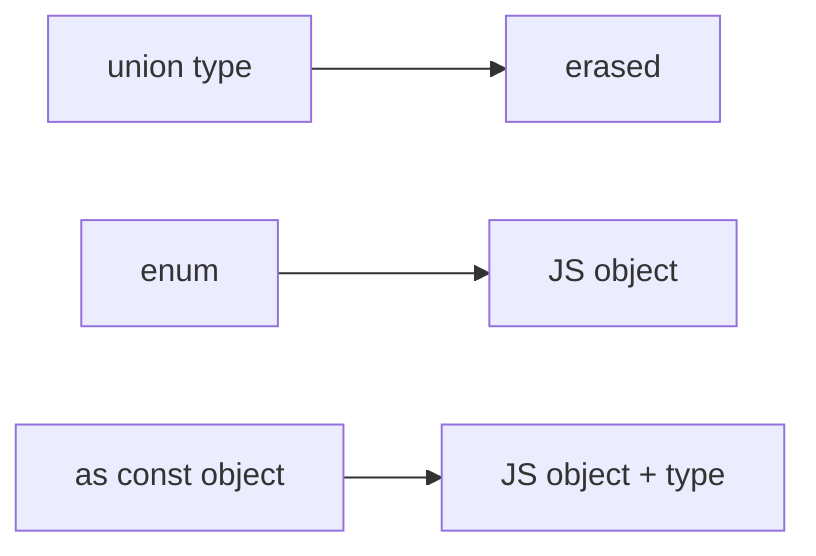

# Enums and Alternatives

<TopicMeta />

<Prerequisites />

::: tip Published
This page meets the handbook **published** bar: deep explanation, ≥10 common mistakes, and official references. Further engine-level errata welcome via PR.
:::

## Introduction

**Enums** are one of the few TypeScript features that emit runtime JavaScript (unless `const enum` + compatible emit). Modern teams often prefer **string union types** or `as const` objects for fewer surprises with bundlers and `isolatedModules`.

Know enums so you can read legacy code—and know when not to add new ones.

## Why does it exist?

Closed sets of variants appear everywhere (roles, statuses). You need autocomplete and exhaustiveness. Enums provide that but with runtime and interop costs unions avoid.

## Historical Background

Numeric enums with reverse mappings came early. String enums followed. As bundlers and `isolatedModules` dominated, community guidance shifted toward unions.

## Mental Model

Ask: do I need a **runtime object** mapping names to values? If yes, prefer `as const` + type. If I only need a type-level closed set, use a string union. Use classic enums mainly for interop with existing code.

## Internal Workflow

1. Default to `'a' | 'b'` unions.
2. If you need runtime iteration, `const Roles = { Admin: 'admin', ... } as const`.
3. Avoid numeric enums unless required.
4. Migrate legacy enums carefully (values may be in DB/storage).

## Lifecycle



## Browser Perspective

Not applicable.

## JavaScript Engine Perspective

Emitted enum IIFEs are real runtime code.

## React Perspective

Props like `tone: "primary" | "danger"` beat `Tone.Primary` enums for ergonomics.

## Next.js Perspective

Serializable RSC props prefer string unions over enum objects.

## Server Perspective

Not applicable.

## Network Perspective

Not applicable.

## Memory Perspective

Not applicable.

## Performance

Small; const enums inline but break under isolated transpile. Unions have zero runtime cost.

## Production Example

Status fields stored in Postgres as text use string unions end-to-end. An old numeric enum is migrated with an explicit mapping layer.

## Code Examples

```ts
// Preferred
type Status = 'idle' | 'loading' | 'error'

const StatusMap = {
  idle: 'idle',
  loading: 'loading',
  error: 'error',
} as const
type StatusFromMap = (typeof StatusMap)[keyof typeof StatusMap]

// Enum (emits runtime)
enum LegacyStatus {
  Idle = 'idle',
  Loading = 'loading',
}
```

## Diagrams



## Common Mistakes

1. Numeric enums without explicit values (fragile reorder)
2. `const enum` across packages with Babel/SWC
3. Mixing enum members with raw strings inconsistently
4. Using enums only for types and paying emit cost
5. Reverse-mapping surprises with numeric enums
6. Assuming enums are erased like interfaces
7. Overlooking an edge case #1 specific to 07-typescript.enums-and-alternatives in production traffic
8. Overlooking an edge case #2 specific to 07-typescript.enums-and-alternatives in production traffic
9. Overlooking an edge case #3 specific to 07-typescript.enums-and-alternatives in production traffic
10. Overlooking an edge case #4 specific to 07-typescript.enums-and-alternatives in production traffic


## Best Practices

- Prefer string unions for new code
- Use `as const` objects when you need runtime values
- Reserve enums for legacy/interop
- Make exhaustiveness checks with `never`

## Anti-patterns

- Huge enum barrels for every constant in the app
- Numeric status codes in new APIs without docs

## Comparison

| Approach | Runtime | Exhaustiveness | Isolated modules |
| --- | --- | --- | --- |
| String union | None | Yes | Safe |
| `as const` object | Object | Yes (via typeof) | Safe |
| `enum` | Emitted | Yes | OK |
| `const enum` | Inlined | Yes | Risky with some toolchains |

## Interview Questions

### Easy

**Q:** Do enums erase completely like interfaces?

**A:** No. Normal enums emit JavaScript objects (const enums may inline).

### Medium

**Q:** Why do many style guides prefer unions over enums?

**A:** Unions erase cleanly, work well with isolated transpilation, serialize naturally, and avoid reverse-mapping quirks.

### Hard

**Q:** How do you migrate a numeric enum stored in a database?

**A:** Introduce an explicit mapping layer, dual-read old/new values, backfill, then switch types to string unions—never rename numeric members silently.

## Summary

- Enums emit runtime code; unions do not
- Prefer unions / `as const` for new frontend code
- Know enums for legacy and interop

## References

- [Enums](https://www.typescriptlang.org/docs/handbook/enums.html)
- [TypeScript enum alternatives discussion in handbook + community guides](https://www.typescriptlang.org/docs/handbook/enums.html#enums-at-runtime)

<RelatedTopics />


Prev: [`07-typescript.satisfies`](/07-typescript/satisfies/) · Next: [`07-typescript.typescript-with-react`](/07-typescript/typescript-with-react/)
