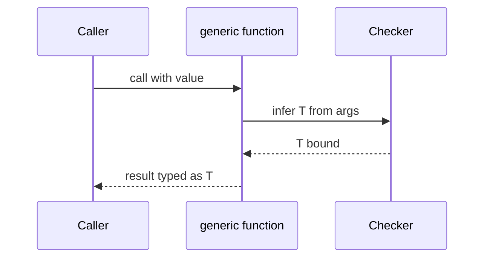

# Generics

<TopicMeta />

<Prerequisites />

::: tip Published
This page meets the handbook **published** bar: deep explanation, ≥10 common mistakes, and official references. Further engine-level errata welcome via PR.
:::

## Introduction

**Generics** introduce type variables (`T`, `TKey`, …) so one function or type works across many shapes while preserving relationships between inputs and outputs.

`identity<T>(value: T): T` returns the same type it received—something overloads or `any` cannot express cleanly.

## Why does it exist?

Containers (`Promise`, `Array`, `Map`), data-fetch helpers, and React props all need “same type in, same type out” or “key of this object.” Without generics, libraries become `any`-typed or explode into copy-pasted overloads.

## Historical Background

Generics have been central since early TypeScript, modeled after C#/Java but adapted to structural typing and inference. Features like generic constraints (`extends`), `keyof`, conditional types, and inference from usage (`infer`) made generics the backbone of modern TS libraries.

## Mental Model

A generic is a **hole filled at use site** (explicitly or via inference). Constraints (`T extends { id: string }`) bound what can fill the hole. Variance shows up practically: a `Fetcher<T>` that only produces `T` is covariant in `T`; one that consumes `T` is contravariant—get this wrong and assignability surprises appear.

## Internal Workflow

1. Write the concrete version for one type.
2. Replace the varying parts with `T`.
3. Add constraints only when you need members of `T`.
4. Prefer inference; add explicit type args when inference fails.
5. Avoid `T` soup—name parameters (`TData`, `TError`).

## Lifecycle



## Browser Perspective

Not applicable at runtime.

## JavaScript Engine Perspective

Erased. Emitted JS is the monomorphic/ specialized code you wrote, not Java-style reified generics.

## React Perspective

`useState<T>`, context, and list render props rely on generics. Component generics: `function List<T>({ items, render }: Props<T>)`.

## Next.js Perspective

Generic data loaders must still validate runtime JSON; generics only thread types through your code.

## Server Perspective

Not applicable.

## Network Perspective

Not applicable.

## Memory Perspective

Not applicable.

## Performance

Complex generic types can slow the checker. Simplify public types; hide infernal conditionals inside helper aliases.

## Production Example

A `query<TData>(url: string): Promise<TData>` helper is used with an explicit type argument only after Zod parse: `query('/api/user')` returns `unknown` until parsed to `User`. Generics then flow `User` through UI hooks.

## Code Examples

```ts
function first<T>(items: readonly T[]): T | undefined {
  return items[0]
}

function pick<T extends object, K extends keyof T>(obj: T, key: K): T[K] {
  return obj[key]
}

type ApiResponse<T> = {
  data: T
  meta: { requestId: string }
}

async function getJson<T>(url: string): Promise<ApiResponse<T>> {
  const res = await fetch(url)
  return res.json() as Promise<ApiResponse<T>> // prefer schema parse in real apps
}
```

```tsx
type ListProps<T> = {
  items: T[]
  renderItem: (item: T) => React.ReactNode
}

function List<T>({ items, renderItem }: ListProps<T>) {
  return <>{items.map(renderItem)}</>
}
```

## Diagrams


## Common Mistakes

1. Defaulting to `<T = any>` and losing safety
2. Over-constraining (`T extends object`) when unnecessary
3. Using generics where a concrete union would be clearer
4. Returning `T | any` and defeating the point
5. Confusing generic type params with React component props named `T`
6. Deep nested generics no human can read
7. Overlooking an edge case #1 specific to 07-typescript.generics in production traffic
8. Overlooking an edge case #2 specific to 07-typescript.generics in production traffic
9. Overlooking an edge case #3 specific to 07-typescript.generics in production traffic
10. Overlooking an edge case #4 specific to 07-typescript.generics in production traffic


## Best Practices

- Name type params by role (`TData`, `TKey`)
- Constrain only when you access properties of `T`
- Keep one idea per generic parameter
- Export helper types (`ApiResponse<T>`) used by many callsites

## Anti-patterns

- `function f<T>(x: T): T { return x as any }`
- Generics on every function “for future flexibility”

## Comparison

| Approach | Pros | Cons |
| --- | --- | --- |
| Generics | Preserve relationships | Harder to read when overused |
| `any` | Fast to write | No safety |
| Overloads | Precise cases | Verbose, easy to get wrong |
| Concrete union | Clear for closed sets | Not open-ended |

## Interview Questions

### Easy

**Q:** What problem do generics solve?

**A:** They let you write reusable functions/types that preserve specific type information instead of collapsing to `any` or a too-wide supertype.

### Medium

**Q:** What does `K extends keyof T` mean?

**A:** `K` must be a key of `T`, so `T[K]` is a valid property lookup. It ties a key parameter to an object type.

### Hard

**Q:** How do you design a generic `useFetch` hook that stays safe?

**A:** Parameterize `TData`, accept a runtime parser/`schema`, return discriminated state (`idle`/`loading`/`success`/`error`), and never cast network JSON to `TData` without validation.

## Summary

- Generics thread type relationships through reusable APIs
- Inference fills type params; constraints bound them
- Erase at runtime — pair with validation for external data

## References

- [TypeScript Handbook — Generics](https://www.typescriptlang.org/docs/handbook/2/generics.html)
- [keyof and indexed access](https://www.typescriptlang.org/docs/handbook/2/keyof-types.html)

<RelatedTopics />


Prev: [`07-typescript.type-vs-interface`](/07-typescript/type-vs-interface/) · Next: [`07-typescript.utility-types`](/07-typescript/utility-types/)
