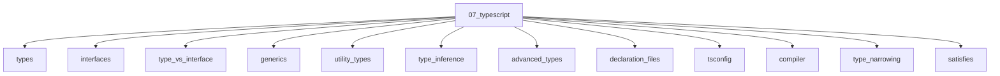

# TypeScript

## Scope

Types as a compile-time system on top of JavaScript

## Prerequisites

See the learning paths and each topic's prerequisites in the registry.

## Topics in order

- [Types](/07-typescript/types/) — junior, ~35 min
- [Interfaces](/07-typescript/interfaces/) — junior, ~30 min
- [Type vs Interface](/07-typescript/type-vs-interface/) — junior, ~25 min
- [Generics](/07-typescript/generics/) — mid, ~40 min
- [Utility Types](/07-typescript/utility-types/) — mid, ~35 min
- [Type Inference](/07-typescript/type-inference/) — junior, ~30 min
- [Advanced Types](/07-typescript/advanced-types/) — senior, ~45 min
- [Declaration Files](/07-typescript/declaration-files/) — mid, ~30 min
- [tsconfig](/07-typescript/tsconfig/) — mid, ~35 min
- [TypeScript Compiler](/07-typescript/compiler/) — mid, ~35 min
- [Type Narrowing](/07-typescript/type-narrowing/) — mid, ~30 min
- [satisfies](/07-typescript/satisfies/) — mid, ~20 min
- [Enums and Alternatives](/07-typescript/enums-and-alternatives/) — mid, ~25 min
- [TypeScript with React](/07-typescript/typescript-with-react/) — mid, ~40 min

## Module knowledge graph

## Suggested learning paths

Browse [Learning Paths](/learning-paths/).
