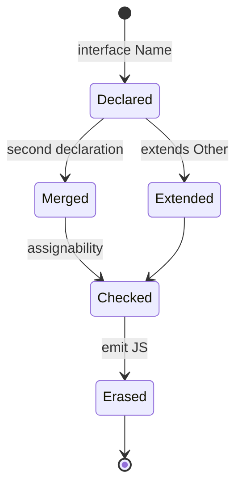
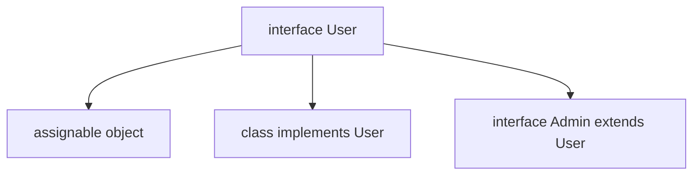

# Interfaces

<TopicMeta />

<Prerequisites />

::: tip Published
This page meets the handbook **published** bar: deep explanation, ≥10 common mistakes, and official references. Further engine-level errata welcome via PR.
:::

## Introduction

An **interface** names an object contract: required/optional properties, method signatures, index signatures, and sometimes call or construct signatures. Interfaces are purely type-space and erase at emit.

They shine for public object shapes (props, API records, class contracts) and for **declaration merging** when ambient typings extend existing libraries.

## Why does it exist?

Teams need a shared vocabulary for “what fields does this object have?” Interfaces make that vocabulary searchable and extendable. Without them, the same anonymous object type is copy-pasted and drifts.

Declaration merging lets @types packages and app code augment globals (`Window`, module shapes) without forking the original definitions.

## Historical Background

Interfaces arrived with TypeScript’s earliest releases, borrowing syntax familiar from C#/Java but with structural semantics. Over time, `type` aliases gained unions/intersections/mapped types that interfaces cannot express directly, so modern style is: interfaces for object shapes you may extend; type aliases for unions and computed types.

## Mental Model

An interface is a **named structural requirement**. Implementing it (explicitly on a `class` or implicitly via assignability) means “this value has at least these members.”

Openness: multiple `interface User` blocks in the same scope **merge**. That is a feature for ambient libs and a footgun for app code if you accidentally redeclare.

## Internal Workflow

1. Identify a stable object shape used across modules.
2. Declare `interface` with precise property types and `readonly` where mutation is forbidden.
3. `extends` other interfaces for composition; avoid deep inheritance trees.
4. For unions or mapped transforms, switch to `type`.
5. Reserve merging for intentional ambient augmentation.

## Lifecycle



## Browser Perspective

DOM typings are huge interface graphs (`HTMLElement`, `Event`). Augment carefully via `declare global` when adding custom properties.

## JavaScript Engine Perspective

Not applicable — interfaces do not exist at runtime.

## React Perspective

`interface Props { ... }` is the common pattern for component props. Prefer explicit props interfaces over inline sprawl for exported components.

## Next.js Perspective

Same as React; keep serializable props. Do not put functions on interfaces intended for RSC cross-boundary props.

## Server Perspective

Not applicable.

## Network Perspective

Not applicable.

## Memory Perspective

No runtime footprint.

## Performance

Interface-heavy codebases type-check fine; pathological declaration merging across thousands of modules can slow the language service—keep merges intentional and local.

## Production Example

A design-system package exports `interface ButtonProps`. Apps extend styling props via module augmentation of that interface so all consumers see `tone?: 'brand' | 'danger'` without wrapping components.

## Code Examples

```ts
interface User {
  readonly id: string
  email: string
  displayName?: string
}

interface Admin extends User {
  role: 'admin'
  permissions: string[]
}

function greet(u: User): string {
  return u.displayName ?? u.email
}

// Declaration merging (ambient / same name)
interface Window {
  __APP_VERSION__?: string
}
```

```ts
interface StringMap {
  [key: string]: string
}
```

## Diagrams



## Common Mistakes

1. Re-declaring an interface in app code by accident and merging incompatible members
2. Using an interface for a union of primitives (invalid — need `type`)
3. Empty interfaces as “branding” without understanding structural typing
4. Optional everything (`?:`) so the type no longer guides callers
5. Index signatures that force all properties to a too-wide type
6. Assuming `implements` adds runtime checks
7. Overlooking an edge case #1 specific to 07-typescript.interfaces in production traffic
8. Overlooking an edge case #2 specific to 07-typescript.interfaces in production traffic
9. Overlooking an edge case #3 specific to 07-typescript.interfaces in production traffic
10. Overlooking an edge case #4 specific to 07-typescript.interfaces in production traffic


## Best Practices

- Use interfaces for object shapes that may be extended
- Mark stable IDs `readonly`
- Prefer composition (`extends` small interfaces) over giant bags
- Document intentional merges next to `declare global` / module augmentation

## Anti-patterns

- Interface per ephemeral local object
- Merging app interfaces across unrelated features
- `interface IUser` Java-style prefixes with no benefit

## Comparison

| | `interface` | `type` alias |
| --- | --- | --- |
| Object shapes | Excellent | Excellent |
| Unions / primitives | No | Yes |
| Declaration merging | Yes | No |
| Mapped / conditional | Limited | First-class |
| `extends` / `implements` | Natural | Via intersections |

## Interview Questions

### Easy

**Q:** What happens to an interface at runtime?

**A:** It is erased completely. No JavaScript is emitted for the interface itself.

### Medium

**Q:** What is declaration merging?

**A:** Multiple interface declarations with the same name combine into one. Useful for augmenting libraries; dangerous if accidental in application code.

### Hard

**Q:** When would you choose interface over type for a public component props API?

**A:** When the shape is an object, may be augmented by consumers, and you want clear `extends`/`implements` ergonomics. If the public API is a union or heavily mapped, prefer `type`.

## Summary

- Interfaces name structural object contracts
- They erase at compile time; merging is opt-in power
- Use for extendable object shapes; use `type` for unions and computed types

## References

- [TypeScript Handbook — Object Types](https://www.typescriptlang.org/docs/handbook/2/objects.html)
- [Declaration Merging](https://www.typescriptlang.org/docs/handbook/declaration-merging.html)

<RelatedTopics />


Prev: [`07-typescript.types`](/07-typescript/types/) · Next: [`07-typescript.type-vs-interface`](/07-typescript/type-vs-interface/)
