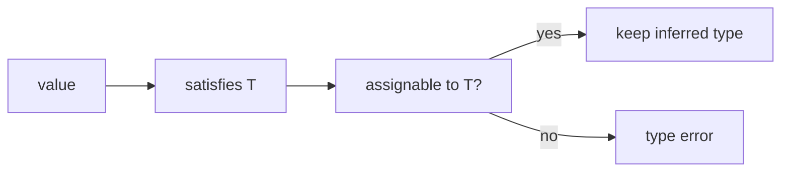
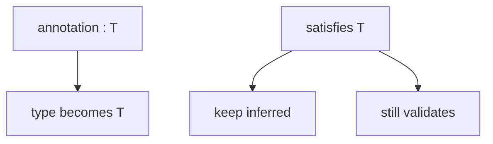

# satisfies

<TopicMeta />

<Prerequisites />

::: tip Published
This page meets the handbook **published** bar: deep explanation, ≥10 common mistakes, and official references. Further engine-level errata welcome via PR.
:::

## Introduction

**`satisfies`** (TS 4.9+) checks that an expression matches a type **without widening** the expression’s inferred type to that annotation.

`const routes = { home: '/' } satisfies Record<string, string>` still knows `routes.home` is `'/'`, not merely `string`.

## Why does it exist?

Plain annotations (`: T`) force the wider type and lose literal information. `as const` keeps literals but does not check against a target shape. `satisfies` gives both validation and narrow inference.

## Historical Background

Before `satisfies`, teams used awkward combinations of `as const` plus separate type tests. 4.9 added the operator specifically for config objects and lookup tables.

## Mental Model

`satisfies T` means: **infer as usual, but fail if the value is not assignable to `T`.** The resulting type is the inferred type, not `T`.

## Internal Workflow

1. Build a config/lookup object.
2. `satisfies` the required interface/record.
3. Use inferred literals for exhaustive switches.
4. Prefer over `: T` when keys/literals matter downstream.

## Lifecycle



## Browser Perspective

Not applicable.

## JavaScript Engine Perspective

Not applicable.

## React Perspective

Great for variant maps, theme tokens, and route tables feeding components.

## Next.js Perspective

Typed route/config objects without losing path literals.

## Server Perspective

Not applicable.

## Network Perspective

Not applicable.

## Memory Perspective

Not applicable.

## Performance

Negligible compile cost versus the safety win.

## Production Example

Feature flag configs `satisfies Record<FlagName, boolean>` so missing flags fail CI, while each flag remains a precise key for analytics.

## Code Examples

```ts
type Role = 'user' | 'admin'

const labels = {
  user: 'User',
  admin: 'Administrator',
} satisfies Record<Role, string>

// labels.admin is 'Administrator', not string
type LabelAdmin = typeof labels.admin

// Missing key errors:
// const bad = { user: 'User' } satisfies Record<Role, string>
```

## Diagrams



## Common Mistakes

1. Using `satisfies` thinking it changes runtime
2. Expecting the expression type to become `T` (it does not)
3. Using `as T` instead when you needed a check
4. Forgetting `as const` when you still need readonly tuples elsewhere
5. Satisfying a too-wide type (`Record<string, string>`) that allows extra keys carelessly
6. Not combining with key unions for exhaustiveness
7. Overlooking an edge case #1 specific to 07-typescript.satisfies in production traffic
8. Overlooking an edge case #2 specific to 07-typescript.satisfies in production traffic
9. Overlooking an edge case #3 specific to 07-typescript.satisfies in production traffic
10. Overlooking an edge case #4 specific to 07-typescript.satisfies in production traffic


## Best Practices

- Use for configs, maps, and i18n dictionaries
- Pair with key unions for exhaustiveness
- Prefer `satisfies` over `as` for validation

## Anti-patterns

- `as const satisfies` noise when a simple `satisfies` suffices
- Satisfying `any`

## Comparison

| Form | Validates? | Preserves literals? |
| --- | --- | --- |
| `const x: T = ...` | Yes | Usually no |
| `as const` | No | Yes |
| `as T` | No (unsafe) | Forced |
| `satisfies T` | Yes | Yes |

## Interview Questions

### Easy

**Q:** What problem does `satisfies` solve?

**A:** It checks a value against a type while preserving the more specific inferred type.

### Medium

**Q:** How does `const x: T = v` differ from `const x = v satisfies T`?

**A:** The annotation widens `x` to `T`. `satisfies` keeps the inferred type of `v` after validating assignability to `T`.

### Hard

**Q:** When is `satisfies` better than `as const` alone?

**A:** When you need to guarantee required keys/value types exist (e.g. every `Role` has a label), which `as const` does not enforce by itself.

## Summary

- `satisfies` validates without widening
- Ideal for config objects and lookup tables
- Compile-time only

## References

- [TypeScript 4.9 — satisfies](https://www.typescriptlang.org/docs/handbook/release-notes/typescript-4-9.html)
- [Everyday Types](https://www.typescriptlang.org/docs/handbook/2/everyday-types.html)

<RelatedTopics />


Prev: [`07-typescript.type-narrowing`](/07-typescript/type-narrowing/) · Next: [`07-typescript.enums-and-alternatives`](/07-typescript/enums-and-alternatives/)
