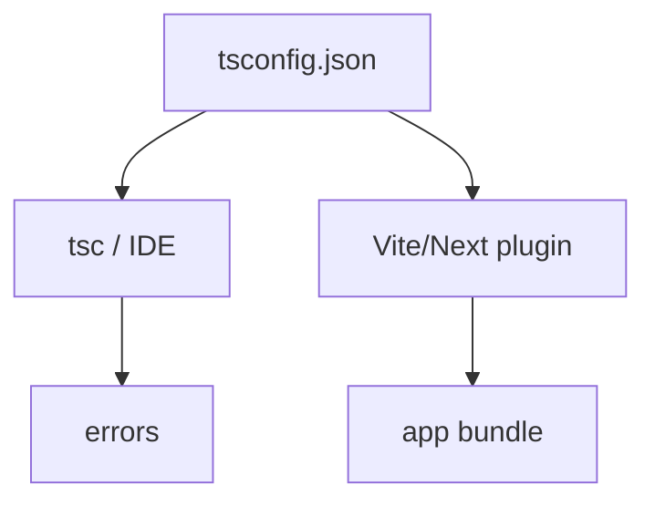
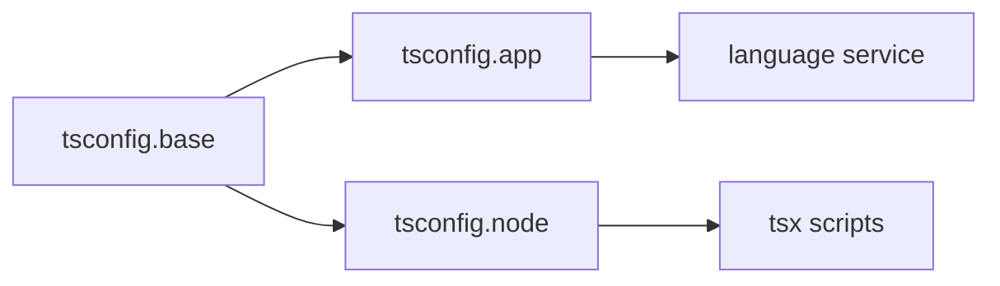

# tsconfig

<TopicMeta />

<Prerequisites />

::: tip Published
This page meets the handbook **published** bar: deep explanation, ≥10 common mistakes, and official references. Further engine-level errata welcome via PR.
:::

## Introduction

**`tsconfig.json`** configures the TypeScript compiler and language service: which files belong to the project, how strict checking is, how modules resolve, and what JS emit (if any) looks like.

A wrong tsconfig silently weakens safety (`strict: false`) or breaks builds (mismatched `module`/`moduleResolution`).

## Why does it exist?

Frontends mix bundlers (Vite/Webpack), frameworks (Next), and Node scripts. `tsconfig` is the contract between editor, `tsc`, and sometimes the bundler’s TS plugin.

## Historical Background

Options expanded with modern resolution (`bundler`, `nodenext`), `verbatimModuleSyntax`, and stricter defaults in templates. `strict` remains the umbrella flag teams should turn on early.

## Mental Model

Think in layers: **root options** (strictness, target), **module system** (resolution + emit), **jsx** (react-jsx), **paths** (aliases), **project references** (monorepos). Separate `tsconfig` for app vs node tooling when runtimes differ.

## Internal Workflow

1. Start from the framework template config.
2. Enable `strict` (and ideally `noUncheckedIndexedAccess`).
3. Align `moduleResolution` with the bundler.
4. Use `paths` sparingly; prefer real packages in monorepos.
5. CI runs `tsc --noEmit` with the same config the editor uses.

## Lifecycle



## Browser Perspective

Not applicable.

## JavaScript Engine Perspective

Not applicable.

## React Perspective

`jsx: react-jsx` enables the automatic runtime.

## Next.js Perspective

Next.js maintains `tsconfig` defaults (`jsx: preserve`, plugin). Do not fight the framework without cause.

## Server Perspective

Node scripts may need a separate config with different `module`/`types`.

## Network Perspective

Not applicable.

## Memory Perspective

Not applicable.

## Performance

`incremental`, project references, and `skipLibCheck` cut CI times. Huge `include` globs slow everything.

## Production Example

A monorepo splits `tsconfig.base.json` (strict shared) and per-package configs. CI typechecks packages in dependency order via project references.

## Code Examples

```json
{
  "compilerOptions": {
    "target": "ES2022",
    "lib": ["ES2022", "DOM", "DOM.Iterable"],
    "module": "ESNext",
    "moduleResolution": "Bundler",
    "jsx": "react-jsx",
    "strict": true,
    "noEmit": true,
    "skipLibCheck": true,
    "noUncheckedIndexedAccess": true,
    "verbatimModuleSyntax": true
  },
  "include": ["src"]
}
```

## Diagrams



## Common Mistakes

1. Shipping with `strict: false` “temporarily” for years
2. Path aliases that work in tsc but not in the bundler/test runner
3. Mixing `nodenext` and `bundler` resolution incorrectly
4. Including tests and story files that pull `any` into the app project unintentionally
5. `allowJs` + weak checking flooding the project with untyped JS
6. Different tsconfig in CI vs local
7. Overlooking an edge case #1 specific to 07-typescript.tsconfig in production traffic
8. Overlooking an edge case #2 specific to 07-typescript.tsconfig in production traffic
9. Overlooking an edge case #3 specific to 07-typescript.tsconfig in production traffic
10. Overlooking an edge case #4 specific to 07-typescript.tsconfig in production traffic


## Best Practices

- Commit a strict base config
- Match moduleResolution to the tool
- Use solution-style configs for apps with Node tooling
- Document non-default flags in the PR that adds them

## Anti-patterns

- Disabling individual strict flags to silence one error
- Mega `paths` map as a substitute for package boundaries

## Comparison

| Flag | Purpose |
| --- | --- |
| `strict` | Umbrella for strong checking |
| `noEmit` | Typecheck-only (bundler emits) |
| `moduleResolution: bundler` | Modern bundler-aware resolution |
| `jsx: react-jsx` | Automatic JSX runtime |
| `skipLibCheck` | Faster checks; skip `.d.ts` bodies |

## Interview Questions

### Easy

**Q:** What does `strict: true` do?

**A:** It enables a set of stronger checks (including `strictNullChecks`, `noImplicitAny`, etc.) that catch more bugs.

### Medium

**Q:** Why do many React apps set `noEmit: true`?

**A:** Because Vite/Next/etc. emit/bundles JS; `tsc` is used for typechecking only.

### Hard

**Q:** How do you typecheck a monorepo efficiently?

**A:** Shared base config, per-package configs, project references / incremental builds, and CI that caches `.tsbuildinfo`.

## Summary

- `tsconfig` controls safety and tooling alignment
- Prefer strict templates matching your bundler
- Keep CI and editor on the same config

## References

- [TSConfig Reference](https://www.typescriptlang.org/tsconfig)
- [React JSX transform](https://www.typescriptlang.org/docs/handbook/jsx.html)

<RelatedTopics />


Prev: [`07-typescript.declaration-files`](/07-typescript/declaration-files/) · Next: [`07-typescript.compiler`](/07-typescript/compiler/)
