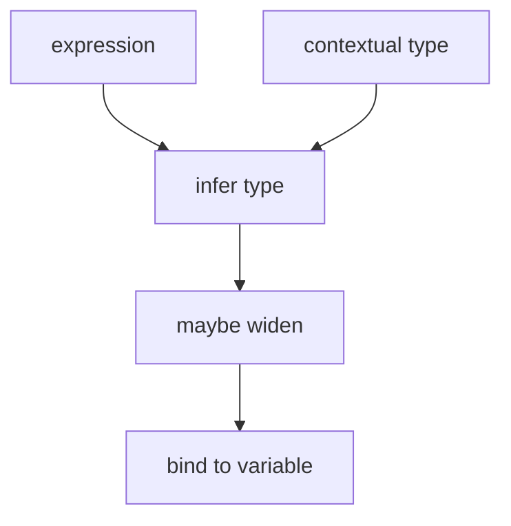
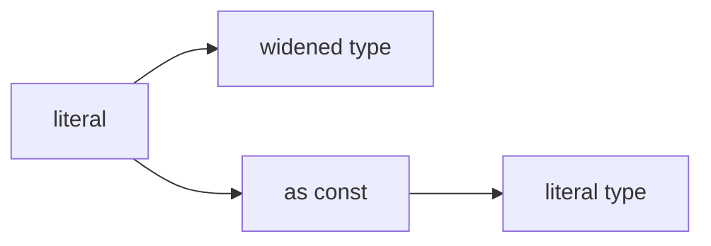

# Type Inference

<TopicMeta />

<Prerequisites />

::: tip Published
This page meets the handbook **published** bar: deep explanation, ≥10 common mistakes, and official references. Further engine-level errata welcome via PR.
:::

## Introduction

**Type inference** is the checker filling in types you omit. Locals, return types, generics, and contextual typing (e.g. arguments to `array.map`) are inferred from usage.

Good TypeScript style leans on inference inside functions and annotates edges where inference would widen or hide intent.

## Why does it exist?

Annotating every binding duplicates information and fights refactors. Inference keeps code terse while staying checked—if you understand widening, `const` assertions, and contextual typing.

## Historical Background

Inference improved steadily: better control-flow analysis, improved generic inference, and features like `satisfies` (TS 4.9) that validate without widening. The direction is “annotate less, mean more.”

## Mental Model

Inference walks from **known** nodes: literals, annotations, parameter contextual types. It widens mutable locals (`let x = 0` → `number`) more than `const`/`as const`. When inference hits `any` or fails, errors cascade—fix the root annotation.

## Internal Workflow

1. Write values first; inspect inferred types in the IDE.
2. Annotate exported functions and public props.
3. Use `as const` / `satisfies` when literals widen too far.
4. Add generic annotations only when inference cannot see the relation.
5. Avoid annotating both sides of a trivial assignment.

## Lifecycle



## Browser Perspective

Not applicable.

## JavaScript Engine Perspective

Inference is compile-time only.

## React Perspective

`useState(0)` infers `number`; `useState<Status>('idle')` or `useState('idle' as Status)` when you need a union. Event handlers get contextual types from JSX props.

## Next.js Perspective

Not applicable.

## Server Perspective

Not applicable.

## Network Perspective

Not applicable.

## Memory Perspective

Not applicable.

## Performance

Pathological inference (huge union literals) can slow the language service; split types or annotate the export.

## Production Example

A feature-flag map uses `as const` so keys stay literal unions for exhaustiveness checks in `switch`—without writing the union twice.

## Code Examples

```ts
const status = 'idle' // string (widened)
const statusLit = 'idle' as const // 'idle'

const flags = {
  checkoutV2: true,
  newNav: false,
} as const
type FlagName = keyof typeof flags // 'checkoutV2' | 'newNav'

function sum(a: number, b: number) {
  return a + b // return type inferred as number
}

;[1, 2, 3].map((n) => n * 2) // n contextually number
```

## Diagrams



## Common Mistakes

1. Annotating every variable and losing readability
2. Letting empty arrays infer as `any[]`
3. Surprising widening of mutable objects
4. Relying on inference across poorly typed third-party libs
5. Using `as` instead of fixing inference roots
6. Exporting functions with inferred return types that accidentally include `undefined`
7. Overlooking an edge case #1 specific to 07-typescript.type-inference in production traffic
8. Overlooking an edge case #2 specific to 07-typescript.type-inference in production traffic
9. Overlooking an edge case #3 specific to 07-typescript.type-inference in production traffic
10. Overlooking an edge case #4 specific to 07-typescript.type-inference in production traffic


## Best Practices

- Annotate module boundaries
- Initialize state with explicit union types when needed
- Prefer `satisfies` to keep inference while checking shape
- Give empty arrays a type: `const xs: User[] = []`

## Anti-patterns

- Disable `noImplicitAny` so inference failures become silent `any`
- Mass `as const` on huge configs without need

## Comparison

| Technique | Keeps literals? | Checks against type? |
| --- | --- | --- |
| Plain value | Often widens | No target |
| Annotation `: T` | May widen to T | Yes |
| `as const` | Yes | No |
| `satisfies T` | Yes | Yes |

## Interview Questions

### Easy

**Q:** What type does `let x = 10` infer?

**A:** `number` (widened), not the literal `10`.

### Medium

**Q:** What is contextual typing?

**A:** When the expected type of a position (e.g. a callback parameter) flows inward so you need fewer annotations.

### Hard

**Q:** Why might an exported function’s inferred return type be a breaking change?

**A:** If implementation details change, inference may add/remove union members from the public signature. Explicit return types lock the contract.

## Summary

- Inference fills types from values and context
- Widen vs literal control matters (`as const`, `satisfies`)
- Annotate boundaries; trust inference inside

## References

- [Type Inference](https://www.typescriptlang.org/docs/handbook/type-inference.html)
- [satisfies operator](https://www.typescriptlang.org/docs/handbook/release-notes/typescript-4-9.html)

<RelatedTopics />


Prev: [`07-typescript.utility-types`](/07-typescript/utility-types/) · Next: [`07-typescript.advanced-types`](/07-typescript/advanced-types/)
