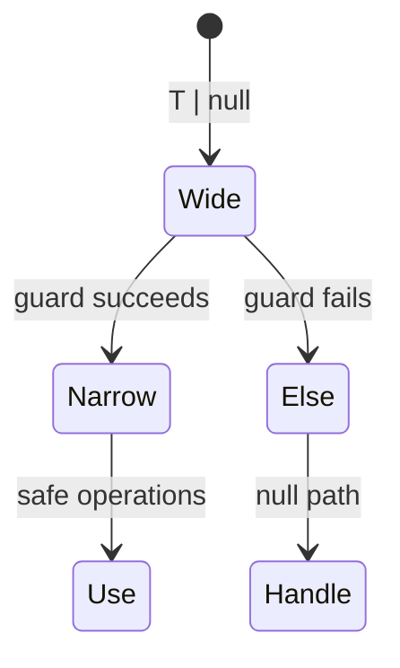
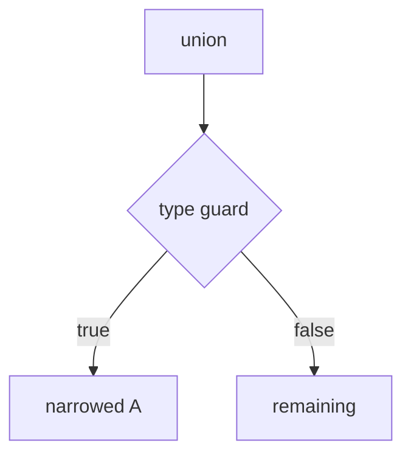

# Type Narrowing

<TopicMeta />

<Prerequisites />

::: tip Published
This page meets the handbook **published** bar: deep explanation, ≥10 common mistakes, and official references. Further engine-level errata welcome via PR.
:::

## Introduction

**Type narrowing** is how TypeScript refines a wide type to a smaller one inside a branch. After `if (typeof x === 'string')`, `x` is `string` in that block.

Narrowing is the practical heart of `strictNullChecks` and discriminated unions.

## Why does it exist?

Real data is unions: `T | null`, network results, UI states. Narrowing lets you handle each case without unsafe casts.

## Historical Background

Control-flow analysis grew more precise across TS versions—discriminated unions, `in` checks, assertion functions (`asserts x is T`), and better analysis of assignments.

## Mental Model

Each check is a **type guard** that splits the possibility space. Discriminants (`kind: 'a' | 'b'`) are the most scalable pattern for app state.

## Internal Workflow

1. Model state as a discriminated union.
2. `switch (state.kind)` for exhaustiveness.
3. Use `typeof` / `Array.isArray` / `in` for built-ins.
4. Write `function isUser(v: unknown): v is User` at boundaries.
5. Avoid `!` non-null assertions except with proof.

## Lifecycle



## Browser Perspective

Not applicable.

## JavaScript Engine Perspective

Guards are real runtime checks; narrowing mirrors those checks in type space.

## React Perspective

Render branches on `status === "success"` narrow data props. Event targets often need `instanceof HTMLInputElement`.

## Next.js Perspective

Not applicable.

## Server Perspective

Not applicable.

## Network Perspective

Not applicable.

## Memory Perspective

Not applicable.

## Performance

Runtime guards are cheap compared to wrong-path bugs. Keep predicates honest—lying predicates are worse than `any`.

## Production Example

API handlers validate with a type predicate; UI reducers use `status` discriminants so loading spinners and error toasts typecheck exhaustively.

## Code Examples

```ts
type Shape =
  | { kind: 'circle'; radius: number }
  | { kind: 'rect'; w: number; h: number }

function area(s: Shape): number {
  switch (s.kind) {
    case 'circle':
      return Math.PI * s.radius ** 2
    case 'rect':
      return s.w * s.h
  }
}

function isNonEmptyString(v: unknown): v is string {
  return typeof v === 'string' && v.length > 0
}
```

## Diagrams



## Common Mistakes

1. Using `as` instead of a real guard
2. Type predicates that return true for invalid values
3. Optional chaining that leaves types too wide for later logic
4. Switch on non-discriminant fields
5. Mutating a variable after narrowing and expecting the narrow to stick incorrectly
6. Ignoring the `default`/`never` exhaustiveness pattern
7. Overlooking an edge case #1 specific to 07-typescript.type-narrowing in production traffic
8. Overlooking an edge case #2 specific to 07-typescript.type-narrowing in production traffic
9. Overlooking an edge case #3 specific to 07-typescript.type-narrowing in production traffic
10. Overlooking an edge case #4 specific to 07-typescript.type-narrowing in production traffic


## Best Practices

- Discriminants named `type`/`kind`/`status`
- Assert never in default for exhaustiveness
- Keep predicates next to validators
- Prefer equality checks on literals

## Anti-patterns

- Boolean flags instead of unions (`isLoading` + `data` + `error` soup)
- `x!` everywhere after optional fetch

## Comparison

| Technique | Runtime? | Best for |
| --- | --- | --- |
| `typeof` | Yes | Primitives |
| `instanceof` | Yes | Classes / DOM |
| Discriminant | Yes | App state |
| `v is T` predicate | Yes | Boundaries |
| Assignment assertion | No | Rare, proven holes |

## Interview Questions

### Easy

**Q:** How do you narrow `string | undefined`?

**A:** Check with `if (x !== undefined)` or truthiness carefully; then use `x` as `string`.

### Medium

**Q:** What is a discriminated union?

**A:** A union of object types sharing a literal field (discriminant) that TypeScript uses to narrow the rest of the fields in each branch.

### Hard

**Q:** How do you ensure switch exhaustiveness?

**A:** Add `default: { const _exhaustive: never = state; throw ... }` so new variants cause a type error until handled.

## Summary

- Narrowing refines unions via real checks
- Discriminated unions scale best for UI/state
- Predicates must be truthful at runtime

## References

- [Narrowing](https://www.typescriptlang.org/docs/handbook/2/narrowing.html)
- [Discriminated unions](https://www.typescriptlang.org/docs/handbook/2/narrowing.html#discriminated-unions)

<RelatedTopics />


Prev: [`07-typescript.compiler`](/07-typescript/compiler/) · Next: [`07-typescript.satisfies`](/07-typescript/satisfies/)
