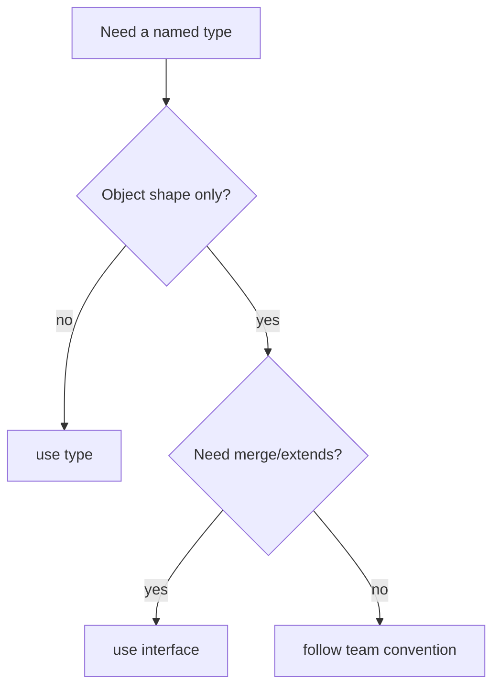
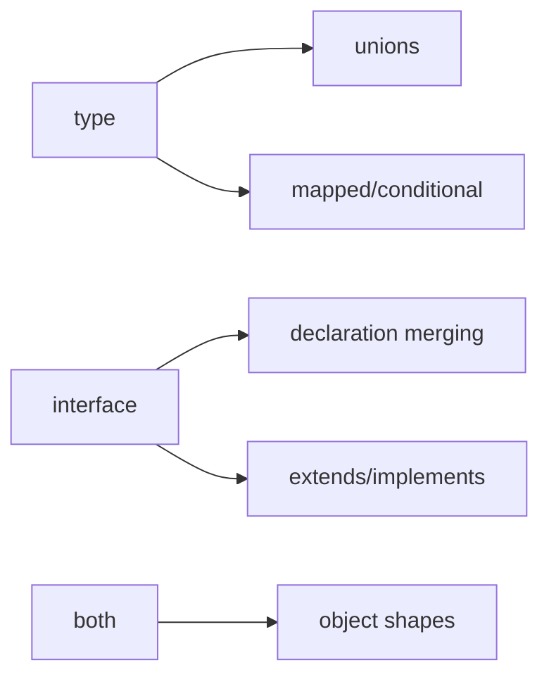

# Type vs Interface

<TopicMeta />

<Prerequisites />

::: tip Published
This page meets the handbook **published** bar: deep explanation, ≥10 common mistakes, and official references. Further engine-level errata welcome via PR.
:::

## Introduction

**`type` vs `interface`** is a style-and-capability choice, not a runtime one. Both can describe object shapes. `type` can alias any type (unions, tuples, mapped types). `interface` can merge and is optimized for extendable object contracts.

Pick deliberately; inconsistency across a codebase costs more than either choice.

## Why does it exist?

Without guidance, PRs bikeshed every props declaration. A clear rule reduces noise: e.g. “interfaces for objects that may extend; types for unions and utilities,” or “types everywhere except ambient merges.”

## Historical Background

Early TS culture favored interfaces. As conditional and mapped types matured (TS 2.x–4.x), `type` became necessary for advanced modeling. React and many style guides now accept either; the handbook documents both as valid for objects.

## Mental Model

Ask two questions:

1. Is this **only an object shape** that others might `extends` or augment? → `interface` is natural.
2. Is this a **union, intersection combinator, primitive alias, tuple, or mapped type**? → `type` is required or clearer.

If neither merge nor advanced type features matter, follow the repo convention and move on.

## Internal Workflow

1. Read the team convention (document it in CONTRIBUTING if missing).
2. Default: `type` for unions/aliases; `interface` for exported object props if you want extends.
3. Never convert a union to a fake interface with optional fields.
4. Avoid dual exports (`type X` + `interface X`) unless merging is intentional.

## Lifecycle



## Browser Perspective

Not applicable.

## JavaScript Engine Perspective

Not applicable.

## React Perspective

Props and state: either works. Many codebases use `type Props = { ... }` for components and `interface` for design-system public objects.

## Next.js Perspective

Same as React; prefer serializable object types for RSC props.

## Server Perspective

Not applicable.

## Network Perspective

Not applicable.

## Memory Perspective

Not applicable.

## Performance

No runtime difference. Slight language-service differences are negligible compared to project size.

## Production Example

A team documents: “Exported React props → `type`; ambient augmentation → `interface`; domain unions → `type`.” Reviewers reject bikeshed-only changes that flip between them without a reason.

## Code Examples

```ts
// Union — must be type
type Status = 'idle' | 'loading' | 'error'

// Object — either works
interface UserIface {
  id: string
}
type UserType = {
  id: string
}

// Interface extends interface
interface Timestamped extends UserIface {
  createdAt: string
}

// Type intersection
type Timestamped2 = UserType & { createdAt: string }
```

## Diagrams



## Common Mistakes

1. Rewriting every `type` to `interface` (or vice versa) in drive-by PRs
2. Using interface for `string | number`
3. Relying on merge accidentally by duplicating interface names
4. Teaching juniors that one is “more OOP” and therefore better
5. Exporting both an interface and a value with confusing same names without care
6. Assuming performance differs at runtime
7. Overlooking an edge case #1 specific to 07-typescript.type-vs-interface in production traffic
8. Overlooking an edge case #2 specific to 07-typescript.type-vs-interface in production traffic
9. Overlooking an edge case #3 specific to 07-typescript.type-vs-interface in production traffic
10. Overlooking an edge case #4 specific to 07-typescript.type-vs-interface in production traffic


## Best Practices

- Document a one-paragraph team rule
- Use the construct that expresses the idea with less ceremony
- Prefer discriminated unions (`type`) over boolean soup
- Keep public API types stable; rename churn hurts consumers

## Anti-patterns

- Religious bans (“never interface”) without handling augmentation
- Hungarian naming `IUser` / `TUser` everywhere

## Comparison

| Need | Prefer |
| --- | --- |
| Union / intersection alias | `type` |
| Mapped / conditional | `type` |
| Declaration merging | `interface` |
| `class implements` contract | `interface` |
| Component props (either) | Team convention |

## Interview Questions

### Easy

**Q:** Can an interface represent a union of string literals?

**A:** No. Use a `type` alias for unions.

### Medium

**Q:** Name one capability unique to interfaces versus type aliases.

**A:** Declaration merging: multiple interface blocks with the same name combine. Type aliases do not merge.

### Hard

**Q:** How do you evolve a public props type without breaking consumers?

**A:** Add optional fields carefully, avoid removing/renaming, prefer additive changes, and use unions for new variants. Whether props are `type` or `interface` matters less than semver discipline.

## Summary

- `type` and `interface` both erase; choose by capability and convention
- Unions and mapped types need `type`
- Merging and classic `extends` favor `interface`

## References

- [TypeScript Handbook — Differences Between Type Aliases and Interfaces](https://www.typescriptlang.org/docs/handbook/2/everyday-types.html#differences-between-type-aliases-and-interfaces)
- [React TypeScript Cheatsheet](https://react-typescript-cheatsheet.netlify.app/)

<RelatedTopics />


Prev: [`07-typescript.interfaces`](/07-typescript/interfaces/) · Next: [`07-typescript.generics`](/07-typescript/generics/)
