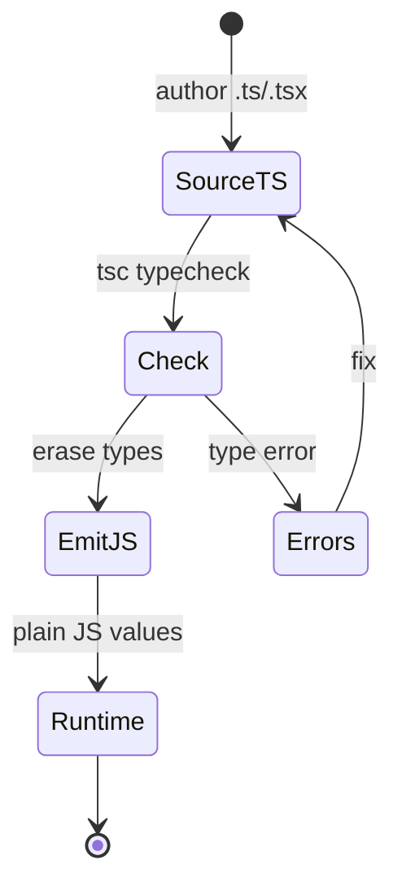
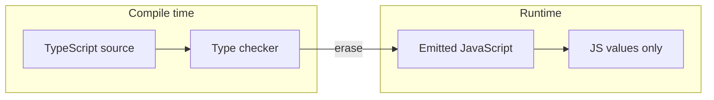
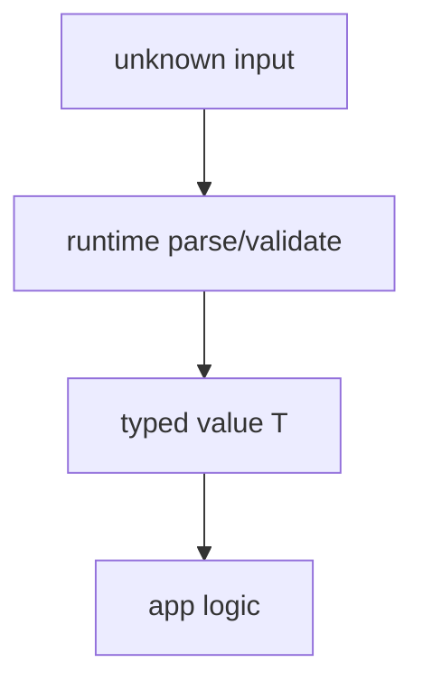

# Types

<TopicMeta />

<Prerequisites />

::: tip Published
This page meets the handbook **published** bar: deep explanation, ≥10 common mistakes, and official references. Further engine-level errata welcome via PR.
:::

## Introduction

**Types** in TypeScript are a compile-time description of values. They do not exist at runtime: `tsc` (or a bundler plugin) checks them, then emits plain JavaScript with types erased.

A type answers: “What shapes and operations are allowed on this value?” Mastering types is less about syntax and more about modeling domain data so illegal states become unrepresentable.

## Why does it exist?

JavaScript’s dynamic typing is flexible but silent: typos, wrong shapes from APIs, and `undefined` access fail only when that path runs. Types shift many of those failures to edit/CI time.

Teams adopt TypeScript types to:

- document APIs without stale comments
- refactor with confidence across large codebases
- catch contract drift between frontend and backend payloads
- enable editor tooling (completions, jump-to-definition, safe rename)

## Historical Background

TypeScript launched in 2012 as a gradual typing layer over JavaScript. Early versions emphasized optional annotations and classes; later releases added mapped types, conditional types, template literal types, and `satisfies`.

The design stayed **structural** (shape-based) rather than nominal like Java/C#, which fits JS’s duck-typing culture. Types remain erasable by default—unlike languages that emit runtime type metadata.

## Mental Model

Hold three layers:

1. **Value space** — what exists at runtime (`42`, `{ id: "a" }`, functions)
2. **Type space** — what the checker knows (`number`, `{ id: string }`, call signatures)
3. **Control flow** — how narrowing updates type space as the program branches

Most bugs come from confusing these layers: treating a type as a runtime check, or assuming `typeof` mirrors your TypeScript type alias.

## Internal Workflow

1. Start from **values and APIs** you actually have (JSON, DOM, props).
2. Write the narrowest accurate type: prefer unions of literals over `string` when the set is closed.
3. Let inference fill locals; annotate **module boundaries** (exports, public functions, component props).
4. Use narrowing (`typeof`, discriminants, predicates) instead of casts.
5. Only reach for `unknown` → narrow, or intentional escape hatches (`as const`, generics) when the model needs them.

## Lifecycle



- **Author** — types live only in source
- **Check** — structural assignability, control-flow analysis
- **Emit** — JavaScript with no type objects
- **Runtime** — only values and JS semantics remain

## Browser Perspective

Browsers never see TypeScript types. What ships is JS. DOM typings (`lib.dom.d.ts`) describe browser APIs so you get typed `document`, `fetch`, and events—still erased before load.

## JavaScript Engine Perspective

V8/JSC/SpiderMonkey execute the emitted JS. A refined TypeScript type does not change hidden classes or inline caches by itself; only the emitted code shape does.

## React Perspective

Component props, state, and context are modeled as types. Incorrect prop types are the most common TS×React win: the checker blocks passing `user` where `userId: string` was required.

## Next.js Perspective

Shared types between Server and Client Components must stay serializable across the RSC boundary. Functions and class instances are not valid props from server to client.

## Server Perspective

On Node/Edge, the same erasure rule applies. Validate external input at runtime (`zod`, etc.); TypeScript alone does not authenticate JSON from the network.

## Network Perspective

HTTP payloads are `unknown` until parsed. Type assertions on `response.json()` without validation are a common production footgun.

## Memory Perspective

Types do not allocate. Generics and aliases are compile-time only. Runtime memory follows the JS values you construct.

## Performance

Type-checking cost is a **dev/CI** concern (`tsc` time, IDE lag on huge projects). Runtime performance is unaffected by type annotations.

Tips: project references / `composite`, skip `skipLibCheck` only when you understand the trade-off, and avoid pathological conditional types in hot public APIs if editor performance suffers.

## Production Example

A payments UI receives `{ amount: number; currency: "USD" | "EUR" }` from an API. The team defines a shared type, parses with a schema at the boundary, and uses the narrowed type through the form and receipt components. Invalid currency strings fail in CI or at parse time—not after the charge call.

## Code Examples

```ts
type Currency = 'USD' | 'EUR'

interface Money {
  amount: number
  currency: Currency
}

function formatMoney(m: Money): string {
  return new Intl.NumberFormat('en', {
    style: 'currency',
    currency: m.currency,
  }).format(m.amount)
}

// Structural typing: extra properties are allowed when the source is a variable
const payload = { amount: 19.99, currency: 'USD' as const, debug: true }
formatMoney(payload)

// Fresh object literals are excess-property checked:
// formatMoney({ amount: 1, currency: 'USD', debug: true }) // error
```

```ts
type Result<T> =
  | { ok: true; value: T }
  | { ok: false; error: string }

function unwrap<T>(r: Result<T>): T {
  if (!r.ok) throw new Error(r.error)
  return r.value // narrowed to T
}
```

## Diagrams





## Common Mistakes

1. Using `any` to silence errors until the whole module is untyped
2. Asserting `as User` on `fetch` JSON without runtime validation
3. Confusing `interface` merge / open types with runtime class identity
4. Annotating every local and fighting inference
5. Using `enum` + numeric values without understanding reverse mapping emit
6. Believing TypeScript enforces types in the browser after deploy
7. Overlooking an edge case #1 specific to 07-typescript.types in production traffic
8. Overlooking an edge case #2 specific to 07-typescript.types in production traffic
9. Overlooking an edge case #3 specific to 07-typescript.types in production traffic
10. Overlooking an edge case #4 specific to 07-typescript.types in production traffic


## Best Practices

- Annotate boundaries; let inference handle internals
- Prefer `unknown` + narrowing over `any`
- Model illegal states out of the type (discriminated unions)
- Keep domain types in a shared module used by UI and tests
- Pair network boundaries with runtime schema validation

## Anti-patterns

- Ubiquitous `as any` / double assertions
- God-object types that mirror the entire Redux store as one interface
- Duplicating the same union in five files instead of one source of truth

## Comparison

| Construct | Erased at runtime? | Typical use |
| --- | --- | --- |
| `type` / `interface` | Yes | Shapes, unions, props |
| `enum` (TS) | No (emits JS) | Prefer unions unless you need emit |
| `as const` | Yes (widening control) | Literal inference |
| `satisfies` | Yes | Check value against type, keep narrow inference |
| Zod/Yup schemas | No | Runtime validation |

## Interview Questions

### Easy

**Q:** Do TypeScript types exist at runtime?

**A:** No. By default types are erased during compilation; only JavaScript values remain unless you emit something like enums or decorators with runtime semantics.

### Medium

**Q:** What is structural typing, and how does excess property checking differ for object literals?

**A:** Assignability is based on shape: if `Y` has at least `X`’s properties, `Y` is assignable to `X`. Fresh object literals get excess-property checks so typos in option bags are caught; variables are not excess-checked the same way.

### Hard

**Q:** How would you type an external JSON API safely in production?

**A:** Treat `response.json()` as `unknown`, validate with a schema (or hand-written guards), infer/narrow to a TypeScript type from that schema, and never trust a bare assertion. Keep the schema as the runtime source of truth.

## Summary

- Types describe values at compile time and erase before runtime
- TypeScript is structural: shapes matter more than nominal names
- Annotate boundaries; validate untrusted input at runtime
- Unions and narrowing model real control flow better than casts

## References

- [TypeScript Handbook — Everyday Types](https://www.typescriptlang.org/docs/handbook/2/everyday-types.html)
- [TypeScript Handbook — Type Compatibility](https://www.typescriptlang.org/docs/handbook/type-compatibility.html)
- [TypeScript release notes](https://www.typescriptlang.org/docs/handbook/release-notes/overview.html)

<RelatedTopics />


Next: [`07-typescript.interfaces`](/07-typescript/interfaces/)
