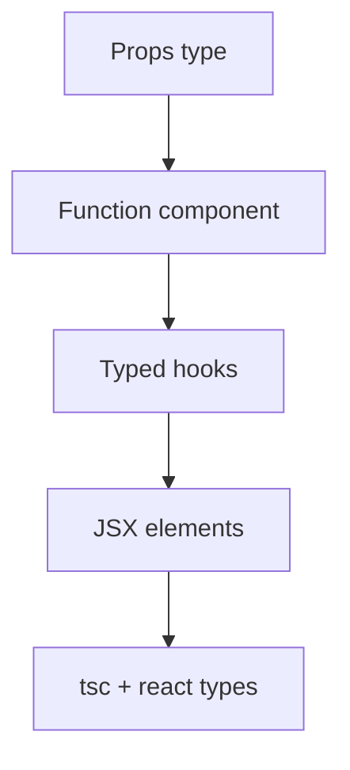
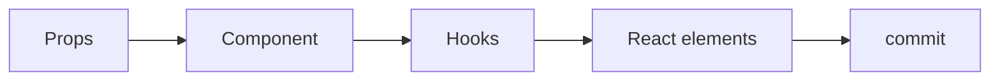

# TypeScript with React

<TopicMeta />

<Prerequisites />

::: tip Published
This page meets the handbook **published** bar: deep explanation, ≥10 common mistakes, and official references. Further engine-level errata welcome via PR.
:::

## Introduction

**TypeScript with React** means modeling UI contracts: props, state, discriminated UI states, DOM events, and hook return types. The JSX namespace and `@types/react` connect components to the type system.

The goal is not maximum generics—it is catching wrong props and impossible states before runtime.

## Why does it exist?

React apps pass nested props everywhere. Without types, refactors break children silently. With types, renaming `userName` to `name` fails at every callsite in CI.

## Historical Background

`@types/react` evolved with hooks, concurrent features, and the automatic JSX runtime. React 19 improves type integration further (ref as props, etc.). Prefer current `@types/react` matching your React major.

## Mental Model

A component is a function from **props type** to React nodes. Hooks are generic functions. Events are typed DOM wrappers. Children are `React.ReactNode` unless you need stricter slots.

## Internal Workflow

1. Type props explicitly on exported components.
2. Model async UI with discriminated unions, not multiple booleans.
3. Use `ComponentProps<typeof X>` when wrapping.
4. Type context with a real value type + null guard / provider requirement.
5. Prefer `ReactElement`/`ReactNode` accurately for slots.

## Lifecycle



## Browser Perspective

Event types (`React.ChangeEvent<HTMLInputElement>`) mirror DOM.

## JavaScript Engine Perspective

Not applicable.

## React Perspective

This topic is the React×TS intersection—props, hooks, elements.

## Next.js Perspective

Server Components: no event handlers / hooks in server files; types should reflect serializable props.

## Server Perspective

Not applicable.

## Network Perspective

Not applicable.

## Memory Perspective

Not applicable.

## Performance

Heavy prop types are fine; avoid generating enormous unions per styled component if IDE lag appears.

## Production Example

A form component takes `type FormState = { status: 'editing'; values: V } | { status: 'submitting'; values: V } | { status: 'error'; values: V; message: string }` so submit buttons and error banners are correctly gated.

## Code Examples

```tsx
type ButtonProps = {
  tone?: 'primary' | 'danger'
  onClick?: (e: React.MouseEvent<HTMLButtonElement>) => void
  children: React.ReactNode
}

export function Button({ tone = 'primary', onClick, children }: ButtonProps) {
  return (
    <button data-tone={tone} onClick={onClick}>
      {children}
    </button>
  )
}

type User = { id: string; name: string }
const UserCtx = React.createContext<User | null>(null)

export function useUser(): User {
  const u = React.useContext(UserCtx)
  if (!u) throw new Error('UserProvider missing')
  return u
}
```

## Diagrams



## Common Mistakes

1. Typing children as `JSX.Element` when `ReactNode` is needed (strings/arrays)
2. `React.FC` with implicit children confusion (legacy)
3. Leaving context as `createContext(null!)` without guards
4. Using `any` for event handlers
5. Incorrectly typing `useRef` initial null vs element
6. Duplicating props instead of `ComponentProps<typeof Button>`
7. Overlooking an edge case #1 specific to 07-typescript.typescript-with-react in production traffic
8. Overlooking an edge case #2 specific to 07-typescript.typescript-with-react in production traffic
9. Overlooking an edge case #3 specific to 07-typescript.typescript-with-react in production traffic
10. Overlooking an edge case #4 specific to 07-typescript.typescript-with-react in production traffic


## Best Practices

- Explicit props types on exports
- Discriminated UI state
- Wrap context with safe hooks
- Keep RSC/client boundaries reflected in types

## Anti-patterns

- Huge optional props bags instead of variants
- `as any` on JSX to silence children errors

## Comparison

| Pattern | Prefer |
| --- | --- |
| Props object | Named `type`/`interface` |
| Wrap DOM | `ComponentProps<'div'>` |
| Async view state | Discriminated union |
| Context | `T \| null` + hook guard |

## Interview Questions

### Easy

**Q:** How do you type component props?

**A:** Declare a props type/interface and annotate the function parameter; children usually `React.ReactNode`.

### Medium

**Q:** How do you type `useRef` for a DOM element?

**A:** `useRef<HTMLInputElement | null>(null)` and pass `ref` to the element; narrow before reading `.current` properties.

### Hard

**Q:** How do you type a polymorphic `as` prop safely?

**A:** Use generics constrained to element types, merge props with `ComponentPropsWithoutRef<E>`, and omit conflicting props—or use a well-tested utility. Keep it simple unless you truly need polymorphism.

## Summary

- Type props, state, events, and context deliberately
- Discriminated unions model UI honestly
- Match `@types/react` to your React version

## References

- [React + TypeScript Cheatsheet](https://react-typescript-cheatsheet.netlify.app/)
- [Typing React](https://react.dev/learn/typescript)
- [DefinitelyTyped React](https://github.com/DefinitelyTyped/DefinitelyTyped/tree/master/types/react)

<RelatedTopics />


Prev: [`07-typescript.enums-and-alternatives`](/07-typescript/enums-and-alternatives/)
