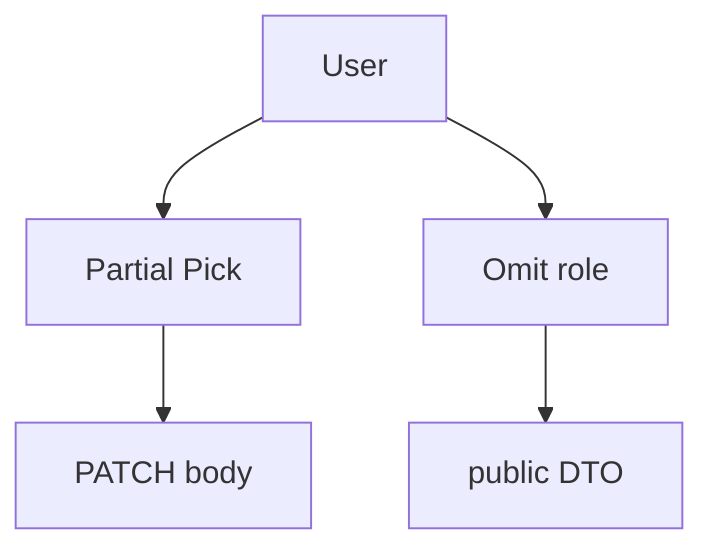

# Utility Types

<TopicMeta />

<Prerequisites />

::: tip Published
This page meets the handbook **published** bar: deep explanation, ≥10 common mistakes, and official references. Further engine-level errata welcome via PR.
:::

## Introduction

**Utility types** are generic type transforms shipped with TypeScript. They derive new types from old ones: make fields optional (`Partial`), select keys (`Pick`), build maps (`Record`), or extract function types (`Parameters`, `ReturnType`).

They encode common mapped-type patterns so you do not reinvent `{ [K in keyof T]?: T[K] }` at every callsite.

## Why does it exist?

API evolution and UI props constantly need “same as X but different.” Utility types keep those derivatives linked to the source of truth so renaming a field updates every `Pick`/`Omit` consumer.

## Historical Background

Many utilities were added as the mapped-types feature landed (TS 2.1+). The set grew with `Omit` (3.5), template-literal utilities, and `Awaited`. Knowing they are ordinary types in `lib.es5.d.ts` / later libs demystifies them—you can jump-to-definition and learn the pattern.

## Mental Model

Treat utilities as **pure functions in type space**: input type → output type. Prefer deriving from a canonical domain type over maintaining parallel interfaces by hand.

## Internal Workflow

1. Keep a canonical `User` / `Props` type.
2. Derive view models with `Pick` / `Omit` / `Partial`.
3. Use `Record<K, V>` for keyed maps with known keys.
4. Extract function contracts with `ReturnType` / `Parameters` instead of duplicating signatures.
5. If a utility becomes unreadable, write a named alias or custom mapped type.

## Lifecycle


## Browser Perspective

Not applicable.

## JavaScript Engine Perspective

Erased at runtime.

## React Perspective

`Partial<Props>` for updates, `ComponentProps<'button'>` / `React.ComponentProps<typeof Button>` for wrapping DOM/design-system components.

## Next.js Perspective

Derive server action input types from shared domain types rather than re-declaring.

## Server Perspective

Not applicable.

## Network Perspective

Not applicable.

## Memory Perspective

Not applicable.

## Performance

Deeply nested utility compositions can slow the checker; flatten with intermediate named aliases.

## Production Example

Form edit screens use `type UserUpdate = Partial<Pick<User, 'email' | 'displayName'>>` so PATCH bodies stay aligned with `User` without allowing `id` changes.

## Code Examples

```ts
type User = { id: string; email: string; role: 'user' | 'admin' }

type UserPatch = Partial<Pick<User, 'email' | 'role'>>
type UserPublic = Omit<User, 'role'>
type RoleMap = Record<User['role'], string>

type AsyncUser = () => Promise<User>
type UserResolved = Awaited<ReturnType<AsyncUser>>
```

## Diagrams



## Common Mistakes

1. `Partial<T>` on everything so required fields become accidentally optional
2. Using `Omit` with mistyped key strings that silently do nothing useful
3. `Record<string, T>` when a closed key union is safer
4. Copy-pasting utility results instead of aliasing a name
5. Confusing `Readonly<T>` with runtime immutability
6. Using `NonNullable` to hide real null checks instead of handling null
7. Overlooking an edge case #1 specific to 07-typescript.utility-types in production traffic
8. Overlooking an edge case #2 specific to 07-typescript.utility-types in production traffic
9. Overlooking an edge case #3 specific to 07-typescript.utility-types in production traffic
10. Overlooking an edge case #4 specific to 07-typescript.utility-types in production traffic


## Best Practices

- Name derived types (`UserPatch`) at module scope
- Prefer key unions from `keyof` / indexed access
- Read lib definitions when unsure what a utility does
- Compose small utilities rather than one giant nested expression inline

## Anti-patterns

- `type X = Partial<Omit<Pick<...>>>` ten layers deep in a props file
- Reimplementing `Pick` by hand differently in each package

## Comparison

| Utility | Effect |
| --- | --- |
| `Partial<T>` | All props optional |
| `Required<T>` | All props required |
| `Pick<T,K>` | Subset of keys |
| `Omit<T,K>` | Remove keys |
| `Record<K,V>` | Map from keys to V |
| `ReturnType<F>` | Function return type |

## Interview Questions

### Easy

**Q:** What does `Partial<T>` do?

**A:** It produces a type with the same properties as `T` but all marked optional.

### Medium

**Q:** How is `Omit` different from `Pick`?

**A:** `Pick` keeps listed keys; `Omit` removes listed keys. Both are mapped types over `keyof T`.

### Hard

**Q:** Implement a `StrictOmit` that errors on keys not in `T`.

**A:** Constrain the keys parameter: `type StrictOmit<T, K extends keyof T> = Omit<T, K>`. Built-in `Omit` is looser (`K extends keyof any`), so typos can slip through.

## Summary

- Utilities derive types from a source of truth
- They are mapped/conditional types in lib definitions
- Name derivatives; avoid unreadable nests

## References

- [Utility Types](https://www.typescriptlang.org/docs/handbook/utility-types.html)
- [Mapped Types](https://www.typescriptlang.org/docs/handbook/2/mapped-types.html)

<RelatedTopics />


Prev: [`07-typescript.generics`](/07-typescript/generics/) · Next: [`07-typescript.type-inference`](/07-typescript/type-inference/)
