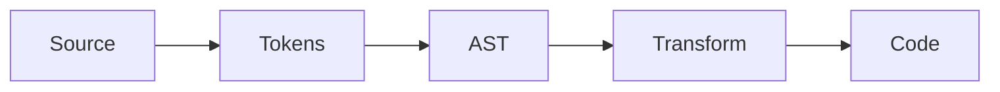
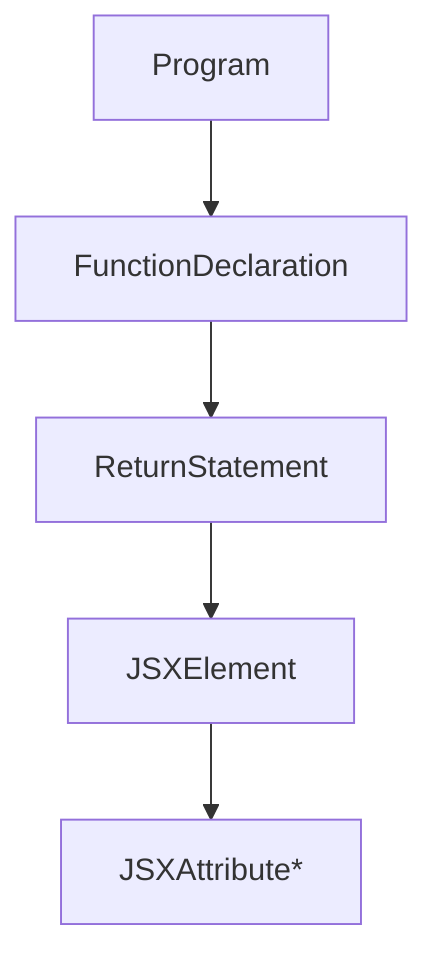

# AST

<TopicMeta />

<Prerequisites />

::: tip Published
This page meets the handbook **published** bar: deep explanation, ≥10 common mistakes, and official references. Further engine-level errata welcome via PR.
:::

## Introduction

An **AST** (Abstract Syntax Tree) is a structured tree representation of source code. Compilers, formatters, ESLint, and React’s JSX transform all operate on ASTs rather than raw text.

For JSX, a `<Button foo={1} />` becomes nodes like `JSXElement`, `JSXAttribute`, `JSXExpressionContainer`.

## Why does it exist?

Text transforms are fragile. ASTs make “find every JSX attribute named `className`” reliable and enable source maps and precise lint rules.

## Historical Background

Compiler theory long used ASTs. In JS tooling, Espree/Babel/TypeScript/SWC each define AST shapes. ESTree popularized a common JS AST dialect; JSX extends it.

## Mental Model

Source → tokens → AST → transforms → code. Nodes have `type`, child nodes, and location (`loc`). Tools traverse with visitors (`enter`/`exit`).

## Internal Workflow

1. Parse with a parser matching your syntax (TSX).
2. Traverse for analysis (lint) or rewrite (compile).
3. Generate code if transforming.
4. Preserve locations for maps/diagnostics.

## Lifecycle



## Browser Perspective

Not applicable.

## JavaScript Engine Perspective

Engines parse differently (not your tooling AST).

## React Perspective

JSX AST is the input to the React refresh/babel/SWC transforms and to ESLint react plugins.

## Next.js Perspective

Not applicable.

## Server Perspective

Not applicable.

## Network Perspective

Not applicable.

## Memory Perspective

Not applicable.

## Performance

Parsing dominates cold tool startup; incremental parsers help IDEs.

## Production Example

A codemod uses jscodeshift (AST) to rename a prop across hundreds of components safely—regex would break comments/strings.

## Code Examples

```js
// Conceptual JSX element node
{
  type: 'JSXElement',
  openingElement: {
    type: 'JSXOpeningElement',
    name: { type: 'JSXIdentifier', name: 'Button' },
    attributes: [/* JSXAttribute nodes */],
  },
  children: [],
}
```

## Diagrams



## Common Mistakes

1. Trying to transform code with regex across a codebase
2. Assuming Babel AST === TypeScript AST
3. Losing `loc` info so source maps break
4. Mutating AST incorrectly and emitting invalid code
5. Ignoring JSX text vs expression children differences
6. Running codemods without formatting/tests
7. Overlooking an edge case #1 specific to 08-jsx-and-react-runtime.ast in production traffic
8. Overlooking an edge case #2 specific to 08-jsx-and-react-runtime.ast in production traffic
9. Overlooking an edge case #3 specific to 08-jsx-and-react-runtime.ast in production traffic
10. Overlooking an edge case #4 specific to 08-jsx-and-react-runtime.ast in production traffic


## Best Practices

- Use established parsers for your language
- Prefer proven codemod runners
- Always snapshot-test transforms
- Keep plugins small and composable

## Anti-patterns

- Hand-rolled parsers for JSX in app code
- Silent AST mutations in shared lint rules

## Comparison

| Parser ecosystem | Used by |
| --- | --- |
| Babel AST | Babel, many codemods |
| TS AST | `tsc`, ts-eslint |
| ESTree | ESLint |

## Interview Questions

### Easy

**Q:** What is an AST?

**A:** A tree representation of source code structure used by compilers and tools.

### Medium

**Q:** Why do JSX transforms need an AST?

**A:** To correctly rewrite nested elements, attributes, and expressions without breaking string contents or comments.

### Hard

**Q:** What breaks when two tools disagree on AST shape?

**A:** Plugins can miss nodes or crash; you must run transforms in a compatible pipeline (e.g. TS-ESLint vs Babel parser options).

## Summary

- ASTs make code analysis and transforms reliable
- JSX has dedicated node types
- Tooling ecosystems differ in AST dialects

## References

- [React Documentation](https://react.dev/)
- [React Reference](https://react.dev/reference/react)
- [Babel Parser](https://babeljs.io/docs/babel-parser)
- [ESTree JSX](https://github.com/facebook/jsx)

<RelatedTopics />


Prev: [`08-jsx-and-react-runtime.babel`](/08-jsx-and-react-runtime/babel/) · Next: [`08-jsx-and-react-runtime.jsx-transform`](/08-jsx-and-react-runtime/jsx-transform/)
