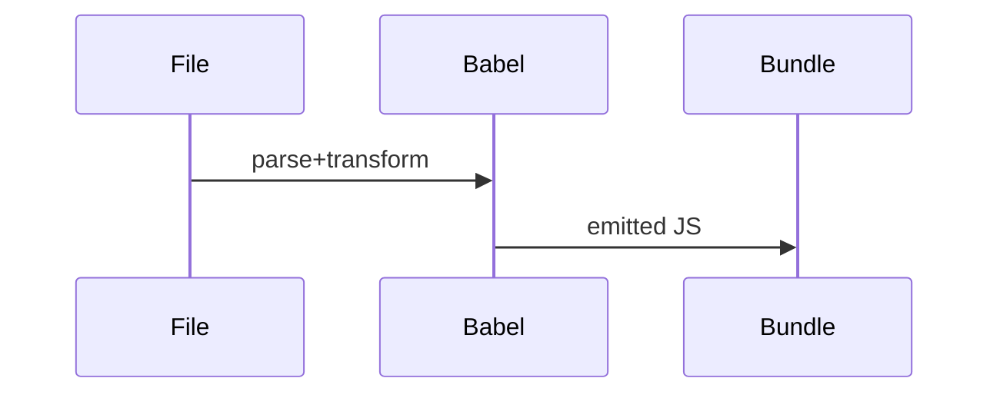

# Babel

<TopicMeta />

<Prerequisites />

::: tip Published
This page meets the handbook **published** bar: deep explanation, ≥10 common mistakes, and official references. Further engine-level errata welcome via PR.
:::

## Introduction

**Babel** is a toolchain that parses JavaScript/TypeScript-ish syntax to an AST, runs transform plugins, and generates code. Historically it was the default way to compile JSX and ESNext for browsers.

Many apps now use SWC/esbuild for speed, but Babel’s plugin model still matters for custom transforms and understanding how JSX becomes runtime calls.

## Why does it exist?

Browsers and engines lag language/proposal features. Babel let teams ship JSX and modern syntax early with a configurable plugin set.

## Historical Background

6to5 → Babel; the plugin/preset ecosystem exploded. `@babel/preset-react` encoded classic then automatic JSX runtimes. Bundlers increasingly embed SWC, but Babel remains in Jest and specialized pipelines.

## Mental Model

**Parse → transform visitors → generate**. Each plugin walks the AST and rewrites nodes. Presets are ordered plugin bundles. Source maps stitch original lines to output.

## Internal Workflow

1. Configure presets/plugins.
2. Parse file to AST (Babylon/@babel/parser).
3. Run plugin visitors (JSX → calls).
4. Generate code + source map.
5. Bundler consumes the result (or Babel runs inside the bundler).

## Lifecycle


## Browser Perspective

Not applicable.

## JavaScript Engine Perspective

Engines execute output JS only.

## React Perspective

`preset-react` selects classic vs automatic runtime and development helpers (`jsxDEV`).

## Next.js Perspective

Next.js moved toward SWC; Babel config is opt-in for custom plugins.

## Server Perspective

Not applicable.

## Network Perspective

Not applicable.

## Memory Perspective

Not applicable.

## Performance

Babel is slower than native transforms. Use it when you need plugins SWC cannot match; otherwise prefer faster compilers.

## Production Example

A design-system still runs a Babel plugin to strip data-test attributes in production builds while keeping them in test bundles.

## Code Examples

```js
// babel.config.cjs
module.exports = {
  presets: [
    ['@babel/preset-env', { targets: 'defaults' }],
    ['@babel/preset-react', { runtime: 'automatic' }],
    '@babel/preset-typescript',
  ],
}
```

## Diagrams



## Common Mistakes

1. Duplicate transforms (Babel + SWC both rewriting JSX differently)
2. Wrong `runtime` option vs React version
3. Not enabling TypeScript preset while parsing `.tsx`
4. Plugin order bugs that break other transforms
5. Shipping Babel-transformed test-only code to prod accidentally
6. Ignoring browserslist targets and over-transpiling
7. Overlooking an edge case #1 specific to 08-jsx-and-react-runtime.babel in production traffic
8. Overlooking an edge case #2 specific to 08-jsx-and-react-runtime.babel in production traffic
9. Overlooking an edge case #3 specific to 08-jsx-and-react-runtime.babel in production traffic
10. Overlooking an edge case #4 specific to 08-jsx-and-react-runtime.babel in production traffic


## Best Practices

- One transpile pipeline of truth
- Match JSX runtime to React 17+
- Cache Babel results in CI
- Prefer SWC/esbuild when plugins are unnecessary

## Anti-patterns

- Mega custom Babel stacks nobody can upgrade
- Transpiling `node_modules` wholesale without need

## Comparison

| Tool | Strength | Weakness |
| --- | --- | --- |
| Babel | Plugins | Speed |
| SWC | Speed | Fewer custom plugins |
| esbuild | Speed/bundling | Limited AST plugins |

## Interview Questions

### Easy

**Q:** What does Babel do to JSX?

**A:** A plugin transforms JSX AST nodes into function calls for the chosen runtime.

### Medium

**Q:** What is the difference between a preset and a plugin?

**A:** A plugin is one transform; a preset is a curated set of plugins/options.

### Hard

**Q:** When would you keep Babel in a Next.js app that defaults to SWC?

**A:** When you need a Babel-only plugin (custom AST rewrite) and accept the compile-time cost for those files.

## Summary

- Babel is parse → transform → generate
- JSX support lives in presets/plugins
- Modern stacks often replace Babel with SWC/esbuild

## References

- [React Documentation](https://react.dev/)
- [React Reference](https://react.dev/reference/react)
- [Babel Docs](https://babeljs.io/docs/)
- [@babel/preset-react](https://babeljs.io/docs/babel-preset-react)

<RelatedTopics />


Prev: [`08-jsx-and-react-runtime.jsx`](/08-jsx-and-react-runtime/jsx/) · Next: [`08-jsx-and-react-runtime.ast`](/08-jsx-and-react-runtime/ast/)
