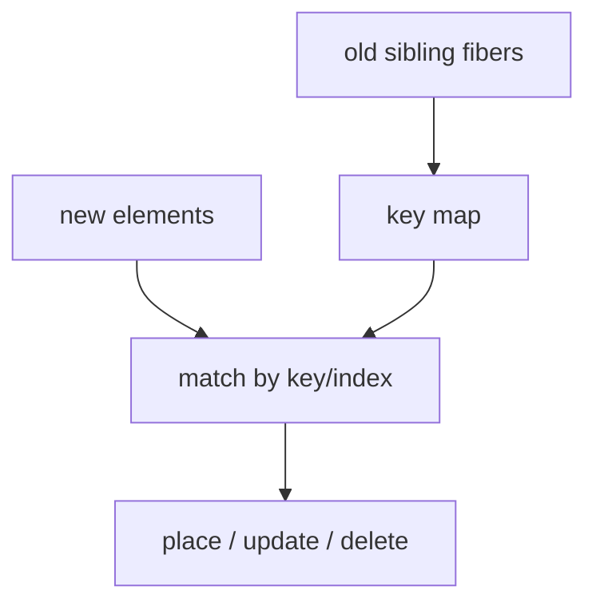
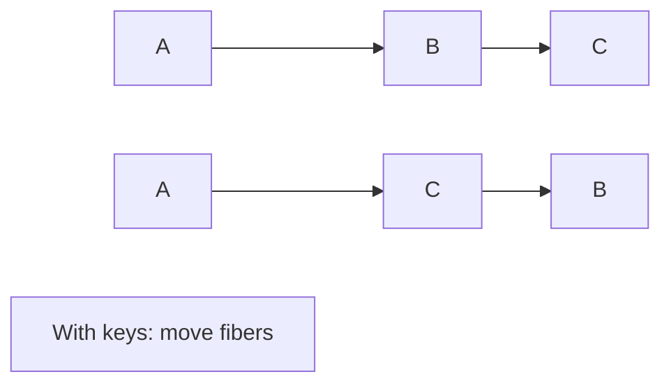

# Diffing Algorithm

<TopicMeta />

<Prerequisites />

::: tip Published
This page meets the handbook **published** bar: deep explanation, ≥10 common mistakes, and official references. Further engine-level errata welcome via PR.
:::

## Introduction

React’s **diffing algorithm** is the concrete set of heuristics inside reconciliation: compare trees level by level, treat different element types as different subtrees, and match list children by key.

It is not a generic Myers diff of DOM strings—it is tuned for UI trees.

## Why does it exist?

UI updates must be fast and predictable. Heuristics encode React’s bets: components rarely change type at a position; lists have stable IDs; depth-first structure matches how UIs nest.

## Historical Background

Described in early React docs (“Reconciliation”). Fiber kept the heuristics while changing execution/scheduling. Warnings for missing keys came from real-world misuse of index matching.

## Mental Model

**Assumptions**:

1. Different `type` ⇒ replace entire subtree.
2. Diff only among siblings (not cross-level moves as one operation).
3. Keys make sibling identity stable.

From those, React derives placements/deletions efficiently.

## Internal Workflow

1. Walk new children vs old fiber children.
2. First pass: try to match in order / by map of keys.
3. Remaining old fibers → deletions; remaining new elements → placements.
4. Preserve existing fibers when matched; update props.

## Lifecycle



## Browser Perspective

Moves may still involve DOM insertBefore operations on commit.

## JavaScript Engine Perspective

Not applicable.

## React Perspective

Directly explains keyed list behavior and remounts.

## Next.js Perspective

Not applicable.

## Server Perspective

Not applicable.

## Network Perspective

Not applicable.

## Memory Perspective

Not applicable.

## Performance

Good keys → mostly updates. Bad keys → deletes+creates (state loss, DOM thrash). Very large lists need virtualization beyond diffing.

## Production Example

Infinite scroll lists use stable IDs from the server as keys and windowing so diffing work stays bounded to viewport-ish counts.

## Code Examples

```tsx
// Bad: index keys when sorting
items.map((item, i) => <Row key={i} item={item} />)

// Good: stable ids
items.map((item) => <Row key={item.id} item={item} />)
```

## Diagrams



## Common Mistakes

1. Index keys with insert/reorder/delete
2. Keys unique globally but duplicated among siblings
3. Using array index plus “it’s static” when it later isn’t
4. Expecting React to move a node to a different parent without remount
5. Stringifying objects as keys unstably
6. Over-optimizing micro-diffs instead of reducing render scope
7. Overlooking an edge case #1 specific to 08-jsx-and-react-runtime.diffing-algorithm in production traffic
8. Overlooking an edge case #2 specific to 08-jsx-and-react-runtime.diffing-algorithm in production traffic
9. Overlooking an edge case #3 specific to 08-jsx-and-react-runtime.diffing-algorithm in production traffic
10. Overlooking an edge case #4 specific to 08-jsx-and-react-runtime.diffing-algorithm in production traffic


## Best Practices

- Keys from stable IDs
- Keep list item components pure and memoizable
- Virtualize huge lists
- Reset state with explicit key changes

## Anti-patterns

- Composite keys that change when data is equal
- Forcing remounts to “fix” bugs instead of fixing state

## Comparison

| Strategy | Cost model |
| --- | --- |
| React heuristics | ~O(n) siblings |
| Naive remount all | Simple, slow, loses state |
| Optimal tree edit | Too expensive for UI defaults |

## Interview Questions

### Easy

**Q:** What is the purpose of keys in lists?

**A:** To identify which items are the same across renders so React can diff correctly.

### Medium

**Q:** Does React diff across different depths as a move?

**A:** Not as a first-class move optimization between levels; different positions/parents generally tear down and recreate.

### Hard

**Q:** How does keyed reconciliation find matches?

**A:** React builds a map of existing keyed fibers among siblings and probes new children’s keys to reuse fibers, then handles insertions/deletions for the rest.

## Summary

- Diffing is heuristic and sibling-scoped
- Keys provide identity for list children
- Type changes replace subtrees wholesale

## References

- [React Documentation](https://react.dev/)
- [React Reference](https://react.dev/reference/react)
- [Rendering Lists](https://react.dev/learn/rendering-lists)
- [Preserving and Resetting State](https://react.dev/learn/preserving-and-resetting-state)

<RelatedTopics />


Prev: [`08-jsx-and-react-runtime.reconciliation`](/08-jsx-and-react-runtime/reconciliation/) · Next: [`08-jsx-and-react-runtime.keys`](/08-jsx-and-react-runtime/keys/)
