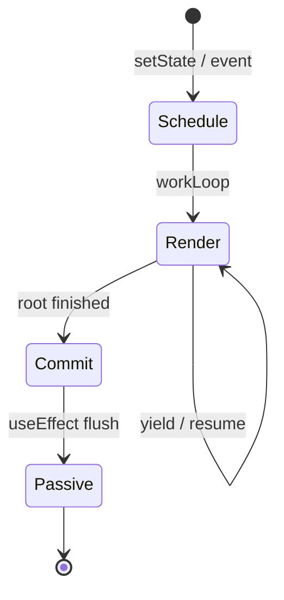
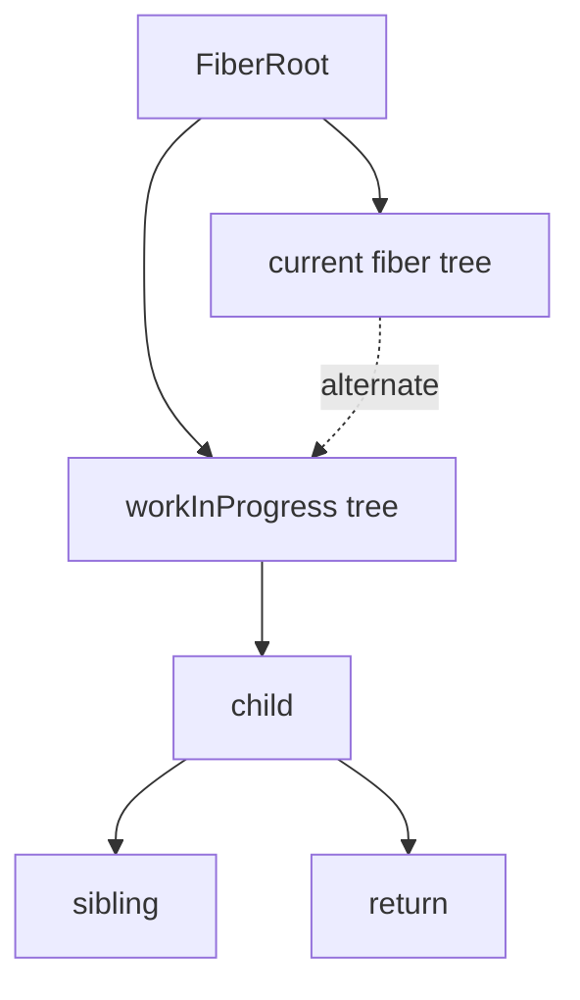
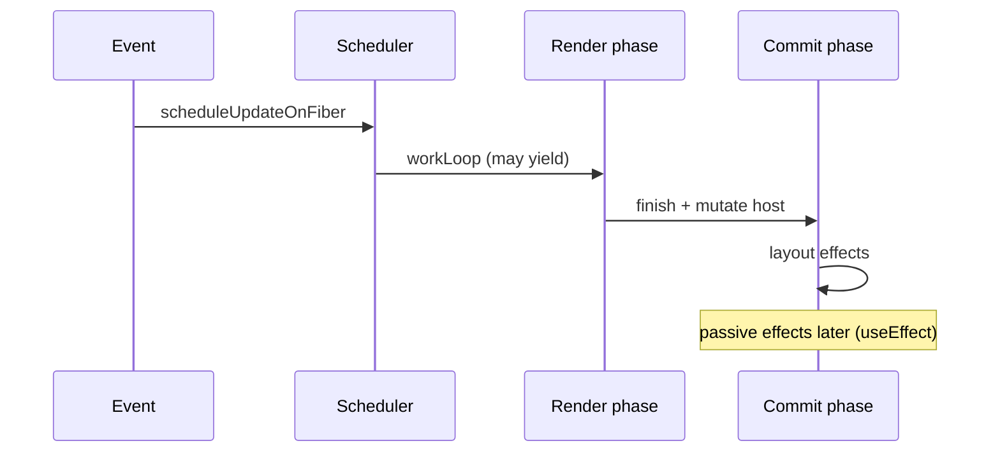

# Fiber

<TopicMeta />

<Prerequisites />

::: tip Published
This page meets the handbook **published** bar: deep explanation, ≥10 common mistakes, and official references. Further engine-level errata welcome via PR.
:::

## Introduction

**Fiber** is React’s internal data structure and reconciliation algorithm (since React 16). Each fiber is a unit of work corresponding roughly to a component or host node, linked via `child` / `sibling` / `return` pointers.

Fiber enables **incremental rendering**: React can pause, abort, and resume work—foundation for concurrent features.

## Why does it exist?

The old stack reconciler walked the tree recursively and could not interrupt mid-update. Long updates blocked input/animation. Fiber reified the call stack into a linked list of work units React schedules explicitly.

## Historical Background

Announced as a rewrite (“Fiber”) and shipped in React 16 (2017). Later concurrent features (time slicing, transitions, Suspense) build on the same architecture. Implementation details evolve; the mental model of alternate trees and phases remains essential.

## Mental Model

Two fiber trees conceptually: **current** (what’s on screen) and **work-in-progress** (the update being built). React clones/reuses fibers while rendering WIP. On commit, WIP becomes current.

Each fiber stores: `type`, `key`, `pendingProps`, `memoizedProps`, `memoizedState` (hooks linked list), `flags`/`subtreeFlags` (effects), `lanes` (priority), and output (`stateNode` for hosts).

## Internal Workflow

1. **Schedule**: an update is assigned lanes (priority).
2. **Render (interruptible)**: `beginWork` descends (reconcile children), `completeWork` ascends (bubble flags).
3. Build effect lists via flags.
4. **Commit (sync)**: mutation/layout/passive effect subphases against the host.
5. Switch `current` pointer to the finished tree.

## Lifecycle



Render may restart if a higher-priority update arrives; commit is not interruptible.

## Browser Perspective

Render work should yield to the browser for input/paint when using concurrent features. Commit still runs as a synchronous stretch of DOM ops.

## JavaScript Engine Perspective

Fibers are JS objects; deep trees allocate. Hooks state lives on the fiber’s linked list.

## React Perspective

You do not create fibers directly; understanding them explains double-invoke in Strict Mode, Suspense retries, and why identity of `type` matters.

## Next.js Perspective

RSC payload hydrates into client fibers for client subtrees; server components are not the same as client fibers.

## Server Perspective

Not applicable.

## Network Perspective

Not applicable.

## Memory Perspective

Not applicable.

## Performance

Fiber enables concurrency but does not make bad O(n) render free. Prefer:

- smaller update subtrees (state locality)
- `startTransition` for non-urgent updates
- memoization/compiler where props churn is high
- avoid cascading layout reads in layout effects

## Production Example

A filterable data grid typed quickly. Urgent updates (input value) use normal setState; filtering the grid uses `startTransition` so Fiber can keep the input responsive while the WIP tree for the grid catches up.

## Code Examples

```ts
// Conceptual fiber shape (simplified, not public API)
type Fiber = {
  type: any
  key: string | null
  child: Fiber | null
  sibling: Fiber | null
  return: Fiber | null
  alternate: Fiber | null // current <-> WIP link
  pendingProps: any
  memoizedProps: any
  memoizedState: any // hooks list head for function components
  flags: number
  lanes: number
  stateNode: any // DOM node or class instance
}
```

```tsx
// User-level lever into Fiber scheduling
import { startTransition, useState } from 'react'

function Search() {
  const [text, setText] = useState('')
  const [query, setQuery] = useState('')
  return (
    <input
      value={text}
      onChange={(e) => {
        const v = e.target.value
        setText(v) // urgent
        startTransition(() => setQuery(v)) // non-urgent WIP tree
      }}
    />
  )
}
```

## Diagrams





## Common Mistakes

1. Treating Fiber as a public API to mutate
2. Assuming render phase is always safe for DOM writes
3. Blocking the main thread with huge sync updates when transitions would help
4. Relying on render phase side effects (they may run twice / restart)
5. Confusing lanes/priorities with CSS z-index “layers”
6. Equating Fiber with Virtual DOM buzzwords without the two-phase model
7. Treating Fiber as a public API you should depend on in app code
8. Assuming concurrent rendering always makes every update faster
9. Equating “virtual DOM” slogans with Fiber’s linked-list scheduler
10. Ignoring lanes/priorities when explaining transitions


## Best Practices

- Keep render pure; side effects in effects/event handlers
- Use transitions for heavy non-urgent UI
- Know commit is synchronous—keep layout effects lean
- Read react.dev concurrent docs before micro-optimizing

## Anti-patterns

- Side effects during render that touch external stores without `useSyncExternalStore`
- Measuring “Fiber time” without React Profiler

## Comparison

| Era | Reconciler | Interruptible render? |
| --- | --- | --- |
| React ≤15 | Stack | No |
| React 16+ | Fiber | Yes (concurrent features) |
| Commit phase | Host mutations | No (must be consistent) |

## Interview Questions

### Easy

**Q:** What is a Fiber in React?

**A:** An internal JS object representing a unit of work / a node in React’s tree, used by the reconciler to schedule and track updates.

### Medium

**Q:** What is the difference between the render phase and the commit phase?

**A:** Render (reconciliation) can be interrupted and restarted; it computes changes. Commit applies DOM updates and runs layout effects synchronously and cannot be torn for consistency.

### Hard

**Q:** How do current and work-in-progress trees interact?

**A:** React builds a WIP tree linked via `alternate` pointers while current remains on screen. After a successful commit, WIP becomes current. This double buffering enables concurrency and aborting abandoned WIP work.

## Summary

- Fiber reifies React’s work as a linked tree of units
- Render is interruptible; commit is not
- Concurrent features schedule updates with lanes/priorities

## References

- [React Documentation](https://react.dev/)
- [React Reference](https://react.dev/reference/react)
- [React Fiber Architecture (Lin Clark notes / historical)](https://github.com/acdlite/react-fiber-architecture)
- [Render and Commit](https://react.dev/learn/render-and-commit)
- [Managing State — Transitions](https://react.dev/reference/react/startTransition)

<RelatedTopics />


Prev: [`08-jsx-and-react-runtime.virtual-dom`](/08-jsx-and-react-runtime/virtual-dom/) · Next: [`08-jsx-and-react-runtime.reconciliation`](/08-jsx-and-react-runtime/reconciliation/)
