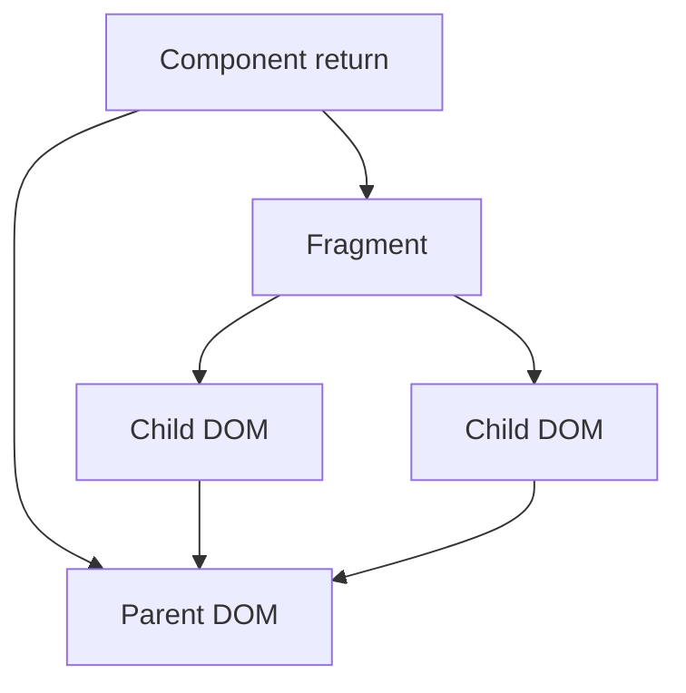
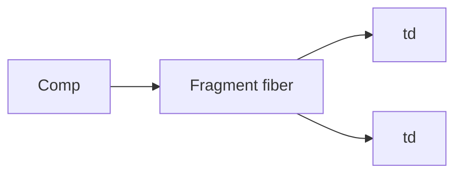

# Fragments

<TopicMeta />

<Prerequisites />

::: tip Published
This page meets the handbook **published** bar: deep explanation, ≥10 common mistakes, and official references. Further engine-level errata welcome via PR.
:::

## Introduction

A **Fragment** lets a component return multiple children without adding an extra DOM wrapper. Written as `<React.Fragment>` or `<>...</>`.

Use fragments when layout/CSS would break if you introduced a `div`, or when tables require specific child tags.

## Why does it exist?

HTML and CSS care about DOM structure (`flex` children, `tr` under `table`). Extra wrappers break semantics and styling. Fragments group in React’s tree without host nodes.

## Historical Background

Fragments shipped in React 16. Shorthand `<>...` came with limited keyed support—keyed fragments still need `<Fragment key={...}>`.

## Mental Model

Fragments are fibers with no host `stateNode` (or a special fragment tag). Children hoist to the parent’s DOM children. Keys on fragments matter when mapping lists of groups.

## Internal Workflow

1. Return multiple nodes from a component.
2. Prefer `<>...` when no key needed.
3. Use `<Fragment key>` for lists of groups.
4. Avoid fragments when a semantic wrapper is better for a11y.

## Lifecycle



## Browser Perspective

No extra node means CSS selectors/flex see the real children.

## JavaScript Engine Perspective

Not applicable.

## React Perspective

DevTools may show fragments; they still participate in reconciliation.

## Next.js Perspective

Not applicable.

## Server Perspective

Not applicable.

## Network Perspective

Not applicable.

## Memory Perspective

Not applicable.

## Performance

Negligible—avoids extra DOM nodes, which can help layout.

## Production Example

A `TableRows` component maps records to `<Fragment key={id}><tr>...</tr><tr>...</tr></Fragment>` so each record can emit two rows without illegal wrappers.

## Code Examples

```tsx
import { Fragment } from 'react'

export function Columns() {
  return (
    <>
      <td>A</td>
      <td>B</td>
    </>
  )
}

export function PairList({ pairs }: { pairs: { id: string; a: string; b: string }[] }) {
  return (
    <>
      {pairs.map((p) => (
        <Fragment key={p.id}>
          <dt>{p.a}</dt>
          <dd>{p.b}</dd>
        </Fragment>
      ))}
    </>
  )
}
```

## Diagrams



## Common Mistakes

1. Trying to pass `key` to `<>` shorthand
2. Using fragments when a landmark/`section` would improve a11y
3. Forgetting keys on mapped fragments
4. Wrapping everything in fragments habitually without need
5. Invalid HTML structure still invalid with fragments (e.g. `div` in `tr`)
6. Assuming fragments break CSS `:first-child` differently than expected—verify
7. Overlooking an edge case #1 specific to 08-jsx-and-react-runtime.fragments in production traffic
8. Overlooking an edge case #2 specific to 08-jsx-and-react-runtime.fragments in production traffic
9. Overlooking an edge case #3 specific to 08-jsx-and-react-runtime.fragments in production traffic
10. Overlooking an edge case #4 specific to 08-jsx-and-react-runtime.fragments in production traffic


## Best Practices

- Shorthand when unkeyed
- Keyed `Fragment` for lists of groups
- Prefer semantic elements when they help AT/CSS

## Anti-patterns

- Fragment wrappers around single children for no reason
- Illegal table markup “fixed” incorrectly with fragments

## Comparison

| Approach | Extra DOM node? | Can take key? |
| --- | --- | --- |
| `<>...</>` | No | No |
| `<Fragment key>` | No | Yes |
| `<div>` | Yes | Yes |

## Interview Questions

### Easy

**Q:** Why use a Fragment?

**A:** To return multiple children without adding an extra DOM element.

### Medium

**Q:** When must you use `<Fragment>` instead of `<>`?

**A:** When you need to pass a `key` (or other limited attributes supported on Fragment).

### Hard

**Q:** How do fragments interact with reconciliation of lists?

**A:** A keyed fragment is a sibling fiber whose children are grouped; the key identifies the group when the list of groups changes.

## Summary

- Fragments group without DOM wrappers
- Keyed fragments need the long-form API
- Still obey host HTML rules

## References

- [React Documentation](https://react.dev/)
- [React Reference](https://react.dev/reference/react)
- [Fragment reference](https://react.dev/reference/react/Fragment)

<RelatedTopics />


Prev: [`08-jsx-and-react-runtime.keys`](/08-jsx-and-react-runtime/keys/)
