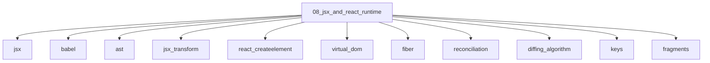

# JSX and React Runtime

## Scope

JSX transforms, Virtual DOM, Fiber, and reconciliation before the React API surface

## Prerequisites

See the learning paths and each topic's prerequisites in the registry.

## Topics in order

- [JSX](/08-jsx-and-react-runtime/jsx/) — junior, ~30 min
- [Babel](/08-jsx-and-react-runtime/babel/) — mid, ~35 min
- [AST](/08-jsx-and-react-runtime/ast/) — mid, ~35 min
- [JSX Transform](/08-jsx-and-react-runtime/jsx-transform/) — mid, ~30 min
- [React.createElement](/08-jsx-and-react-runtime/react-createelement/) — junior, ~25 min
- [Virtual DOM](/08-jsx-and-react-runtime/virtual-dom/) — mid, ~40 min
- [Fiber](/08-jsx-and-react-runtime/fiber/) — senior, ~50 min
- [Reconciliation](/08-jsx-and-react-runtime/reconciliation/) — mid, ~40 min
- [Diffing Algorithm](/08-jsx-and-react-runtime/diffing-algorithm/) — mid, ~35 min
- [Keys](/08-jsx-and-react-runtime/keys/) — junior, ~25 min
- [Fragments](/08-jsx-and-react-runtime/fragments/) — junior, ~15 min

## Module knowledge graph

## Suggested learning paths

Browse [Learning Paths](/learning-paths/).
