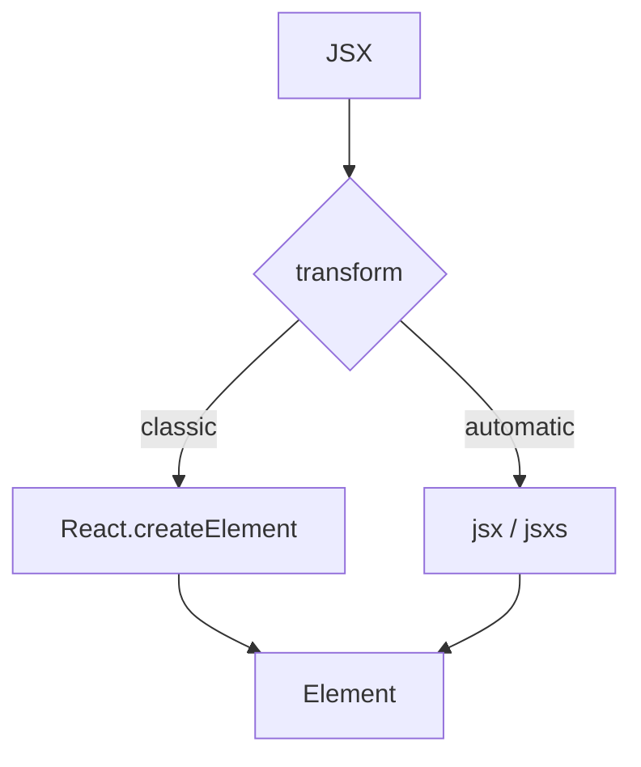

# JSX Transform

<TopicMeta />

<Prerequisites />

::: tip Published
This page meets the handbook **published** bar: deep explanation, ≥10 common mistakes, and official references. Further engine-level errata welcome via PR.
:::

## Introduction

The **JSX transform** is the compiler step that turns JSX into JS calls. The **classic** transform emits `React.createElement`. The **automatic** transform (React 17+) emits `jsx`/`jsxs` from `react/jsx-runtime`, so files need not import React for JSX.

## Why does it exist?

Requiring `import React from 'react'` in every file was boilerplate. The automatic runtime also opens the door to improved development warnings (`jsxDEV`) and future optimizations.

## Historical Background

Announced with React 17. TypeScript `jsx: react-jsx` and Babel `runtime: 'automatic'` adopted it. New templates use automatic by default.

## Mental Model

JSX → **factory calls** producing elements. Classic factory is `React.createElement`. Automatic factory is imported from `jsx-runtime`. Children packing differs (`jsxs` when children are static arrays).

## Internal Workflow

1. Set compiler option (`jsx: react-jsx` / Babel automatic).
2. Compile; verify imports of `jsx-runtime` in output.
3. Ensure React version ≥ 17 (or compatible runtime).
4. Keep classic only for legacy packages that assume it.

## Lifecycle



## Browser Perspective

Not applicable.

## JavaScript Engine Perspective

Ordinary imports/calls after emit.

## React Perspective

Required foundation for modern React tooling and React Refresh.

## Next.js Perspective

App Router templates use automatic transform.

## Server Perspective

Not applicable.

## Network Perspective

Not applicable.

## Memory Perspective

Not applicable.

## Performance

Automatic runtime can slightly reduce bundle noise; not a major perf feature by itself.

## Production Example

Migrating a CRA-era repo: enable automatic JSX, delete unused React imports with a codemod, confirm Jest and Storybook configs agree.

## Code Examples

```tsx
// input
export function Hi() {
  return <p>Hi</p>
}

// classic emit (conceptually)
import React from 'react'
export function Hi() {
  return React.createElement('p', null, 'Hi')
}

// automatic emit (conceptually)
import { jsx as _jsx } from 'react/jsx-runtime'
export function Hi() {
  return _jsx('p', { children: 'Hi' })
}
```

## Diagrams


## Common Mistakes

1. Enabling automatic JSX on React 16 without polyfill/runtime
2. Mixed classic/automatic across packages causing double React assumptions
3. ESLint rules still requiring React in scope incorrectly
4. Forgetting `jsxImportSource` when using emotion/preact
5. Assuming transform removes the need for React for hooks imports
6. Breaking custom `createElement` pragma setups during migration
7. Overlooking an edge case #1 specific to 08-jsx-and-react-runtime.jsx-transform in production traffic
8. Overlooking an edge case #2 specific to 08-jsx-and-react-runtime.jsx-transform in production traffic
9. Overlooking an edge case #3 specific to 08-jsx-and-react-runtime.jsx-transform in production traffic
10. Overlooking an edge case #4 specific to 08-jsx-and-react-runtime.jsx-transform in production traffic


## Best Practices

- Use automatic runtime for new code
- Align TS, Babel/SWC, and test runners
- Codemod away unused default React imports

## Anti-patterns

- Per-file pragmas fighting the project setting
- Shipping both runtimes without need

## Comparison

| | Classic | Automatic |
| --- | --- | --- |
| Import React for JSX | Required | Not required |
| Factory | `createElement` | `jsx`/`jsxs` |
| React version | Older OK | 17+ typical |

## Interview Questions

### Easy

**Q:** What is the automatic JSX runtime?

**A:** A transform that imports JSX helpers from `react/jsx-runtime` instead of calling `React.createElement`.

### Medium

**Q:** Why can you omit `import React` after migrating?

**A:** Because JSX no longer expands to `React.createElement`, so the default React binding is unused for JSX (hooks still need importing).

### Hard

**Q:** How does `jsxImportSource` interact with Emotion?

**A:** It changes where `jsx` is imported from (e.g. `@emotion/react`) so CSS props and transforms apply correctly.

## Summary

- Transforms turn JSX into factory calls
- Automatic runtime is the modern default
- Align all toolchains on one mode

## References

- [React Documentation](https://react.dev/)
- [React Reference](https://react.dev/reference/react)
- [Introducing the New JSX Transform](https://legacy.reactjs.org/blog/2020/09/22/introducing-the-new-jsx-transform.html)
- [TypeScript jsx options](https://www.typescriptlang.org/tsconfig#jsx)

<RelatedTopics />


Prev: [`08-jsx-and-react-runtime.ast`](/08-jsx-and-react-runtime/ast/) · Next: [`08-jsx-and-react-runtime.react-createelement`](/08-jsx-and-react-runtime/react-createelement/)
