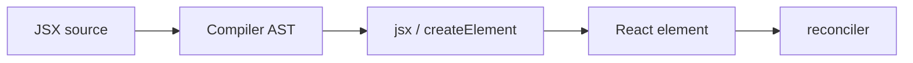
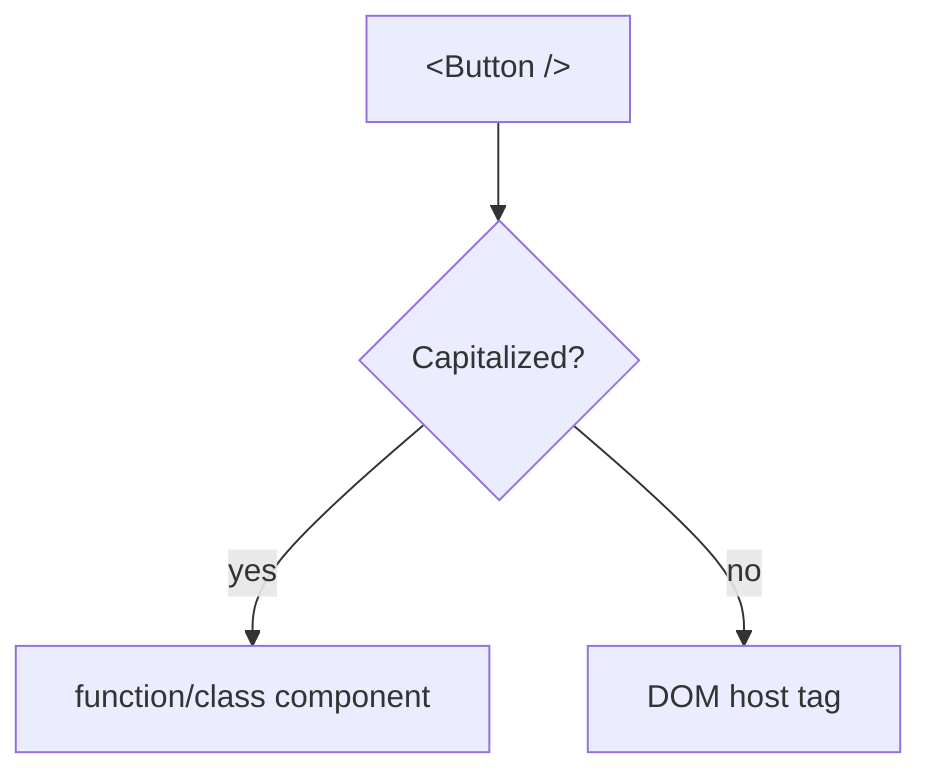

# JSX

<TopicMeta />

<Prerequisites />

::: tip Published
This page meets the handbook **published** bar: deep explanation, ≥10 common mistakes, and official references. Further engine-level errata welcome via PR.
:::

## Introduction

**JSX** is a syntax extension that looks like HTML in JavaScript/TypeScript. Compilers transform it into calls such as `jsx("div", props)` or `React.createElement("div", props, ...children)`.

JSX is not HTML and not required by React—but it is the ergonomic surface almost every React codebase uses.

## Why does it exist?

UI is nested trees. Nested `createElement` calls are unreadable. JSX keeps structure visual while remaining JavaScript expressions (with rules: one root or fragments, expressions in `{}`, etc.).

## Historical Background

JSX arrived with React early on, inspired by XML-in-JS experiments. Babel made it mainstream. The 2020 automatic runtime removed the need to import React just for JSX. Other frameworks (Solid, etc.) reuse JSX with different compilers.

## Mental Model

Every JSX tag is an **element description**, not a DOM node yet. Lowercase tags are host components (DOM); capitalized names are user components/functions. Attributes become a props object; children become `props.children` or trailing arguments depending on the runtime.

## Internal Workflow

1. Author JSX in components.
2. Compiler parses to AST and transforms to runtime calls.
3. At runtime, those calls create element objects (or, with compilers, optimized output).
4. React reconciles elements against Fiber and commits host updates.

## Lifecycle



## Browser Perspective

Browsers do not parse JSX natively in typical apps; the bundle contains function calls.

## JavaScript Engine Perspective

After transform, it is ordinary JS. Hot paths benefit from stable element shapes.

## React Perspective

JSX is the primary way to construct the element tree React reconciles.

## Next.js Perspective

Server and Client Components both may use JSX; the RSC bundler treats them differently.

## Server Perspective

Not applicable.

## Network Perspective

Not applicable.

## Memory Perspective

Not applicable.

## Performance

JSX itself is syntax. Cost is creating element objects each render—React Compiler / manual memo can reduce churn.

## Production Example

Design-system buttons are written as JSX with typed props. The automatic runtime (`jsxImportSource`) is configured once in the bundler/tsconfig for the whole monorepo.

## Code Examples

```tsx
const name = 'Ada'
const el = (
  <section className="hero" data-active={true}>
    <h1>{name}</h1>
    <button type="button" onClick={() => console.log('hi')}>
      Click
    </button>
  </section>
)
// roughly: jsx('section', { className: 'hero', 'data-active': true, children: [...] })
```

## Diagrams



## Common Mistakes

1. Using `class` instead of `className`
2. Returning two adjacent roots without a fragment
3. Putting statements (not expressions) inside `{}`
4. Assuming JSX sanitizes dangerouslySetInnerHTML for you
5. Lowercasing a custom component so React treats it as an unknown DOM tag
6. Spreading props without understanding overrides order
7. Overlooking an edge case #1 specific to 08-jsx-and-react-runtime.jsx in production traffic
8. Overlooking an edge case #2 specific to 08-jsx-and-react-runtime.jsx in production traffic
9. Overlooking an edge case #3 specific to 08-jsx-and-react-runtime.jsx in production traffic
10. Overlooking an edge case #4 specific to 08-jsx-and-react-runtime.jsx in production traffic


## Best Practices

- Keep JSX readable; extract subcomponents early
- Prefer the automatic JSX runtime
- Type props at the component boundary
- Avoid logic-heavy JSX—compute above the return

## Anti-patterns

- `dangerouslySetInnerHTML` with untrusted strings
- IIFE forests inside JSX for control flow

## Comparison

| Form | Notes |
| --- | --- |
| JSX | Ergonomic tree syntax |
| `createElement` | Explicit, verbose |
| Hyperscript helpers | Alternative DSLs |

## Interview Questions

### Easy

**Q:** Is JSX required to use React?

**A:** No. It compiles to element-creation calls you could write by hand.

### Medium

**Q:** Why must custom components start with a capital letter in JSX?

**A:** The transform treats lowercase tags as host string tags and capitalized names as identifiers referencing components.

### Hard

**Q:** How does the automatic JSX runtime differ from classic?

**A:** Classic calls `React.createElement` and needs React in scope. Automatic imports `jsx`/`jsxs` from `react/jsx-runtime` and does not require a React import for JSX alone.

## Summary

- JSX desugars to element factories
- Capitalization distinguishes host vs components
- It describes UI; reconciliation creates/updates DOM

## References

- [React Documentation](https://react.dev/)
- [React Reference](https://react.dev/reference/react)
- [JSX In Depth (legacy docs archive / react.dev learn)](https://react.dev/learn/writing-markup-with-jsx)

<RelatedTopics />


Next: [`08-jsx-and-react-runtime.babel`](/08-jsx-and-react-runtime/babel/)
