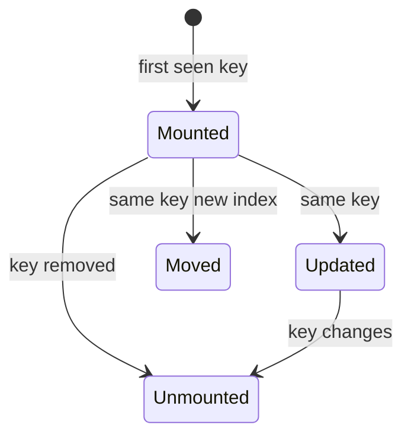
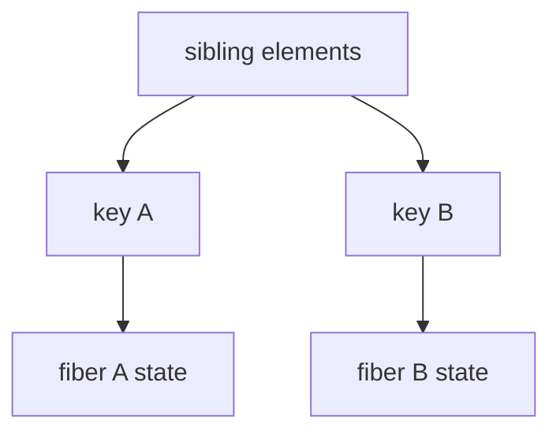

# Keys

<TopicMeta />

<Prerequisites />

::: tip Published
This page meets the handbook **published** bar: deep explanation, ≥10 common mistakes, and official references. Further engine-level errata welcome via PR.
:::

## Introduction

A **key** is a special string (or value converted to string) on a React element that identifies it among **siblings**. Keys are not props passed to your component.

Correct keys preserve state under reorder; intentional key changes remount and reset state.

## Why does it exist?

Lists reorder, filter, and paginate. Index matching attaches state to the wrong row. Keys tell reconciliation who is who.

## Historical Background

Keys have been part of React’s list guidance since early versions. Dev-mode warnings for missing keys remain one of the most common console messages.

## Mental Model

Keys are **identity in a slot list**, not global IDs in the whole app (though globally unique IDs make good keys). React reads `element.key`; your component receives props without `key`.

## Internal Workflow

1. Choose stable unique keys among siblings.
2. Prefer business IDs.
3. Use key changes to reset forms/animations intentionally.
4. Never use random keys each render.

## Lifecycle



## Browser Perspective

Remounts destroy DOM nodes; focus is lost.

## JavaScript Engine Perspective

Not applicable.

## React Perspective

Local component state and DOM state (input values) follow keys.

## Next.js Perspective

Not applicable.

## Server Perspective

Not applicable.

## Network Perspective

Not applicable.

## Memory Perspective

Not applicable.

## Performance

Stable keys minimize DOM churn. Unstable keys maximize it.

## Production Example

A multi-step wizard sets `key={stepId}` on the step panel to reset field state when the step identity changes—explicit, documented remount.

## Code Examples

```tsx
function TodoList({ todos }: { todos: { id: string; text: string }[] }) {
  return (
    <ul>
      {todos.map((t) => (
        <li key={t.id}>{t.text}</li>
      ))}
    </ul>
  )
}

function UserForm({ userId }: { userId: string }) {
  return <ProfileEditor key={userId} userId={userId} />
}
```

## Diagrams



## Common Mistakes

1. Index keys with reordering
2. `key={Math.random()}`
3. Passing key as a normal prop expecting to read it
4. Duplicate keys among siblings
5. Using array index plus “static list” that later becomes dynamic
6. Keys from unstable JSON.stringify of whole objects
7. Overlooking an edge case #1 specific to 08-jsx-and-react-runtime.keys in production traffic
8. Overlooking an edge case #2 specific to 08-jsx-and-react-runtime.keys in production traffic
9. Overlooking an edge case #3 specific to 08-jsx-and-react-runtime.keys in production traffic
10. Overlooking an edge case #4 specific to 08-jsx-and-react-runtime.keys in production traffic


## Best Practices

- IDs from data
- Intentional remount via key documented in code
- Fix duplicate-key warnings immediately

## Anti-patterns

- Suppressing key warnings without fixing identity
- Using index as key “for now” in shared components

## Comparison

| Key choice | Reorder safe? | Notes |
| --- | --- | --- |
| Stable id | Yes | Best |
| Index | No | Only static lists |
| Random | No | Remounts always |

## Interview Questions

### Easy

**Q:** Are keys passed to the child as props?

**A:** No. React consumes keys during reconciliation; they are not on `props`.

### Medium

**Q:** How do you reset a component’s state from a parent?

**A:** Change its `key` so React remounts a new fiber with fresh state.

### Hard

**Q:** Why can keys be unique among siblings only?

**A:** Matching happens within a parent’s child list. The same key under different parents does not collide for reconciliation.

## Summary

- Keys identify siblings for diffing
- Stable IDs preserve state; changing keys resets it
- Keys are not props

## References

- [React Documentation](https://react.dev/)
- [React Reference](https://react.dev/reference/react)
- [Rendering Lists — keys](https://react.dev/learn/rendering-lists#keeping-list-items-in-order-with-key)
- [Preserving and Resetting State](https://react.dev/learn/preserving-and-resetting-state)

<RelatedTopics />


Prev: [`08-jsx-and-react-runtime.diffing-algorithm`](/08-jsx-and-react-runtime/diffing-algorithm/) · Next: [`08-jsx-and-react-runtime.fragments`](/08-jsx-and-react-runtime/fragments/)
