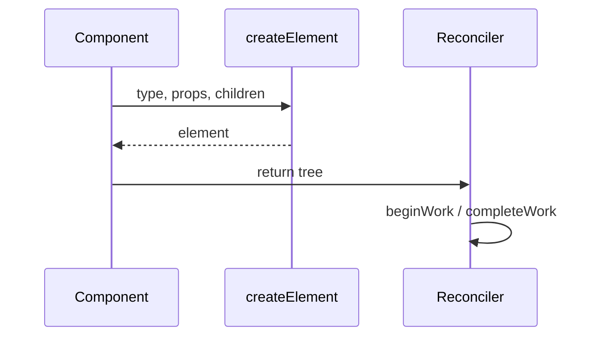
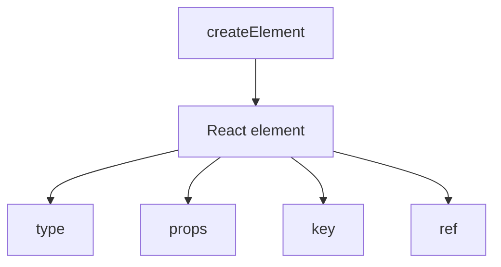

# React.createElement

<TopicMeta />

<Prerequisites />

::: tip Published
This page meets the handbook **published** bar: deep explanation, ≥10 common mistakes, and official references. Further engine-level errata welcome via PR.
:::

## Introduction

**`React.createElement(type, props, ...children)`** builds a plain React **element** object: `{ $$typeof, type, props, key, ref }`. JSX classic mode is sugar for this function.

Elements are instructions; they are not DOM nodes.

## Why does it exist?

React needed a stable, serializable description of UI trees before reconciliation. `createElement` is that constructor. Understanding it demystifies keys, children, and why `type` identity matters.

## Historical Background

Present since early React. Concurrent features and the automatic runtime still produce compatible element objects (via `jsx` helpers).

## Mental Model

`type` is a string host tag or a component function/class. `props` holds attributes + `children`. `key`/`ref` are reserved and lifted off props. `$$typeof` marks the object as a React element (security/XSS hardening against crafted JSON).

## Internal Workflow

1. Call `createElement` or emit via JSX.
2. Parent components return element trees.
3. Reconciler compares element `type`/`key` to fibers.
4. Host instances update on commit.

## Lifecycle



## Browser Perspective

Not applicable.

## JavaScript Engine Perspective

Allocates plain objects each render unless compiled away.

## React Perspective

Core of the element layer beneath hooks and Fiber.

## Next.js Perspective

Not applicable.

## Server Perspective

Not applicable.

## Network Perspective

Not applicable.

## Memory Perspective

Not applicable.

## Performance

Element allocation is expected; avoid constructing huge trees in hot paths without memoization/compiler help.

## Production Example

A logging utility detects invalid elements missing `$$typeof` when user code accidentally returns raw objects from components.

## Code Examples

```js
import { createElement } from 'react'

const el = createElement(
  'button',
  { type: 'button', className: 'primary', key: 'save' },
  'Save',
)
// el.type === 'button'
// el.props.className === 'primary'
// el.key === 'save'
```

## Diagrams



## Common Mistakes

1. Mutating element objects after creation
2. Putting `key` inside the props object manually incorrectly when cloning
3. Returning plain `{ type, props }` without `createElement`/`jsx`
4. Using a new inline `type` function every render (remounts)
5. Confusing elements with component instances
6. Forgetting children can be arrays needing keys
7. Overlooking an edge case #1 specific to 08-jsx-and-react-runtime.react-createelement in production traffic
8. Overlooking an edge case #2 specific to 08-jsx-and-react-runtime.react-createelement in production traffic
9. Overlooking an edge case #3 specific to 08-jsx-and-react-runtime.react-createelement in production traffic
10. Overlooking an edge case #4 specific to 08-jsx-and-react-runtime.react-createelement in production traffic


## Best Practices

- Treat elements as immutable
- Stable component `type` identities
- Prefer JSX unless generating elements dynamically

## Anti-patterns

- Deep cloning element trees by hand
- String refs (legacy) with createElement

## Comparison

| API | Role |
| --- | --- |
| `createElement` | Classic factory |
| `jsx`/`jsxs` | Automatic factory |
| `cloneElement` | Legacy prop injection (avoid when possible) |

## Interview Questions

### Easy

**Q:** What does `createElement` return?

**A:** A React element object describing what to render—not a DOM node.

### Medium

**Q:** Why do `key` and `ref` not appear on `props` the same way?

**A:** They are reserved and extracted onto the element so they are not passed to host components as ordinary DOM attributes.

### Hard

**Q:** Why does `$$typeof` exist on elements?

**A:** To mark trusted React elements so untrusted JSON cannot invent element-like objects that React would treat as UI (XSS hardening).

## Summary

- createElement builds immutable element descriptors
- type/key drive reconciliation identity
- JSX is sugar over factories

## References

- [React Documentation](https://react.dev/)
- [React Reference](https://react.dev/reference/react)
- [createElement reference](https://react.dev/reference/react/createElement)

<RelatedTopics />


Prev: [`08-jsx-and-react-runtime.jsx-transform`](/08-jsx-and-react-runtime/jsx-transform/) · Next: [`08-jsx-and-react-runtime.virtual-dom`](/08-jsx-and-react-runtime/virtual-dom/)
