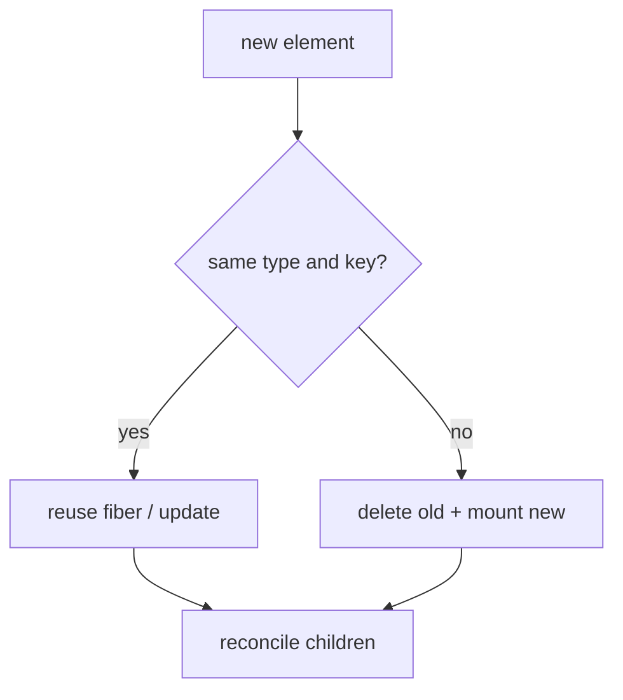
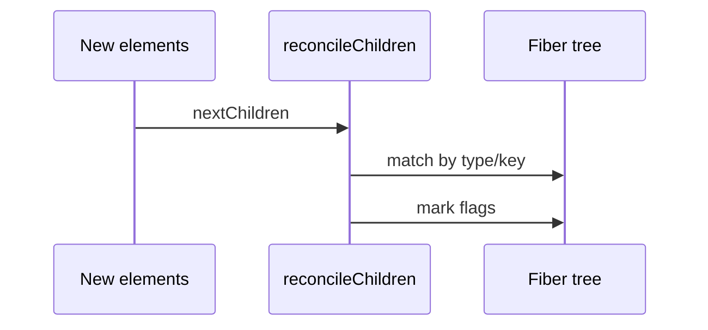

# Reconciliation

<TopicMeta />

<Prerequisites />

::: tip Published
This page meets the handbook **published** bar: deep explanation, ≥10 common mistakes, and official references. Further engine-level errata welcome via PR.
:::

## Introduction

**Reconciliation** is React’s algorithm for comparing the new element tree to the previous fiber tree and deciding what to reuse, update, insert, or delete.

It is intentionally **heuristic O(n)** on children—not a general tree-edit-distance algorithm—so keys and stable types are required for correct performance.

## Why does it exist?

Without reconciliation rules, every update would remount the world (losing state/focus) or require manual DOM diffing. Reconciliation preserves component state when identity matches and resets it when `type` changes.

## Historical Background

Documented early in React’s design (“reconciliation”). Fiber reimplemented it with phases and flags but kept the same developer-facing heuristics: same type → update; different type → replace; lists use keys.

## Mental Model

At a fiber position:

1. If element `type` matches fiber `type` (and key rules for lists) → **reuse fiber**, update props, recurse children.
2. Else → **detach old**, mount new (state reset).
3. Children: walk with keys to match; emit Placement/Update/Deletion flags.

Parent state lives on the parent fiber; remounting a child does not remount the parent.

## Internal Workflow

1. Begin work on a fiber with new props.
2. Call function component / host reconciler.
3. `reconcileChildren` matches old fibers to new elements.
4. Mark flags (`Placement`, `Update`, `Deletion`, …).
5. Complete work; bubble `subtreeFlags`.
6. Commit applies flags to the host tree.

## Lifecycle



## Browser Perspective

Host deletions/insertions happen in commit; focus and DOM state follow remounts.

## JavaScript Engine Perspective

JS work proportional to visited fibers—not only changed leaves.

## React Perspective

Explains remounts when swapping `<A/>` for `<B/>` or changing `key`.

## Next.js Perspective

Not applicable.

## Server Perspective

Not applicable.

## Network Perspective

Not applicable.

## Memory Perspective

Not applicable.

## Performance

Bail out early when props are equal (memo / `Object.is`) skips subtree reconciliation. Keys prevent O(n²)-feeling list shuffles.

## Production Example

A tabs component used index keys; reordering tabs mixed input state. Switching to stable ids fixed reconciliation identity.

## Code Examples

```tsx
// Changing type remounts (state lost)
function Editor({ rich }: { rich: boolean }) {
  return rich ? <RichText key="editor" /> : <TextArea key="editor" />
}

// Same position, different component type => new fiber state
// Prefer one component that switches mode internally if state should persist
```

## Diagrams



## Common Mistakes

1. Index keys on reorderable lists
2. Inline anonymous component types in parents (`type` changes every render)
3. Expecting React to deep-diff arbitrary object graphs beyond children heuristics
4. Using random keys causing constant remounts
5. Assuming CSS transitions survive a type change remount
6. Lifting state incorrectly when remounts are desired vs undesired
7. Using index keys for reorderable lists
8. Changing component `type` to reset state unintentionally
9. Expecting deep equality of props by default
10. Mutating props/state during render and confusing reconciler assumptions


## Best Practices

- Stable component types
- Stable keys from IDs
- Colocate state with the component that should reset on remount
- Use `key` intentionally to reset state

## Anti-patterns

- `key={Math.random()}`
- Factory components defined inside render

## Comparison

| Change | Result |
| --- | --- |
| Same type + key | Update / reuse state |
| Different type | Remount / reset state |
| Reordered list with keys | Move fibers |
| Reordered list with indexes | State can attach wrong |

## Interview Questions

### Easy

**Q:** What happens when a component’s element type changes at the same position?

**A:** React tears down the old fiber and mounts a new one; state is reset.

### Medium

**Q:** Why does reconciliation use keys in lists?

**A:** Keys identify children across renders so React can move/update/delete correctly instead of matching only by index.

### Hard

**Q:** Why isn’t React’s diff a general tree edit-distance algorithm?

**A:** General tree diffing is expensive (e.g. O(n³)). React uses O(n) heuristics that work well for UI when developers provide stable types and keys.

## Summary

- Reconciliation matches elements to fibers by type and key
- Heuristics are O(n); keys matter
- Type changes remount; intentional keys can reset state

## References

- [React Documentation](https://react.dev/)
- [React Reference](https://react.dev/reference/react)
- [Preserving and Resetting State](https://react.dev/learn/preserving-and-resetting-state)
- [Rendering Lists](https://react.dev/learn/rendering-lists)

<RelatedTopics />


Prev: [`08-jsx-and-react-runtime.fiber`](/08-jsx-and-react-runtime/fiber/) · Next: [`08-jsx-and-react-runtime.diffing-algorithm`](/08-jsx-and-react-runtime/diffing-algorithm/)
