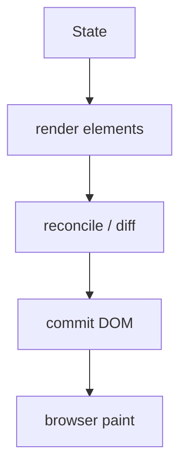
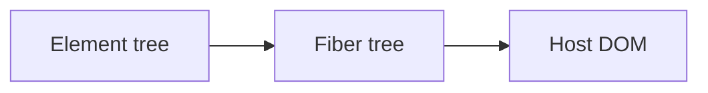

# Virtual DOM

<TopicMeta />

<Prerequisites />

::: tip Published
This page meets the handbook **published** bar: deep explanation, ≥10 common mistakes, and official references. Further engine-level errata welcome via PR.
:::

## Introduction

The **Virtual DOM** is the idea that UI is described as a tree of lightweight elements (plain objects), diffed against the previous tree, then applied to the real DOM.

In modern React, “VDOM” colloquially means the **element tree + Fiber reconciliation**, not a separate magical layer. Fibers are the real unit of work.

## Why does it exist?

Direct DOM mutation is imperative and error-prone at scale. Declaring “UI = f(state)” needs a way to turn new descriptions into minimal host updates. Element trees provide that description.

## Historical Background

Popularized by React in the early 2010s. React 16 replaced the stack reconciler with Fiber, keeping the element abstraction while changing scheduling. Other libraries use fine-grained reactivity without a VDOM.

## Mental Model

**Elements** describe intent. **Fibers** track instances/work. **Host DOM** is the mutable output. Diffing compares element types/keys to decide reuse vs replace. Calling it “virtual DOM” is shorthand—not a second browser DOM.

## Internal Workflow

1. Render phase: components return new element trees.
2. Reconciler diffs against current Fiber tree.
3. Build an effect list of host mutations.
4. Commit phase applies DOM changes (and runs layout effects).

## Lifecycle



## Browser Perspective

Only the commit phase touches DOM APIs; render may be interrupted (concurrent).

## JavaScript Engine Perspective

Render work is JS CPU; commit can force layout if effects read layout.

## React Perspective

Core mental model for why keys and element types matter.

## Next.js Perspective

Not applicable.

## Server Perspective

Not applicable.

## Network Perspective

Not applicable.

## Memory Perspective

Not applicable.

## Performance

VDOM is not free—JS diff work costs CPU. Concurrent React spreads render work; avoid huge unnecessary re-renders.

## Production Example

A dashboard re-renders a large table. Profiling shows render CPU high; memoization and windowing cut element churn more than micro-optimizing DOM APIs.

## Code Examples

```tsx
// "Virtual" description each render
function App({ items }: { items: string[] }) {
  return (
    <ul>
      {items.map((item) => (
        <li key={item}>{item}</li>
      ))}
    </ul>
  )
}
```

## Diagrams



## Common Mistakes

1. Believing React always does the minimal DOM ops imaginable
2. Thinking VDOM means no real DOM performance issues
3. Using index keys and blaming “the VDOM”
4. Mutating state in place so React sees the same reference
5. Equating Virtual DOM with Shadow DOM
6. Assuming every library needs a VDOM
7. Overlooking an edge case #1 specific to 08-jsx-and-react-runtime.virtual-dom in production traffic
8. Overlooking an edge case #2 specific to 08-jsx-and-react-runtime.virtual-dom in production traffic
9. Overlooking an edge case #3 specific to 08-jsx-and-react-runtime.virtual-dom in production traffic
10. Overlooking an edge case #4 specific to 08-jsx-and-react-runtime.virtual-dom in production traffic


## Best Practices

- Understand elements vs fibers vs DOM
- Stable keys for lists
- Measure with Profiler before optimizing
- Prefer correct state immutability

## Anti-patterns

- Premature `shouldComponentUpdate` everywhere
- Reading DOM in render

## Comparison

| Approach | Update model |
| --- | --- |
| React VDOM/Fiber | Diff element trees, commit |
| Fine-grained reactive | Update DOM per signal |
| Imperative DOM | Manual mutations |

## Interview Questions

### Easy

**Q:** What is the Virtual DOM in React?

**A:** A pattern of describing UI with element trees and reconciling them to update the real DOM.

### Medium

**Q:** How does Fiber relate to the Virtual DOM?

**A:** Elements still describe UI; Fibers are the internal units that track component state/effects and enable incremental rendering.

### Hard

**Q:** Why is “React is fast because Virtual DOM” incomplete?

**A:** Diffing costs JS time; React’s value is predictable updates and (with Fiber) scheduling. Performance still requires good architecture.

## Summary

- Elements describe UI; DOM is updated on commit
- Fiber is the modern reconciler behind the VDOM story
- Keys and types control identity

## References

- [React Documentation](https://react.dev/)
- [React Reference](https://react.dev/reference/react)
- [Render and Commit](https://react.dev/learn/render-and-commit)
- [Understanding re-renders](https://react.dev/learn/render-and-commit)

<RelatedTopics />


Prev: [`08-jsx-and-react-runtime.react-createelement`](/08-jsx-and-react-runtime/react-createelement/) · Next: [`08-jsx-and-react-runtime.fiber`](/08-jsx-and-react-runtime/fiber/)
