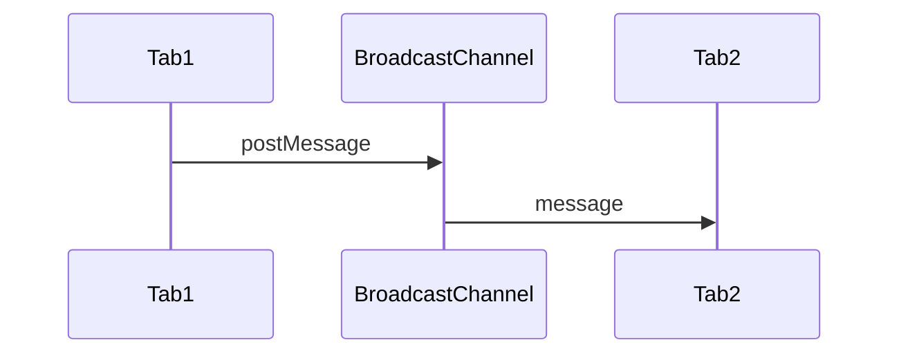
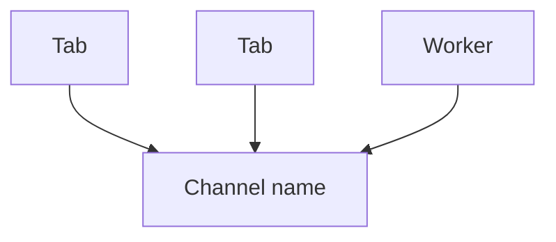

# Broadcast Channel

<TopicMeta />

<Prerequisites />

::: tip Published
This page meets the handbook **published** bar: deep explanation, ≥10 common mistakes, and official references. Further engine-level errata welcome via PR.
:::

## Introduction

**BroadcastChannel** lets same-origin contexts post messages to each other through a named channel. Simpler than `localStorage` storage events or SharedWorker hubs for many tab-sync cases.

## Why does it exist?

Logout-all-tabs, theme sync, and multi-tab coordination need a first-class bus.

## Historical Background

Added to fill cross-context messaging gaps; widely available in evergreen browsers.

## Mental Model

`new BroadcastChannel(name)` → `postMessage` → `onmessage` in other contexts with the same origin+name. Structured clone for payloads.

## Internal Workflow

1. Open channel with a stable name.
2. Post serializable messages.
3. Handle `message` events.
4. `close` when done.

## Lifecycle



## Browser Perspective

Same-origin only.

## JavaScript Engine Perspective

Not applicable.

## React Perspective

Subscribe in effects; close on unmount.

## Next.js Perspective

Not applicable.

## Server Perspective

Not applicable.

## Network Perspective

Not network—local only.

## Memory Perspective

Not applicable.

## Performance

Lightweight for small control messages.

## Production Example

On logout, the auth module broadcasts `{ type: 'logout' }`; other tabs clear state and redirect.

## Code Examples

```ts
const bc = new BroadcastChannel('auth')
bc.onmessage = (e) => {
  if (e.data?.type === 'logout') location.href = '/login'
}
bc.postMessage({ type: 'logout' })
```

## Diagrams



## Common Mistakes

1. Expecting cross-origin delivery
2. Posting non-cloneable values
3. Not closing channels (resource hygiene)
4. Using it for large binary fanout
5. Assuming message ordering across complex scenarios without design
6. Forgetting other contexts must also open the same name
7. Overlooking an edge case #1 specific to 09-browser-apis.broadcast-channel in production traffic
8. Overlooking an edge case #2 specific to 09-browser-apis.broadcast-channel in production traffic
9. Overlooking an edge case #3 specific to 09-browser-apis.broadcast-channel in production traffic
10. Overlooking an edge case #4 specific to 09-browser-apis.broadcast-channel in production traffic


## Best Practices

- Version message schemas
- Small control messages
- Close on teardown

## Anti-patterns

- Replacing proper state sync servers with BC alone for multi-device

## Comparison

| Mechanism | Use |
| --- | --- |
| BroadcastChannel | Same-origin bus |
| storage event | KV change sync |
| Service worker | Proxy/network hub |

## Interview Questions

### Easy

**Q:** What is BroadcastChannel for?

**A:** Sending messages between same-origin browsing contexts via a named channel.

### Medium

**Q:** Can it talk across origins?

**A:** No. Same origin only.

### Hard

**Q:** When prefer BroadcastChannel over localStorage events?

**A:** When you need explicit messaging without abusing storage, with structured clone payloads.

## Summary

- Same-origin named message bus
- Great for multi-tab control events
- Structured clone; close when done

## References

- [MDN: BroadcastChannel](https://developer.mozilla.org/en-US/docs/Web/API/BroadcastChannel)

<RelatedTopics />


Prev: [`09-browser-apis.resize-observer`](/09-browser-apis/resize-observer/) · Next: [`09-browser-apis.web-workers`](/09-browser-apis/web-workers/)
