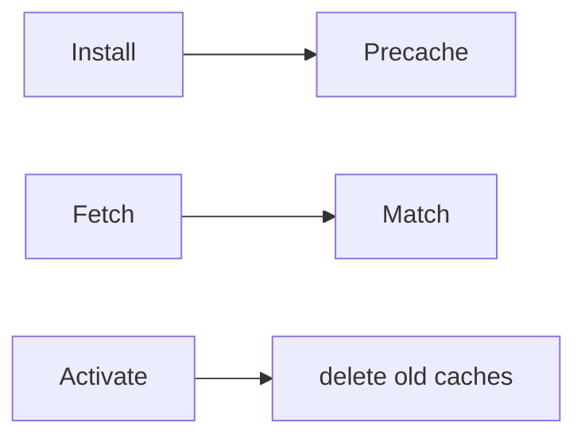
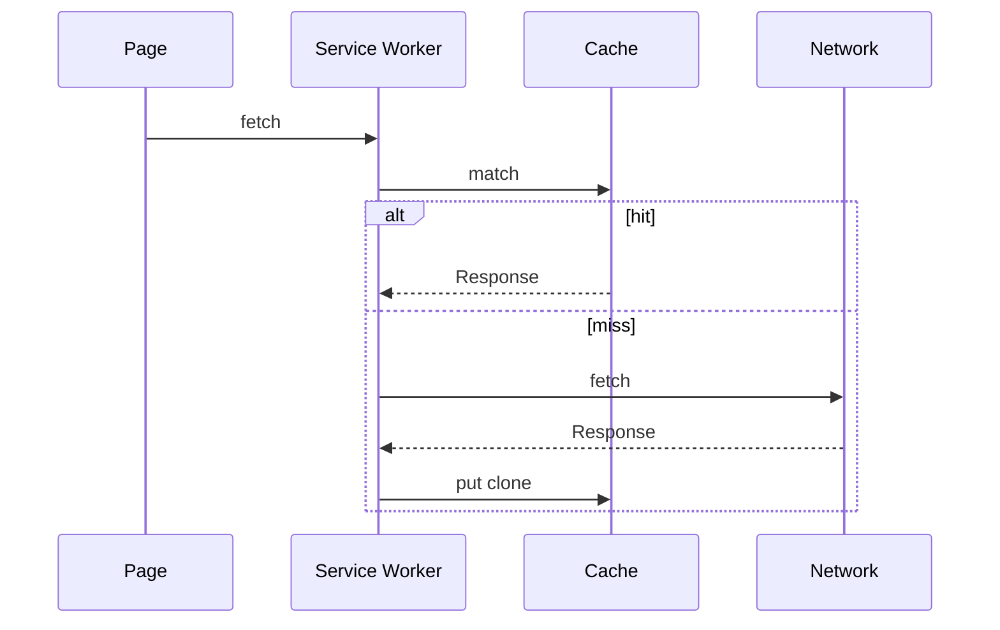

# Cache Storage

<TopicMeta />

<Prerequisites />

::: tip Published
This page meets the handbook **published** bar: deep explanation, ≥10 common mistakes, and official references. Further engine-level errata welcome via PR.
:::

## Introduction

**Cache Storage** (`caches`) stores `Request`/`Response` pairs. It is the backbone of many service-worker caching strategies (cache-first, network-first, stale-while-revalidate).

It is not a generic KV for arbitrary objects—though you can cache synthetic Responses.

## Why does it exist?

Offline and repeat-visit performance need HTTP-aware caching under developer control beyond the HTTP cache.

## Historical Background

Arrived with Service Workers / Cache API as part of the offline web push.

## Mental Model

Named caches contain entries keyed by request. Matching uses URL/method and options (`ignoreSearch`). Opaque responses from opaque CORS have restrictions.

## Internal Workflow

1. Open a named cache.
2. `put`/`addAll` responses.
3. `match` on fetch events.
4. Version cache names; delete old caches on activate.

## Lifecycle



## Browser Perspective

Visible in DevTools Application → Cache Storage.

## JavaScript Engine Perspective

Not applicable.

## React Perspective

Not applicable.

## Next.js Perspective

Often via next-pwa / custom SW—coordinate with framework caching.

## Server Perspective

Not applicable.

## Network Perspective

Works with fetch; respect CORS and redirect modes.

## Memory Perspective

Not applicable.

## Performance

Precache carefully—bloat hurts install. Runtime cache with size limits.

## Production Example

A shell app precaches `/app-shell` and hashed assets on install; runtime caches API GETs with TTL eviction policy.

## Code Examples

```js
self.addEventListener('fetch', (event) => {
  event.respondWith(
    caches.open('v1').then(async (cache) => {
      const cached = await cache.match(event.request)
      if (cached) return cached
      const res = await fetch(event.request)
      cache.put(event.request, res.clone())
      return res
    }),
  )
})
```

## Diagrams



## Common Mistakes

1. Caching POST/personalized responses unsafely
2. Never versioning cache names (stuck old assets)
3. Caching opaque errors forever
4. Forgetting to clone responses
5. Precaching entire sites blindly
6. Ignoring storage quotas
7. Overlooking an edge case #1 specific to 09-browser-apis.cache-storage in production traffic
8. Overlooking an edge case #2 specific to 09-browser-apis.cache-storage in production traffic
9. Overlooking an edge case #3 specific to 09-browser-apis.cache-storage in production traffic
10. Overlooking an edge case #4 specific to 09-browser-apis.cache-storage in production traffic


## Best Practices

- Version caches; purge on activate
- Choose strategy per resource class
- Clone before put
- Limit runtime cache size

## Anti-patterns

- Cache-first for highly dynamic personalized HTML without plan

## Comparison

| Cache layer | Controlled by |
| --- | --- |
| HTTP cache | Headers |
| Cache Storage | Your SW/code |
| Memory caches | App |

## Interview Questions

### Easy

**Q:** What does Cache Storage store?

**A:** HTTP Request/Response pairs in named caches.

### Medium

**Q:** Why clone a Response before caching?

**A:** Response bodies are one-shot streams; clone allows serving and storing.

### Hard

**Q:** How do you avoid serving stale hashed assets forever?

**A:** Include version/hash in cache names or URLs and delete old caches on service worker activate.

## Summary

- Request/response caches for SW strategies
- Version and prune caches
- Clone responses; pick strategies carefully

## References

- [MDN: Cache](https://developer.mozilla.org/en-US/docs/Web/API/Cache)
- [MDN: CacheStorage](https://developer.mozilla.org/en-US/docs/Web/API/CacheStorage)
- [Service Worker Cookbook](https://serviceworke.rs/)

<RelatedTopics />


Prev: [`09-browser-apis.indexeddb`](/09-browser-apis/indexeddb/) · Next: [`09-browser-apis.history-api`](/09-browser-apis/history-api/)
