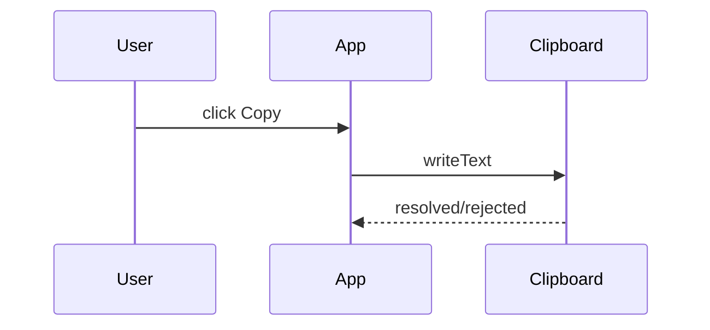
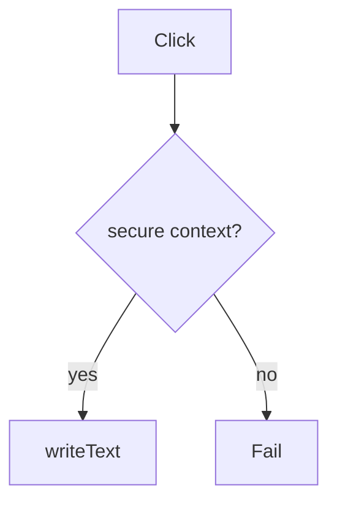

# Clipboard API

<TopicMeta />

<Prerequisites />

::: tip Published
This page meets the handbook **published** bar: deep explanation, ≥10 common mistakes, and official references. Further engine-level errata welcome via PR.
:::

## Introduction

The **Clipboard API** (`navigator.clipboard`) provides promise-based read/write for clipboard data. Writing text is common; reading often requires permission and a short-lived user gesture context.

Older `document.execCommand('copy')` is legacy.

## Why does it exist?

Copy-to-clipboard UX (codes, links, invites) must be reliable and permission-aware across browsers.

## Historical Background

Async Clipboard API modernized flaky execCommand flows; permissions policy and secure contexts tightened access.

## Mental Model

Write is easier than read. Requires **secure context** (HTTPS). Permissions and transient activation rules vary by browser for read.

## Internal Workflow

1. Ensure HTTPS.
2. On user click, `writeText`.
3. For read, request permission / handle denial.
4. Fall back when unavailable.

## Lifecycle



## Browser Perspective

Permissions in site settings; Safari has stricter paste rules.

## JavaScript Engine Perspective

Not applicable.

## React Perspective

Call from event handlers, not effects alone.

## Next.js Perspective

Not applicable.

## Server Perspective

Not applicable.

## Network Perspective

Not applicable.

## Memory Perspective

Not applicable.

## Performance

Negligible.

## Production Example

Invite links copy via `writeText`; UI toasts success/failure; fallback selects an input for manual copy.

## Code Examples

```ts
async function copyText(text: string) {
  try {
    await navigator.clipboard.writeText(text)
    return true
  } catch {
    return false
  }
}
```

## Diagrams



## Common Mistakes

1. Calling clipboard APIs without user gesture where required
2. Ignoring permissions denials
3. Assuming read is always allowed
4. Using execCommand without fallback plan in modern apps
5. HTTP non-secure contexts in production previews
6. Copying secrets into clipboard without warning
7. Overlooking an edge case #1 specific to 09-browser-apis.clipboard-api in production traffic
8. Overlooking an edge case #2 specific to 09-browser-apis.clipboard-api in production traffic
9. Overlooking an edge case #3 specific to 09-browser-apis.clipboard-api in production traffic
10. Overlooking an edge case #4 specific to 09-browser-apis.clipboard-api in production traffic


## Best Practices

- Copy on click
- Toast outcomes
- Feature-detect and fall back
- Prefer writeText for simple cases

## Anti-patterns

- Silent failure when copy does nothing

## Comparison

| API | Style |
| --- | --- |
| clipboard.writeText | Modern async |
| execCommand('copy') | Legacy |

## Interview Questions

### Easy

**Q:** What method copies text with the modern API?

**A:** `navigator.clipboard.writeText(text)`.

### Medium

**Q:** Why might clipboard read fail?

**A:** Missing permission, insecure context, or lack of required user gesture depending on the browser.

### Hard

**Q:** How do you support rich paste (images/html)?

**A:** Use `clipboard.read()` / `ClipboardItem` types and handle permitted MIME types carefully.

## Summary

- Async clipboard with secure-context rules
- Write common; read gated
- Always handle failure UX

## References

- [MDN: Clipboard API](https://developer.mozilla.org/en-US/docs/Web/API/Clipboard_API)

<RelatedTopics />


Prev: [`09-browser-apis.history-api`](/09-browser-apis/history-api/) · Next: [`09-browser-apis.intersection-observer`](/09-browser-apis/intersection-observer/)
