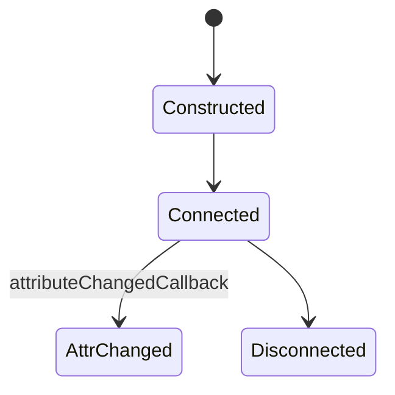
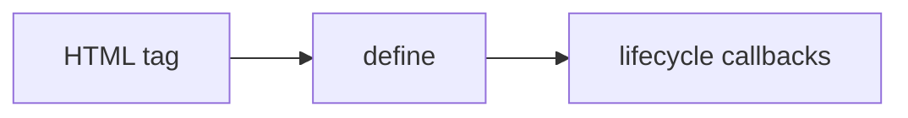

# Custom Elements

<TopicMeta />

<Prerequisites />

::: tip Published
This page meets the handbook **published** bar: deep explanation, ≥10 common mistakes, and official references. Further engine-level errata welcome via PR.
:::

## Introduction

**Custom Elements** let you teach the browser new tags (`class X extends HTMLElement`) registered with `customElements.define('my-x', X)`. Autonomous elements extend `HTMLElement`; customized built-ins extend built-ins (limited support).

## Why does it exist?

Framework-agnostic behavior attached to markup—widgets, embeds, design-system primitives.

## Historical Background

Custom Elements v1 is the standard. Naming requires a hyphen. Upgrade timing matters when HTML parses before definition.

## Mental Model

Lifecycle: `constructor` (limited work), `connectedCallback`, `disconnectedCallback`, `attributeChangedCallback` (with `observedAttributes`), `adoptedCallback`. Properties vs attributes need an explicit reflection strategy.

## Internal Workflow

1. Subclass HTMLElement.
2. List observedAttributes.
3. Define element once.
4. Reflect props ↔ attributes carefully.
5. Emit `CustomEvent`s for outputs.

## Lifecycle



## Browser Perspective

Unresolved custom elements are HTMLUnknownElement-ish until upgraded.

## JavaScript Engine Perspective

Not applicable.

## React Perspective

Pass properties via refs when attributes are insufficient; listen to custom events.

## Next.js Perspective

Not applicable.

## Server Perspective

Not applicable.

## Network Perspective

Not applicable.

## Memory Perspective

Not applicable.

## Performance

Avoid heavy work in constructor; defer to connectedCallback.

## Production Example

`<acme-button variant="primary">` reflects `variant` attribute to a property and fires `acme-click` events for both React and plain HTML consumers.

## Code Examples

```js
class AcmeCounter extends HTMLElement {
  static observedAttributes = ['value']
  #value = 0
  connectedCallback() {
    this.addEventListener('click', () => {
      this.#value++
      this.setAttribute('value', String(this.#value))
      this.dispatchEvent(new CustomEvent('acme-change', { detail: this.#value }))
    })
  }
  attributeChangedCallback(name, _o, next) {
    if (name === 'value') this.#value = Number(next)
  }
}
customElements.define('acme-counter', AcmeCounter)
```

## Diagrams



## Common Mistakes

1. No hyphen in tag name
2. Defining twice / racing definitions
3. Heavy DOM in constructor
4. Not observing attributes you care about
5. Leaking listeners without disconnectedCallback cleanup
6. Customized built-ins assuming Safari support
7. Overlooking an edge case #1 specific to 09-browser-apis.custom-elements in production traffic
8. Overlooking an edge case #2 specific to 09-browser-apis.custom-elements in production traffic
9. Overlooking an edge case #3 specific to 09-browser-apis.custom-elements in production traffic
10. Overlooking an edge case #4 specific to 09-browser-apis.custom-elements in production traffic


## Best Practices

- Hyphenated namespaced tags
- Clean up on disconnect
- Document attr/prop API
- CustomEvent for outputs

## Anti-patterns

- Silent attribute/property desync

## Comparison

| Type | Extends |
| --- | --- |
| Autonomous | HTMLElement |
| Customized built-in | HTMLButtonElement etc. (support varies) |

## Interview Questions

### Easy

**Q:** Why must custom element names contain a hyphen?

**A:** The HTML parser uses this to distinguish custom elements from built-in tags.

### Medium

**Q:** What is `observedAttributes` for?

**A:** It lists attributes that trigger `attributeChangedCallback` when they change.

### Hard

**Q:** How do you handle HTML that appears before `define`?

**A:** Elements upgrade when defined; write code to be upgrade-safe, or use `customElements.whenDefined` / progressive enhancement patterns.

## Summary

- Define new tags with lifecycle callbacks
- Hyphen names; observe attributes intentionally
- Clean up and reflect APIs clearly

## References

- [MDN: Using custom elements](https://developer.mozilla.org/en-US/docs/Web/API/Web_components/Using_custom_elements)

<RelatedTopics />


Prev: [`09-browser-apis.web-components`](/09-browser-apis/web-components/) · Next: [`09-browser-apis.shadow-dom`](/09-browser-apis/shadow-dom/)
