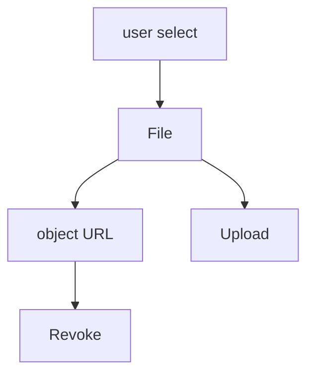
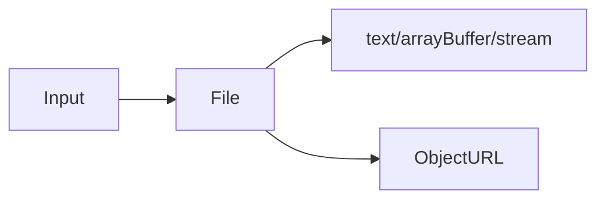

# File API

<TopicMeta />

<Prerequisites />

::: tip Published
This page meets the handbook **published** bar: deep explanation, ≥10 common mistakes, and official references. Further engine-level errata welcome via PR.
:::

## Introduction

The **File API** exposes `File` (a `Blob` with metadata) from `<input type="file">` or drag-and-drop. Read via `FileReader`, `blob.text()`, `arrayBuffer()`, streams, or `URL.createObjectURL`.

## Why does it exist?

Uploads, previews, and client-side validation need safe access to user files without path access to the disk filesystem.

## Historical Background

Enabled rich upload UX beyond opaque file path strings. Async Blob methods largely supersede FileReader for new code.

## Mental Model

User grants files via picker/drop. You receive `File` objects in memory/blob store—not arbitrary disk paths. Object URLs must be revoked.

## Internal Workflow

1. Accept input/drop.
2. Validate type/size client-side.
3. Preview via object URL or bitmap decode.
4. Upload with `FormData` / resumable protocols.
5. `revokeObjectURL`.

## Lifecycle



## Browser Perspective

Sandboxed access; permissions implicit in user gesture selection.

## JavaScript Engine Perspective

Not applicable.

## React Perspective

Controlled inputs still use refs for file values (read-only in JS).

## Next.js Perspective

Not applicable.

## Server Perspective

Not applicable.

## Network Perspective

Uploads often need chunking for large files.

## Memory Perspective

Huge files—prefer streams/slice over full ArrayBuffer.

## Performance

Slice & stream large files; revoke URLs; don’t decode giant images on main thread without care.

## Production Example

Image uploader validates MIME/size, shows object URL preview, then uploads via multipart with progress events.

## Code Examples

```ts
const input = document.querySelector('input[type=file]') as HTMLInputElement
input.addEventListener('change', async () => {
  const file = input.files?.[0]
  if (!file) return
  const url = URL.createObjectURL(file)
  // preview...
  URL.revokeObjectURL(url)
  const text = await file.text()
  console.log(text.slice(0, 100))
})
```

## Diagrams



## Common Mistakes

1. Forgetting revokeObjectURL (leaks)
2. Trusting file extension alone
3. Reading gigabyte files fully into memory
4. Assuming FileReader is required in modern browsers
5. Missing drag-and-drop preventDefault on dragover
6. Uploading without size limits
7. Overlooking an edge case #1 specific to 09-browser-apis.file-api in production traffic
8. Overlooking an edge case #2 specific to 09-browser-apis.file-api in production traffic
9. Overlooking an edge case #3 specific to 09-browser-apis.file-api in production traffic
10. Overlooking an edge case #4 specific to 09-browser-apis.file-api in production traffic


## Best Practices

- Validate type/size
- Object URL revoke
- Slice large uploads
- Accessible file picker labels

## Anti-patterns

- Base64-encoding huge files into JSON

## Comparison

| Read method | Notes |
| --- | --- |
| `blob.text()` | Simple async |
| FileReader | Older event API |
| Streams | Large files |

## Interview Questions

### Easy

**Q:** What object represents a user-selected file?

**A:** `File`, which extends `Blob` with name/lastModified metadata.

### Medium

**Q:** Why revoke object URLs?

**A:** They keep blob data referenced; revoking releases memory when previews unmount.

### Hard

**Q:** How do you upload a multi-GB file reliably?

**A:** Chunk/slice the Blob, use resumable upload protocols, show progress, and avoid holding the entire file as base64.

## Summary

- Sandboxed File/Blob access from user gestures
- Prefer modern Blob async APIs
- Revoke object URLs; stream large data

## References

- [MDN: File API](https://developer.mozilla.org/en-US/docs/Web/API/File_API)
- [MDN: File](https://developer.mozilla.org/en-US/docs/Web/API/File)

<RelatedTopics />


Prev: [`09-browser-apis.streams-api`](/09-browser-apis/streams-api/) · Next: [`09-browser-apis.web-components`](/09-browser-apis/web-components/)
