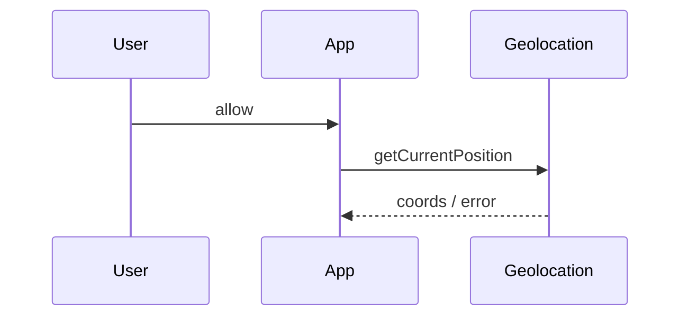
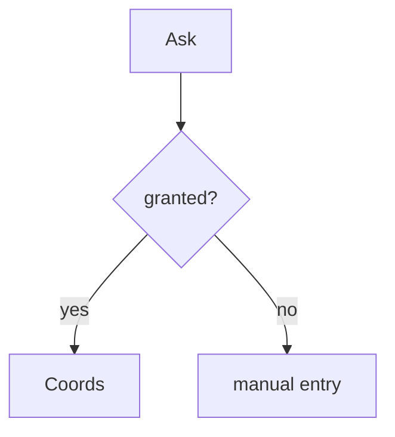

# Geolocation

<TopicMeta />

<Prerequisites />

::: tip Published
This page meets the handbook **published** bar: deep explanation, ≥10 common mistakes, and official references. Further engine-level errata welcome via PR.
:::

## Introduction

The **Geolocation API** provides latitude/longitude (and accuracy) after permission. It is privacy-sensitive and requires secure context in modern browsers.

## Why does it exist?

Maps, store locators, and localized experiences need device location with explicit consent.

## Historical Background

Long-standing API; permission UX and accuracy vary by OS/browser and indoors.

## Mental Model

`getCurrentPosition` one-shot; `watchPosition` stream. Success/error callbacks (or promise wrappers). Accuracy is not guaranteed.

## Internal Workflow

1. Explain why you need location.
2. Request on gesture.
3. Handle denied/unavailable timeouts.
4. Fall back to manual place entry.

## Lifecycle



## Browser Perspective

Permission prompt; HTTPS required typically.

## JavaScript Engine Perspective

Not applicable.

## React Perspective

Request from events; clear watches on unmount.

## Next.js Perspective

Not applicable.

## Server Perspective

Not applicable.

## Network Perspective

May use network/IP assists; still privacy-sensitive.

## Memory Perspective

Not applicable.

## Performance

watchPosition can drain battery—clear when unused.

## Production Example

Store locator requests location once, caches approximate city, and always offers ZIP entry fallback.

## Code Examples

```ts
function getCoords(): Promise<GeolocationCoordinates> {
  return new Promise((resolve, reject) => {
    navigator.geolocation.getCurrentPosition(
      (pos) => resolve(pos.coords),
      reject,
      { enableHighAccuracy: false, timeout: 8000 },
    )
  })
}
```

## Diagrams



## Common Mistakes

1. Requesting location on first paint
2. No fallback when denied
3. Leaving watchPosition active
4. Trusting accuracy blindly
5. Shipping without HTTPS
6. Logging precise coords to third parties without consent
7. Overlooking an edge case #1 specific to 09-browser-apis.geolocation in production traffic
8. Overlooking an edge case #2 specific to 09-browser-apis.geolocation in production traffic
9. Overlooking an edge case #3 specific to 09-browser-apis.geolocation in production traffic
10. Overlooking an edge case #4 specific to 09-browser-apis.geolocation in production traffic


## Best Practices

- Contextual ask + fallback
- Timeouts and error UX
- Clear watches
- Minimize precision retention

## Anti-patterns

- Blocking app usage entirely without location

## Comparison

| Method | Behavior |
| --- | --- |
| getCurrentPosition | One reading |
| watchPosition | Continuous |

## Interview Questions

### Easy

**Q:** Name the API to read user location.

**A:** `navigator.geolocation.getCurrentPosition(...)`.

### Medium

**Q:** Why provide a manual fallback?

**A:** Users deny permission, devices lack GPS, or accuracy is poor indoors.

### Hard

**Q:** What privacy practices should accompany geolocation?

**A:** Minimize collection, disclose purpose, avoid retaining precise coords longer than needed, secure transmission, and honor denial.

## Summary

- Permissioned coordinates API
- Always design deny/fallback paths
- Clear watches; respect privacy

## References

- [MDN: Geolocation API](https://developer.mozilla.org/en-US/docs/Web/API/Geolocation_API)

<RelatedTopics />


Prev: [`09-browser-apis.notifications`](/09-browser-apis/notifications/) · Next: [`09-browser-apis.web-sockets-api`](/09-browser-apis/web-sockets-api/)
