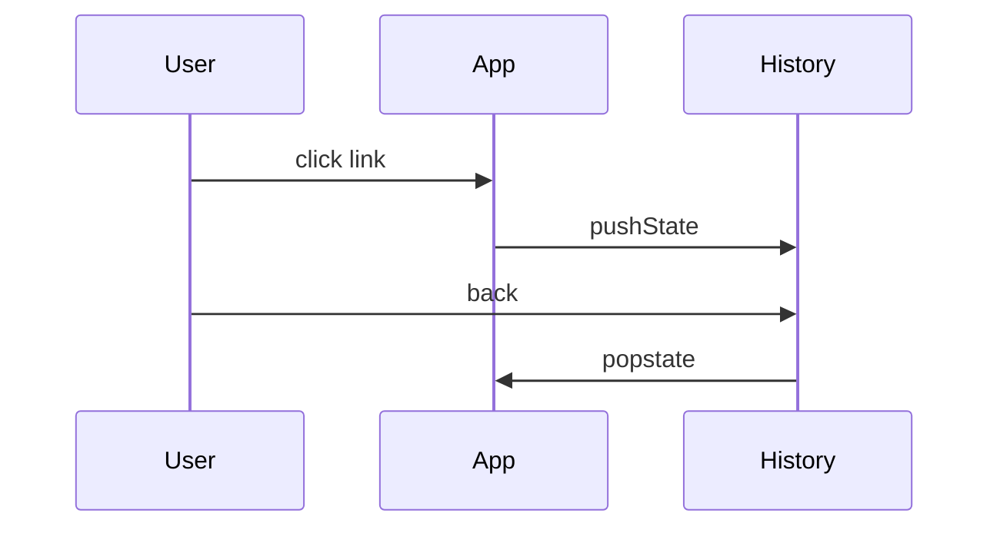

# History API

<TopicMeta />

<Prerequisites />

::: tip Published
This page meets the handbook **published** bar: deep explanation, ≥10 common mistakes, and official references. Further engine-level errata welcome via PR.
:::

## Introduction

The **History API** lets apps manipulate the session history stack with `pushState` / `replaceState` and react to `popstate` when the user navigates back/forward—without full page loads.

This is the foundation of client-side routers.

## Why does it exist?

SPAs need shareable URLs and back-button behavior while keeping app state in memory.

## Historical Background

HTML5 History API ended hash-only routing (`#/path`) as the only option. Modern frameworks wrap it; App Router frameworks also integrate server routing.

## Mental Model

History entries have a URL + optional state object. `pushState` adds; `replaceState` updates current. `popstate` fires on back/forward (not usually on pushState itself).

## Internal Workflow

1. On in-app nav: `pushState` + render route.
2. On `popstate`: read `location` + `event.state` and render.
3. Use `replaceState` for query tweaks that should not spam history.
4. Keep state serializable and modest.

## Lifecycle



## Browser Perspective

Coordinates with session history; DevTools shows history sparsely—test manually.

## JavaScript Engine Perspective

Not applicable.

## React Perspective

React Router / Next client navigation wrap these primitives.

## Next.js Perspective

App Router uses its own navigation; still built on web history concepts.

## Server Perspective

Not applicable.

## Network Perspective

pushState does not fetch by itself—your app must load data.

## Memory Perspective

Not applicable.

## Performance

Cheap; the cost is your route rendering/data fetching.

## Production Example

A storefront updates filters with `replaceState` for query params to keep the back stack clean, and `pushState` when entering a product page.

## Code Examples

```ts
window.history.pushState({ page: 2 }, '', '/items?page=2')
window.addEventListener('popstate', (e) => {
  console.log('state', e.state, location.href)
})
```

## Diagrams

```mermaid
flowchart LR
  A[/] -->|pushState| B[/items]
  B -->|pushState| C[/items/1]
  C -->|back| B
```

## Common Mistakes

1. Assuming pushState fetches the new URL from the server
2. Putting non-serializable objects in state
3. Listening only to clicks and ignoring back button
4. Spamming history on every keystroke filter
5. Broken server fallbacks for deep links (no index.html strategy)
6. Cross-origin pushState attempts
7. Overlooking an edge case #1 specific to 09-browser-apis.history-api in production traffic
8. Overlooking an edge case #2 specific to 09-browser-apis.history-api in production traffic
9. Overlooking an edge case #3 specific to 09-browser-apis.history-api in production traffic
10. Overlooking an edge case #4 specific to 09-browser-apis.history-api in production traffic


## Best Practices

- Accessible link elements for navigation
- replaceState for ephemeral query edits
- Server can serve the SPA shell for deep URLs
- Keep history state small

## Anti-patterns

- hash routing + history API confusion without need

## Comparison

| Method | Reload? | Adds history? |
| --- | --- | --- |
| Location assign | Yes | Yes |
| pushState | No | Yes |
| replaceState | No | No |

## Interview Questions

### Easy

**Q:** Does `pushState` load a new document?

**A:** No. It changes the URL/history entry; your app updates the UI.

### Medium

**Q:** When does `popstate` fire?

**A:** On session history traversal (back/forward), not typically on `pushState` itself.

### Hard

**Q:** How should filter query updates affect history?

**A:** Often `replaceState` while editing filters; `pushState` when navigating to a meaningfully new view.

## Summary

- Client routing primitive
- push vs replace vs popstate
- Does not fetch by itself

## References

- [MDN: History API](https://developer.mozilla.org/en-US/docs/Web/API/History_API)
- [MDN: pushState](https://developer.mozilla.org/en-US/docs/Web/API/History/pushState)

<RelatedTopics />


Prev: [`09-browser-apis.cache-storage`](/09-browser-apis/cache-storage/) · Next: [`09-browser-apis.clipboard-api`](/09-browser-apis/clipboard-api/)
