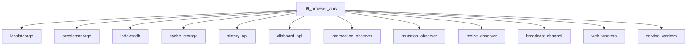

# Browser APIs

## Scope

Storage, observers, workers, and platform APIs

## Prerequisites

See the learning paths and each topic's prerequisites in the registry.

## Topics in order

- [localStorage](/09-browser-apis/localstorage/) — beginner, ~20 min
- [sessionStorage](/09-browser-apis/sessionstorage/) — beginner, ~15 min
- [IndexedDB](/09-browser-apis/indexeddb/) — mid, ~40 min
- [Cache Storage](/09-browser-apis/cache-storage/) — mid, ~30 min
- [History API](/09-browser-apis/history-api/) — junior, ~25 min
- [Clipboard API](/09-browser-apis/clipboard-api/) — junior, ~20 min
- [Intersection Observer](/09-browser-apis/intersection-observer/) — mid, ~30 min
- [Mutation Observer](/09-browser-apis/mutation-observer/) — mid, ~25 min
- [Resize Observer](/09-browser-apis/resize-observer/) — mid, ~20 min
- [Broadcast Channel](/09-browser-apis/broadcast-channel/) — mid, ~20 min
- [Web Workers](/09-browser-apis/web-workers/) — mid, ~40 min
- [Service Workers](/09-browser-apis/service-workers/) — mid, ~40 min
- [Notifications](/09-browser-apis/notifications/) — junior, ~20 min
- [Geolocation](/09-browser-apis/geolocation/) — junior, ~15 min
- [WebSocket API](/09-browser-apis/web-sockets-api/) — mid, ~25 min
- [Streams API](/09-browser-apis/streams-api/) — senior, ~35 min
- [File API](/09-browser-apis/file-api/) — junior, ~25 min
- [Web Components](/09-browser-apis/web-components/) — mid, ~35 min
- [Custom Elements](/09-browser-apis/custom-elements/) — mid, ~30 min
- [Shadow DOM](/09-browser-apis/shadow-dom/) — mid, ~30 min

## Module knowledge graph

## Suggested learning paths

Browse [Learning Paths](/learning-paths/).
